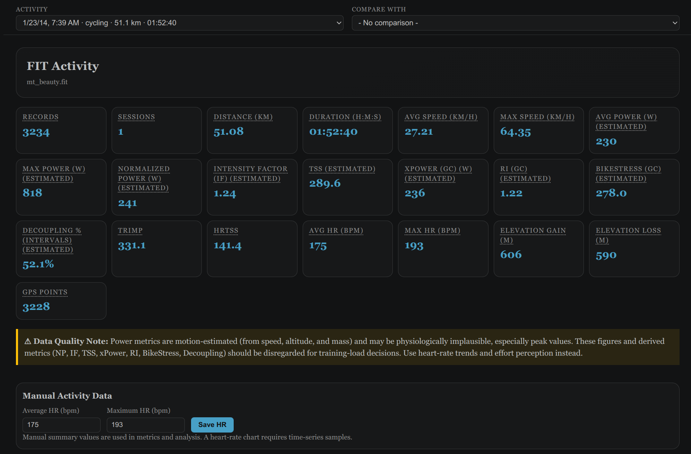
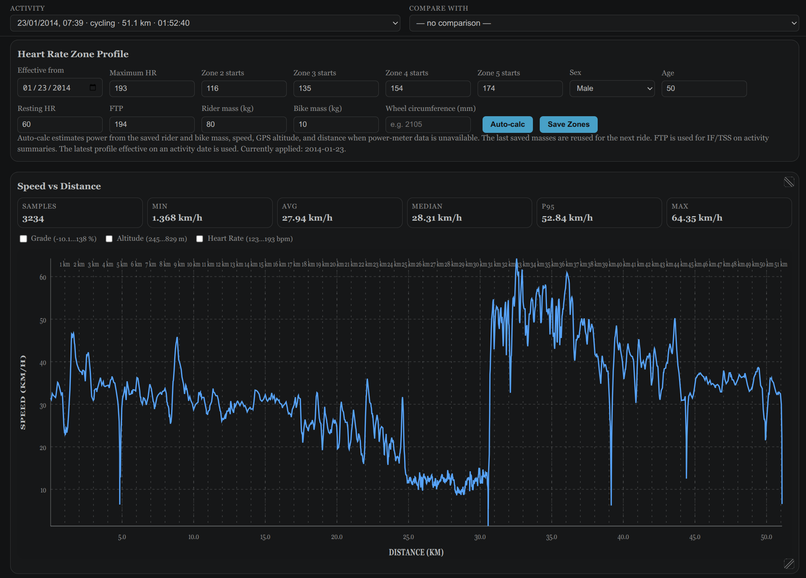
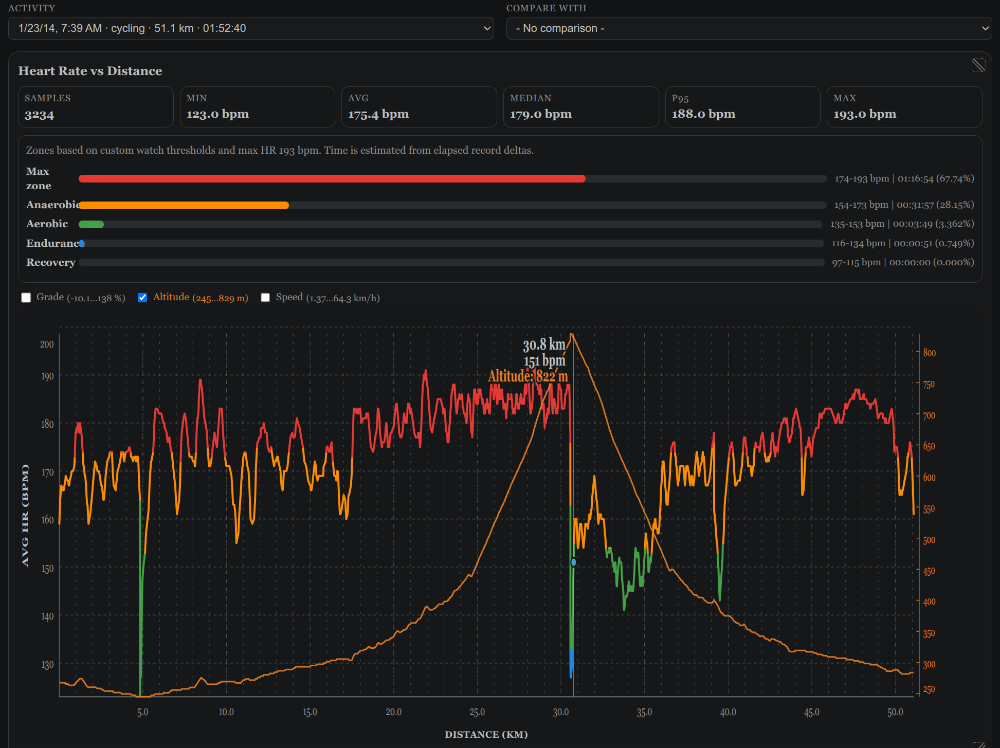
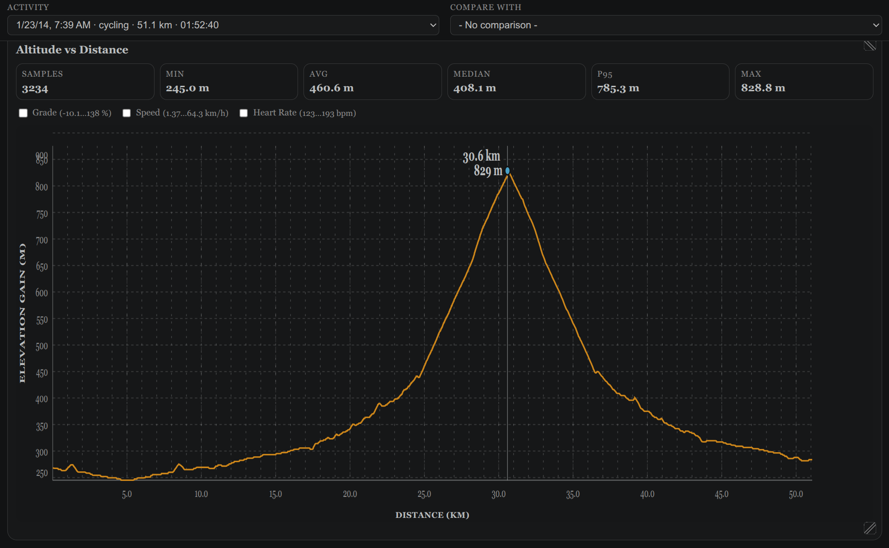
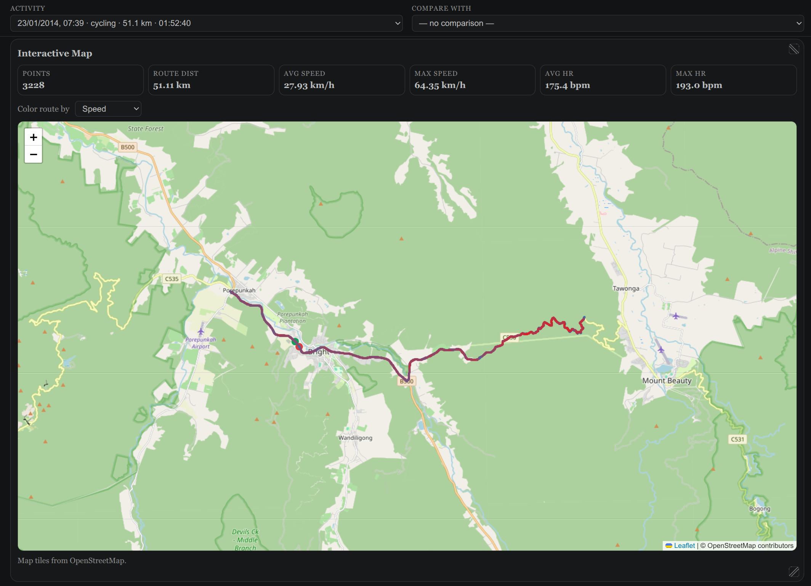
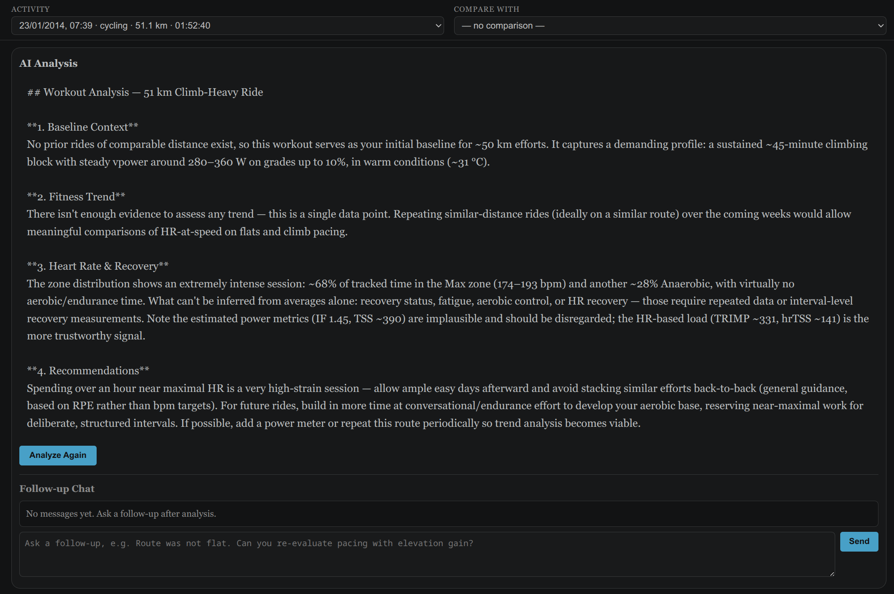

# FIT Visualizer

**A platform-independent, local-first FIT activity viewer and training analyzer for VS Code.**

Explore your cycling and running activities directly in VS Code, including GPS tracks, elevation, heart rate, cadence, power, effort segmentation, historical comparisons, and optional AI-assisted analysis.

## Why FIT Visualizer?

FIT Visualizer started as a personal project.

I wanted a simple way to view and analyze my own FIT activities on Linux, but I couldn't find a tool that worked well for me. So I decided to build one myself, with a focus on keeping my activity data local and making it easy to explore in VS Code.

The project has grown from a simple FIT viewer into a local activity database and training-analysis tool.

It is still actively evolving, driven primarily by real-world activities and use cases.

### Philosophy

FIT Visualizer has a different center of gravity than most FIT tools:

**local FIT viewer → automatic load-oriented segmentation → personal history → conversational analysis**

It's built to answer *"What happened on this ride, and what does that mean in the context of my previous rides?"* rather than *"Give me the most complete possible set of sports metrics."*

That shapes what you ask it:

- Why was this ride harder?
- Which part of the ride explains the difference?
- Is this similar to my previous rides?
- Is there evidence my endurance is improving?

FIT Visualizer is not trying to replace a power-analysis workbench. It is trying to make your own activity history easier to understand.

## Highlights

- Open FIT files in an interactive visual editor
- Auto-index activities into local SQLite storage
- Compare two activities in one view
- Speed, heart rate, and altitude charts by distance — with adaptive axis labels that add detail as you resize width or height
- Overlay any two extra metrics (grade, altitude, speed, heart rate) on top of a chart
- Shared crosshair across all three charts: hover one, see the exact value at that point on all of them
- Render GPS track on an interactive map, with Ctrl/Cmd + scroll to zoom so scrolling the page doesn't fight the map
- Automatic ride segmentation — splits a ride into climbs, descents, flats, and stops, and estimates effort with a physics-based power model on climbs or heart rate elsewhere, honestly labeling which one applies to each segment
- Wheel-circumference calibration hint — compares your wheel sensor's distance against GPS on trustworthy straight stretches and suggests a correction when there's enough evidence, silent otherwise
- Save dated heart-rate zone profiles
- Generate AI analysis of the current ride in the context of comparable past rides, recent training load, and personal records
- Re-analyze activities in bulk after an update changes how analysis works, instead of doing it one by one

## Requirements

- GitHub Copilot Chat, installed and signed in, for AI analysis. Everything else (charts, map, segmentation, zones, calibration) works without it.
- VS Code may ask you to authorize FIT Visualizer before the first Copilot-backed analysis request; if permission is denied, the extension reports that separately from missing sign-in or policy blocks.

## What's a FIT File, and How Do I Get One?

FIT (Flexible and Interoperable Data Transfer) is the binary format most GPS bike computers, sport watches, and fitness apps use to record an activity — GPS position, speed, heart rate, power, cadence, and more, one record per second or so. It was originally created by Garmin, but it's an open format used far beyond Garmin devices.

How to get `.fit` files off common devices:

- **Garmin**: Garmin Connect → activity → **⋯** → *Export Original*. Or plug the device into USB and copy files from `GARMIN/Activity`.
- **Wahoo**: ELEMNT app → ride → share/export.
- **Polar**: Polar Flow → activity → export, choose FIT.
- **Suunto, COROS, Bryton, Sigma, and most other GPS computers/watches**: their companion app usually has an export option; if not, connecting over USB often exposes an `Activities`/`Garmin`-style folder with raw `.fit` files.
- **Zwift**: saved automatically after each ride, under `Documents/Zwift/Activities`.
- **Strava**: if the ride was uploaded from a device (not manually entered), *Export Original* on the activity page gives you back the original `.fit` file.
- **Cycplus M1** (no companion app): see [cycplusSync](https://github.com/jef-sure/cycplusSync) above.

## Quick Start

1. Open the folder that contains your FIT files.
2. Run **FIT: Index New Files**.
3. Open a FIT file or run **FIT: Browse Loaded Data**.
4. (Optional) Configure your Heart Rate Zone Profile.
5. Click **Analyze Activity** to generate the activity analysis.

## Commands

- FIT: Visualize File
- FIT: Browse Loaded Data
- FIT: Index All Files
- FIT: Index New Files
- FIT: Index This File
- FIT: Re-analyze Outdated Analyses — re-runs AI analysis for every activity whose stored analysis predates the current analysis format, instead of clicking through each one by hand

Right-click a `.fit` file in the Explorer for two shortcuts to the commands above — **Visualize File** and **Index This File** — nothing else is added there; segmentation, analysis, and everything else still happens inside the visual editor once the file is open.

## Effort Segmentation

Each ride is split into segments by terrain (climb, descent, flat) and by effort within each terrain type, plus stops. Segments show duration, distance, average grade, and an effort estimate:

- **Climbs** (grade steep enough that gravity dominates over aerodynamics) use a physics-based virtual power estimate from your mass, grade, and speed.
- **Everywhere else** — flats, descents, technical sections — use heart rate, since virtual power isn't reliable where aerodynamic drag and wind matter more than grade.
- Segments where speed data itself is unreliable (technical descents, poor GPS reception) are marked as such, with no effort number attached rather than a misleading one.

This segmentation also feeds the AI analysis, so it can reason about specific intervals rather than only ride-wide averages.

Thresholds (grade cutoff, minimum segment length, stop detection, GPS trust window, etc.) are configurable — see **Settings** below — and are meant to be tuned to your own terrain and riding style rather than used as fixed defaults.

## Wheel Calibration

If your bike uses a wheel speed sensor, its distance depends on a configured wheel circumference — which drifts if tire pressure changes or was mismeasured to begin with. FIT Visualizer compares the sensor's distance against GPS on long, straight, well-tracked stretches across your recent rides, and — only once there's enough trustworthy distance accumulated and the deviation is real, not GPS noise — suggests a corrected circumference. Stable large mismatches are treated as calibration evidence rather than discarded just because they are far from 1:1. It stays silent otherwise; there's no partial progress indicator to watch.

## AI-Assisted Analysis

AI analysis is optional; the rest of FIT Visualizer works without GitHub Copilot.

Analysis runs through GitHub Copilot's chat models (whichever model your Copilot picker is currently using — this can change over time, and each request logs which one answered). Analysis considers:

- The current ride's own stats and segment breakdown
- Comparable prior rides (similar distance) for baseline context
- Recent training load and personal records
- Recent AI analyses of other rides (last 30 days, or the most recent one if the last month is empty), so trends carry across rides rather than resetting each time

Prompts and responses are logged locally (see **Settings**) so you can review exactly what was sent and received.

## Heart-Rate Zones

- Supports dated zone profiles
- Auto-calc uses sex, age, resting HR, and observed max HR
- Manual overrides can be saved and reused

## Local Data

FIT Visualizer keeps your activity data local to your workspace.

- Database: `.fit-visualizer/fit-data.sqlite`
- Copilot request/response logs: `.fit-visualizer/logs`
- Scope: workspace-local (or selected folder)
- Indexed activities persist between sessions

Your original `.fit` files are not uploaded or copied to a remote service by FIT Visualizer.

AI analysis is optional. When enabled, the information required for analysis is sent through GitHub Copilot according to your Copilot configuration.

When AI-assisted analysis is enabled, FIT Visualizer builds an analysis context from the activity rather than sending the original FIT file. Some basic activity information, such as date, duration and distance, is included directly. Most of the context consists of derived and segmented data, where segments group parts of the activity with a similar effort profile, together with training metrics and other analysis results.

### Privacy

FIT files can contain sensitive information, including GPS coordinates, timestamps, heart-rate data, device information, and your training history.

FIT Visualizer processes and stores indexed activity data locally. No cloud service is required for browsing, charts, maps, segmentation, zones, or calibration.

AI-assisted analysis is different: when enabled, the analysis context is sent through GitHub Copilot. This can include data from the current activity and relevant historical activities.

If `fitVisualizer.logLlmRequests` is enabled, the Copilot prompts and responses are also stored locally in `.fit-visualizer/logs`.

Review your Copilot configuration and the logging setting before using AI analysis with activities containing sensitive information.

## Demo Activity

The screenshots in this README use a public cycling activity from the [kuperov/fit](https://github.com/kuperov/fit) repository.

The activity contains a real GPS track and a substantial climbing section, making it a useful example for exploring FIT Visualizer's map, elevation, segmentation, and analysis features.

## Settings

Most settings can be left at their defaults. Segmentation thresholds are mainly useful if your terrain or riding style differs significantly from typical road/gravel riding.

| Setting                                          | Default | Purpose                                                                                                            |
| ------------------------------------------------ | ------- | ------------------------------------------------------------------------------------------------------------------ |
| `fitVisualizer.maxHeartRate`                     | —       | Legacy fallback max HR; prefer a dated zone profile in the activity view.                                          |
| `fitVisualizer.logLlmRequests`                   | `true`  | Write each Copilot prompt/response to `.fit-visualizer/logs`.                                                      |
| `fitVisualizer.llmLogRetentionDays`              | `30`    | Delete request logs older than this; `0` keeps them indefinitely.                                                  |
| `fitVisualizer.segmentation.gradeThresholdPct`   | `2.5`   | Grade (%) separating climbs/descents from flat terrain.                                                            |
| `fitVisualizer.segmentation.gradeHysteresisPct`  | `0.5`   | Extra margin required to switch terrain type, to stop flapping right at the threshold.                             |
| `fitVisualizer.segmentation.minSegmentSeconds`   | `45`    | Shorter segments get merged into a neighbor.                                                                       |
| `fitVisualizer.segmentation.technicalGradePct`   | `-8`    | Descent grade below which an erratic speed trace marks the segment as technical (no effort estimate).              |
| `fitVisualizer.segmentation.effortWindowSeconds` | `10`    | Averaging window before splitting a segment into intervals.                                                        |
| `fitVisualizer.segmentation.effortCostThreshold` | —       | Merge-cost limit for interval detection; left empty, it's derived from the ride's own noise level.                 |
| `fitVisualizer.segmentation.stopSpeedKmh`        | `1`     | Speed at/below which a record counts as stopped.                                                                   |
| `fitVisualizer.segmentation.stopMinSeconds`      | `10`    | Minimum duration to count as a stop or auto-paused gap.                                                            |
| `fitVisualizer.segmentation.gpsTrustMinKm`       | `1`     | Minimum continuous, straight distance before a GPS window can confirm — or calibrate against — the recorded speed. |
