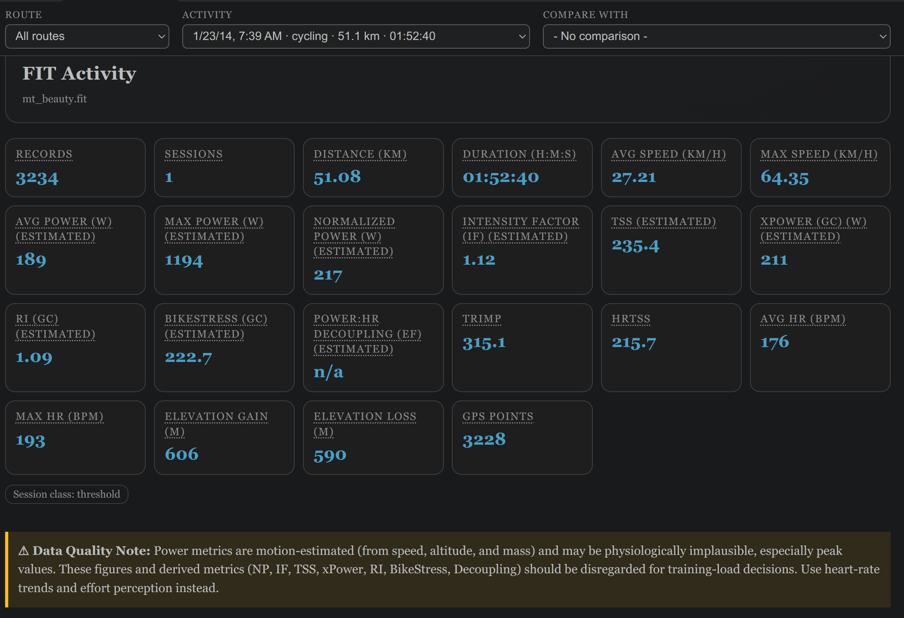
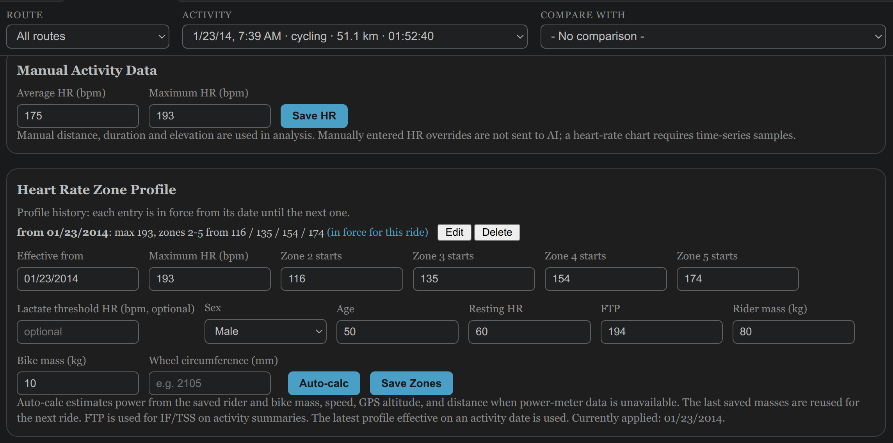
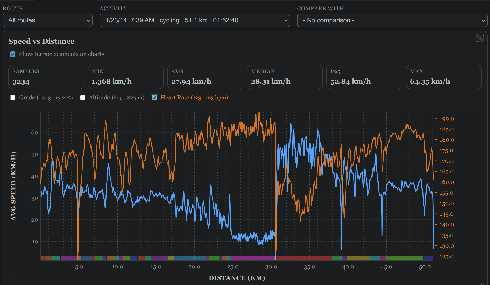
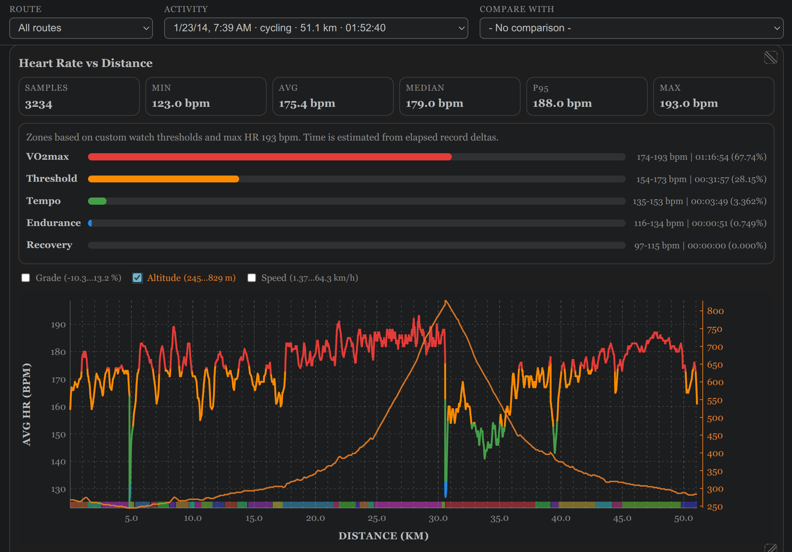
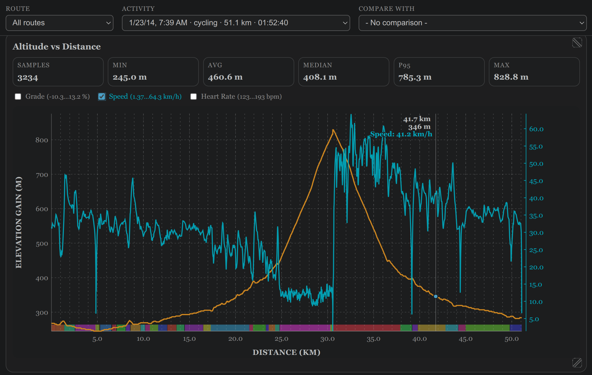
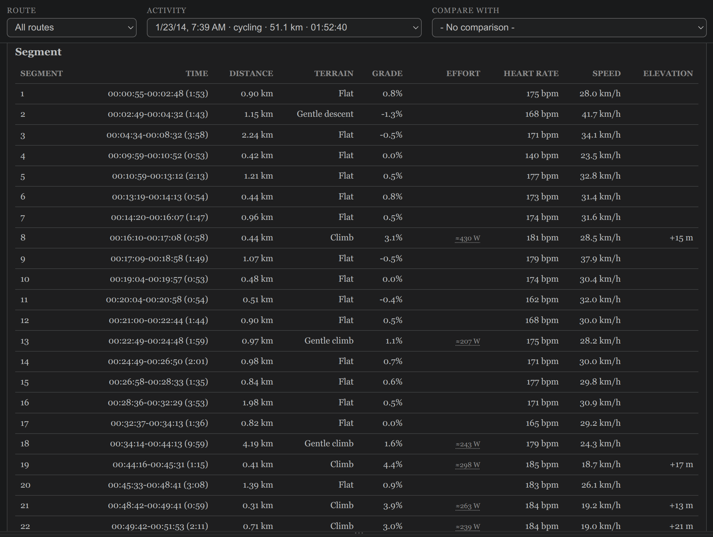

# FIT Visualizer

[Русская версия](README.ru.md)

**A FIT file viewer that doesn't stop at viewing.**

Open a `.fit` file from your bike computer or sports watch right in VS Code and see the ride: speed, heart rate and elevation charts, the route on a map, and the ride split into climbs, descents, flats and stops. Every ride you open goes into a local history, so the next one can be compared with what came before — and if you use GitHub Copilot, you can talk it through in plain language.

## Upgrading

### To 0.18.1

Run **FIT: Re-analyze Outdated Analyses** (analysis format 24). Re-indexing is not required.

### To 0.18.0

Run **FIT: Re-analyze Outdated Analyses** (analysis format 23).

### To 0.17.1

Run **FIT: Re-analyze Outdated Analyses** (analysis format 22). Re-indexing is not required.

### To 0.17.0

1. Run **FIT: Rebuild Derived Features** once: it assigns routes and refills the derived-feature cache (earlier versions did not save lazily computed features; they are persisted now).
2. Run **FIT: Re-analyze Outdated Analyses** to refresh saved AI analyses (analysis format 21). Re-indexing is not required.

### To 0.16.0

1. Run **FIT: Re-analyze Outdated Analyses** to refresh saved AI analyses (analysis format 20). Re-indexing is not required.
2. Optional: run **FIT: Rebuild Derived Features** once to pre-populate the new derived-feature cache for all activities (it also fills lazily during analyses).

### To 0.15.0

1. Run **FIT: Index All Files** to extract the new device fields (timezone offset, device ascent/descent, session timing). **Index New Files** does not refresh existing activities.
2. Run **FIT: Re-analyze Outdated Analyses** to refresh saved AI analyses (analysis format 19).

### To 0.14.1

1. Run **FIT: Re-analyze Outdated Analyses** to refresh saved AI analyses (analysis format 18). Re-indexing is not required for this update.
2. Optional: run **FIT: Tidy Heart-Rate Profiles** to collapse duplicate dated profiles created by earlier saves.

### To 0.14.0

**Existing users: re-index your FIT files and re-run AI analysis after updating.** Grade, segments, heart-rate load and the AI context have changed; stored values and older analyses are not refreshed automatically.

1. Open the folder containing your original `.fit` files and run **FIT: Index All Files** from the Command Palette (`Ctrl+Shift+P`). **Index New Files** does not refresh existing activities.
2. Once indexing finishes, run **FIT: Re-analyze Outdated Analyses** to refresh outdated AI analyses and create any missing ones using the new calculations and context. One confirmation shows the total number of Copilot requests; current analyses are left unchanged.

Re-indexing is local and does not change the original FIT files. Re-analysis is optional, requires GitHub Copilot, sends activity and discussion context to the model, and may consume your Copilot allowance.

## Getting Started

1. Install: press `Ctrl+P`, paste `ext install AntonPetrusevich.fit-visualizer`, press Enter.
2. Open the folder with your `.fit` files (**File → Open Folder**). No files yet? See [where to get them](#whats-a-fit-file-and-how-do-i-get-one).
3. Click any `.fit` file. It opens as an activity page and is added to your local history at the same time.
4. Got a folder full of older rides? Run **FIT: Index All Files** from the Command Palette (`Ctrl+Shift+P`) to add them all at once. After new rides, **FIT: Index New Files** picks up only what's new.
5. To switch between rides later, run **FIT: Browse Loaded Data** and pick an activity from the list at the top.

That's all. Charts, the map, segments and heart-rate zones work right away — no account, no upload. For personal zones, fill in the **Heart Rate Zone Profile** (sex, age, resting HR) once on the activity page.

If GitHub Copilot Chat is installed and signed in, scroll down to **AI Analysis** and click **Analyze Activity**. The answer is not the end of it — keep asking in the chat box below.

Here is a real example from my ride on August 25. First, the original analysis, shown as it was generated at the time:

> This predates the current data-quality fixes. The 171-vs-191 bpm discrepancy came from a manually entered smartwatch value, which should not have been treated as verified FIT data. Current analyses exclude manually entered HR overrides and stale analysis replies.

> **Workout Analysis — 2026-08-25**
>
> **1. Baseline Context**
> This is the first ride after 3 full days off — the rest finally happened — and it lands slightly above the 31-ride baseline for speed (23.35 vs 22.7 km/h) at clearly below-baseline HR (133 vs 138 bpm). That's the cleanest speed-per-effort pairing in the recent history. Per the standing note, disregard the motion-estimated power metrics (IF 1.15, TSS 112.7, −35.9% decoupling are implausible); hrTSS (36.3) and TRIMP better reflect the load.
>
> **2. Fitness Trend**
> The supplied trends remain favorable — speed rising +4.4% on comparables with stable HR — but this should not be framed as a confirmed "efficiency point": today was faster than baseline at lower HR, yet comparing vpower on the closing climbs across days (150–192 W at HR 136–146 versus 152–165 on 8/19–8/21) involves different conditions, no confirmed route identity, and no measured power. One day after rest is not a fitness change; if the faster-and-easier pairing repeats over 2–4 weeks on the same confirmed route, the conclusion would solidify.
>
> **3. Heart Rate & Recovery**
> The distribution shows a well-controlled aerobic ride: 98% at Aerobic or below, only 2% Anaerobic and essentially no Max time, with peak 160 well under the profiled 171 ceiling. The long steady mid-ride blocks stayed in the 125–144 bpm range throughout. Recovery status and cardiac drift cannot be inferred from these summaries, and the 171-vs-191 bpm max-HR profile discrepancy is still unverified.
>
> **4. Recommendations**
> This is close to the clean conversational benchmark that's been outstanding — keep it as your reference and repeat it weekly to track efficiency on the closing climbs. With rest banked and a controlled ride completed, you've earned one structured intensity session this week, followed by easy days; avoid sliding back into daily hard riding. Standing items remain: verify the max-HR profile and consider a direct power meter to replace the unusable motion-estimated metrics.

Except there weren't three days off. I did ride on the 22nd, I just forgot the bike computer at home. The follow-up chat went like this (I wrote in Russian, translated here; replies trimmed):

> **Me:** "This is the first ride after 3 full days off" — not quite, it was two rest days. On August 22 I just forgot the bike computer at home, so the data is only on my smartwatch… It was a 20 km ride where I got caught in heavy rain.
>
> **AI:** Thanks for the clarification — correcting the context: this is the first **recorded** ride after two rest days… That changes the picture a bit: recovery was shorter, which makes today's "speed above baseline (23.35 vs 22.7 km/h) at HR below baseline (133 vs 138 bpm)" an even stronger efficiency signal rather than just a freshness effect. …Was the ride on 8/22 easy/recovery or did it include efforts?
>
> **Me:** 8/22: time 55:08; average speed 22.5; average HR 138
>
> **AI:** …speed and HR almost exactly match the averages over 31 comparable rides (22.7 km/h, 138 bpm), so it was a moderate, not a hard, load.
>
> **Me:** 8/22: ascent 163, descent 850
>
> **AI:** Thanks, but these numbers look questionable: 163 m of ascent with 850 m of descent means a net drop of ~687 m over ~20 km… Most likely it's a barometric altimeter error — rain often distorts this kind of data.

Then I questioned one of the recommendations:

> **Me:** "Avoid sliding back into daily hard riding" — why? … Doesn't the body adapt to the load?
>
> **AI:** It does — but that's exactly the point: adaptation happens **between** sessions, not during them. …Your data illustrates this: 8/19–8/21 back to back — HR 152–165 on the same closing climbs; after rest — 136–146 bpm at vpower ~150–192 W, and 23.35 km/h at 133 bpm versus the baseline 22.7/138. The gain showed up after rest, not after a series of hard days.

I wouldn't have figured out the altimeter thing myself. The conversation is saved with the analysis, so you can pick it up later.

## Why I Built It

It started with a cheap bike computer. Choosing between a Sigma ROX 4.0 and a CYCPLUS M1, I asked Google AI, and it told me the M1 shows up over USB as a drive with your rides on it. It doesn't — the files only come off over Bluetooth, which is how [cycplusSync](https://github.com/jef-sure/cycplusSync) appeared. Next, the tools: GoldenCheetah crashed on my files, even after re-encoding them with GPSBabel, and GPXSee couldn't load map tiles. I'm a programmer, so I wrote my own.

I didn't want just a viewer, though. One ride on its own says little; what matters is how it compares with similar rides, recent training load and earlier results. That's why FIT Visualizer keeps a local database, splits rides into segments by terrain and effort (laps and kilometre splits never line up between two rides on the same road — one red light is enough), and hands a language model the prepared analysis plus your history rather than the raw file.

So it is built to answer *"What happened on this ride, and what does it mean compared with my previous rides?"* rather than *"Give me every sports metric there is."* It isn't trying to replace Strava, Garmin Connect or a power-analysis workbench — it's for understanding your own training history.

## What It Does

It works for cycling and running; most of the examples come from cycling because that's what I ride.

- Open FIT files in an interactive visual editor
- Auto-index activities into local SQLite storage
- Compare two activities in one view
- Speed, heart rate, and altitude charts by distance
- Overlay up to two extra metrics on a chart, each with its own color-coded Y-axis and values in the shared crosshair
- Shared crosshair across all three charts: hover one, see the exact value at that point on all of them
- Hover over activity and training-load terms, including power, speed, heart rate, elevation, TSS, Normalized Power, xPower, and TRIMP, for localized explanations
- Activity controls, forms, map actions, and analysis status messages follow the VS Code interface language
- For an interface language without a packaged translation, generate a local UI translation bundle on demand with the selected Copilot model
- Render GPS track on an interactive map
- Color the GPS route by speed, heart rate, or detected terrain segments, with a legend for climbs, descents, flats, stops, and technical descents
- Show matching low-opacity terrain segment bands behind all distance charts, controlled by one shared toggle
- Hover terrain-colored map sections or chart bands for the available segment details, including duration, distance, grade, speed, heart rate, effort, elevation, and technical status
- Review a compact table of detected segments and, when the FIT device recorded them, its laps
- Automatic ride segmentation — splits a ride into climbs, descents, flats, and stops, and estimates effort with a physics-based power model on climbs or heart rate elsewhere, honestly labeling which one applies to each segment
- Wheel-circumference calibration hint — compares your wheel sensor's distance against GPS on trustworthy straight stretches and suggests a correction when there's enough evidence, silent otherwise
- Save dated heart-rate zone profiles
- Generate AI analysis of the current ride in the context of comparable past rides, recent training load, and personal records
- Compare two activities with AI, including segment-level comparison and persistent results for each comparison direction
- Re-analyze activities in bulk after an update changes how analysis works, instead of doing it one by one

AI analysis is optional and needs GitHub Copilot Chat, installed and signed in. Everything else — charts, map, segmentation, zones, calibration, comparison — works without it.

## What's a FIT File, and How Do I Get One?

FIT (Flexible and Interoperable Data Transfer) is the binary format most GPS bike computers, sport watches, and fitness apps use to record an activity — GPS position, speed, heart rate, power, cadence, and more, one record per second or so. It was originally created by Garmin, but it's an open format used far beyond Garmin devices.

How to get `.fit` files off common devices:

- **Garmin**: Garmin Connect → activity → **⋯** → *Export Original*. Or plug the device into USB and copy files from `GARMIN/Activity`.
- **Wahoo**: ELEMNT app → ride → share/export.
- **Polar**: Polar Flow → activity → export, choose FIT.
- **Suunto, COROS, Bryton, Sigma, and most other GPS computers/watches**: their companion app usually has an export option; if not, connecting over USB often exposes an `Activities`/`Garmin`-style folder with raw `.fit` files.
- **Zwift**: saved automatically after each ride, under `Documents/Zwift/Activities`.
- **Strava**: if the ride was uploaded from a device (not manually entered), *Export Original* on the activity page gives you back the original `.fit` file.
- **Cycplus M1** (no companion app): see [cycplusSync](https://github.com/jef-sure/cycplusSync).

## Screenshots

## Commands

- FIT: Visualize File
- FIT: Browse Loaded Data
- FIT: Index All Files
- FIT: Index New Files
- FIT: Index This File
- FIT: Add Manual Activity — enter a workout by hand when there is no FIT file (say, the bike computer stayed at home), so it still counts in your history and analysis
- FIT: Re-analyze Outdated Analyses — processes all activities with outdated or missing analyses in one chronological batch, after confirming the total number of Copilot requests; current analyses are left unchanged
- FIT: Tidy Heart-Rate Profiles — previews consecutive duplicate dated zone profiles, removes them on confirmation, and lists max-HR flips worth reviewing
- FIT: Rebuild Derived Features — recomputes and caches segments, zones, peaks, session classes and load metrics for every stored activity; used after changing segmentation or power settings
- FIT: Update Model Prices — downloads the official GitHub Copilot token-price table and saves it locally for subsequent analyses; no Copilot request is made

Right-click a `.fit` file in the Explorer for two shortcuts to the commands above — **Visualize File** and **Index This File** — nothing else is added there; segmentation, analysis, and everything else still happens inside the visual editor once the file is open.

## Effort Segmentation

Each ride is split into segments by terrain (climb, descent, flat) and by effort within each terrain type, plus stops. Segments show duration, distance, average grade, and an effort estimate:

- **Measured power**, when present, remains the preferred effort signal.
- **Climbs** may use virtual power when spatial grade coverage and the model's contribution checks support conditional relative comparison. Otherwise heart rate is preferred; without HR, a climb estimate may be shown for rough description only.
- **Flats and descents** use heart rate when available. Rough motion power does not split these sections into effort intervals when HR is missing.
- Segments where speed data itself is unreliable (technical descents, poor GPS reception) are marked as such, with no effort number attached rather than a misleading one.

The virtual power model accounts for gravity, rolling resistance, aerodynamic drag, and acceleration. Frontal area and rolling resistance are configurable; wind is not modelled. Grade is estimated by a robust local height-versus-distance fit using windows from 30 to 120 m, rather than differences between neighbouring heights. Stops, missing altitude, recording gaps and distance resets break the fit. Real slopes above 18% are no longer rejected solely for their steepness.

Power and terrain segmentation share this spatial grade signal. For segments where vpower is the effort signal, window span, fit residual, signal coverage and local sensitivity to grade/mass are supplied to AI analysis. These are consistency and applicability checks, not validated power error bounds: a smooth altitude bias, unknown wind or wrong mass can still produce a wrong estimate. Calibration against a power meter remains necessary for absolute accuracy claims.

This segmentation also feeds the AI analysis, so it can reason about specific intervals rather than only ride-wide averages.

Hover a terrain-colored route section or its matching chart band to inspect the characteristics recorded for that segment. Fields that are not available for a segment are left out.

## Segments And Laps

Below the charts, FIT Visualizer lists detected segments. When a FIT file contains device-recorded laps, a compact switch also exposes those original lap summaries. Each view shows only columns supported by its data, such as time, distance, heart rate, power, grade, and elevation.

Thresholds (grade cutoff, minimum segment length, stop detection, GPS trust window, etc.) are configurable — see **Settings** below — and are meant to be tuned to your own terrain and riding style rather than used as fixed defaults.

## Wheel Calibration

If your bike uses a wheel speed sensor, its distance depends on a configured wheel circumference. FIT Visualizer compares sensor distance against GPS on long, straight, well-tracked stretches and suggests a correction only when enough trustworthy evidence is available. It stays silent otherwise.

## AI-Assisted Analysis

AI analysis is optional; the rest of FIT Visualizer works without GitHub Copilot.

Analysis goes through the VS Code Language Model API. One-off analysis defaults to the cheapest available model in the saved published-price table (or the bundled snapshot before the first update), with Auto/name fallbacks; chat and comparison use the provider's first available model. This is not necessarily the model selected in the Chat view. The log records which model answered.

The FIT file itself is not sent. The model gets a text summary:

- **The ride itself**: distance, time, speed, heart rate, ascent and descent, temperature, hrTSS, TRIMP and the other metrics.
- **Segments and device laps**: terrain, effort source, incomplete signal coverage, grade diagnostics where vpower is the effort signal, VAM for climbs of at least 2 minutes and 25 m, and temporal-half dynamics for segments lasting at least 10 minutes. Repeated segments are grouped and short stops summarized. Up to 40 device laps are supplied, with any omission stated; automatic laps are not assumed to be intended intervals.
- **Candidate comparisons**: earlier same-sport segment sequences with similar terrain, duration and distance, without requiring equal HR or power. Up to four references are selected locally. Five ordered GPS samples can support an approximate match, not prove route identity; coordinates are not included in the prompt.
- **Volume and covered intensity** for the preceding 7 and 28 days and the equal periods before those. Duration, distance, recorded active days and available HR-zone time are separated by sport. Missing records do not establish rest, and missing intensity is not zero.
- **Adaptive observation window**: 28, 56 or 90 days depending on available same-sport activity count. Duration/distance patterns use robust descriptive trends; neither eight observations nor the heuristic noise threshold proves a fitness change. Gaps are discussion cues, not automatically diagnosed phase changes.
- **Time in HR zones**, using a profile effective no later than the activity date, or the legacy setting if no such profile exists, plus an approximate low/moderate/high intensity split (Recovery+Endurance / Tempo / Threshold+VO2max) for the ride and each volume period. Signal detail is computed for up to 40 earlier activities per sport within 90 days; coverage limitations are stated.
- **Peak sustained heart rate** over 1, 5, 20 and 60 minutes (time-weighted; broken by missing HR or recording gaps), with the best earlier same-sport values over 28 and 90 days. Peaks describe the session's demand, not a fitness change.
- **Recent facts and AI hypotheses**: up to 12 earlier same-sport summaries, with current-format AI text for the four latest. Prior AI interpretations are explicitly revisable, not independent evidence.
- **Dated user context** from the latest 24 earlier activity conversations, up to eight user messages each, independently of the numeric window. The current conversation retains up to 24 turns. Stale AI replies and manually overridden HR are excluded without discarding user corrections. Message dates and the periods described are distinguished.

The report classifies the session type (recovery, endurance, tempo, threshold, VO2max/anaerobic, mixed — or states that it cannot be determined without HR or measured power), then discusses execution, the stimulus mix and intensity distribution over recent periods, and one practical step rather than requiring a fitness/recovery verdict. It focuses on what is new compared with recent analyses instead of repeating the same advice, caveats or questions. Historical totals exclude the current activity, and rolling periods are tied to their own date ranges. Goals can be absent, simultaneous or change with circumstances; inferred direction is not treated as declared intent. User corrections can overturn earlier AI hypotheses. After a reported operation or illness, FIT cannot establish healing, medical clearance or safe progression; reported clinician restrictions take priority.

Don't infer recovery or fatigue from average/max HR or prescribe HR targets from a recorded peak. Whole-ride estimated-power metrics remain excluded; decoupling requires measured power. hrTSS uses an estimated threshold HR (middle of the Threshold zone, or 85% of max HR without custom zones), not a tested LTHR or a validated equivalent of a commercial score. Zone names do not establish physiological thresholds, and device temperature is not necessarily ambient temperature. Unknown values are not replaced by zero.

In the chat, the model gets the same ride summary, the initial analysis and the conversation so far. When the data is not enough, it is told to say so and ask one clarifying question — which is why it kept asking about 8/22 in the example.

Derived workload metrics that cannot be calculated from the available data are omitted rather than shown as zero.

Prompts and responses are logged locally (see **Settings**) so you can review exactly what was sent and received.

By default, analysis uses the VS Code copilot language-model vendor. The vendor can be changed with fitVisualizer.lmVendor when another compatible provider is registered in VS Code.

Analysis and follow-up responses default to the language of the VS Code interface. Only the current chat question can change the reply language; earlier messages, archived questions and previous AI replies cannot.

One-off activity analysis (not the follow-up chat) uses the cheapest available Copilot model by published per-token price, since the VS Code API does not expose prices. Models missing from the table fall back to an `Auto` model family, then to a model-name heuristic (`fitVisualizer.cheapModelMarkers`, e.g. `haiku`, `mini`, `flash`, `luna`). Set `fitVisualizer.preferCheapAnalysisModel` to `false` to use the default model instead. The follow-up chat and AI comparison always use the default model. None of this is officially guaranteed by the VS Code language-model API, and each request logs which model answered.

Run **FIT: Update Model Prices** from the Command Palette (`Ctrl+Shift+P`) to refresh prices from [GitHub's official pricing table](https://docs.github.com/en/copilot/reference/copilot-billing/models-and-pricing). The validated default-tier input/output rates are saved in VS Code's local extension storage and apply to subsequent analysis and bulk re-analysis requests without restarting. Failed downloads or unrecognized formats leave the previous table unchanged; before the first successful update, the bundled snapshot is used. Only the public pricing document is downloaded: no activity data is sent and no Copilot allowance is consumed. Ranking still approximates cost using three input tokens per output token; cache, long-context and plan-specific billing can differ.

### Comparing Two Activities with AI

The **AI Analysis** section lists every comparison you've saved for the current activity, labelled the same way as the "Compare with" dropdown (date, sport, distance, duration) — this list is independent of whatever is currently selected in that dropdown, so previously saved comparisons stay visible even after picking a different activity or clearing the selection.

Selecting a comparison activity in the toolbar adds a **Compare with AI** button for that specific pair. It asks Copilot to compare the two workouts segment by segment — the primary activity ("This Workout") against the selected one ("Another Compared Activity") — without assuming their segments line up by position, since a stop can split one activity's segment into two while the other stays continuous.

Comparisons accumulate per directed pair: comparing A against B and B against A are stored separately. Selecting a pair that already has a saved comparison offers **Compare Again** instead of a fresh comparison. Each saved entry has its own **Remove Comparison** button.

## Heart-Rate Zones

- Supports dated zone profiles
- Auto-calc: max HR is the higher of Tanaka's estimate (208 − 0.7 × age) and the highest HR from FIT data; manually entered HR values are not used. Zone 2–5 boundaries use Karvonen: resting HR + 60/70/80/90% of the reserve (max − resting). These max-HR formulas are estimates; dated manual profiles take precedence.
- Zone names: Recovery, Endurance, Tempo, Threshold and VO2max. The 80–90% band is not labelled anaerobic.
- TRIMP is integrated over the recorded HR samples rather than calculated from one ride-average HR. hrTSS integrates squared intensity relative to the reserve between resting HR and threshold HR (one hour at threshold = 100); the threshold is estimated from the zone profile, because there is no direct LTHR test.
- Manual overrides can be saved and reused

## Local Data

FIT Visualizer keeps your activity data local to your workspace.

- Database: `.fit-visualizer/fit-data.sqlite`
- Copilot request/response logs: `.fit-visualizer/logs`
- Scope: workspace-local (or selected folder)
- Indexed activities persist between sessions

Your original `.fit` files are not uploaded or copied to a remote service by FIT Visualizer.

AI analysis is optional. Data is sent through GitHub Copilot, according to your Copilot configuration, only when you start it yourself: **Analyze Activity**, a follow-up chat question, **Compare with AI**, or the **FIT: Re-analyze Outdated Analyses** command.

When AI-assisted analysis is enabled, FIT Visualizer builds an analysis context from the activity rather than sending the original FIT file. Some basic activity information, such as date, duration and distance, is included directly. Most of the context consists of derived and segmented data, where segments group parts of the activity with a similar effort profile, together with training metrics and other analysis results.

### Privacy

FIT Visualizer is local-first.

Browsing FIT files, indexing activities, charts, maps, segmentation, heart-rate zones, wheel calibration, and activity history work locally in VS Code. The original `.fit` files are not uploaded or copied to a remote service by FIT Visualizer.

One network exception: by default the map loads background tiles from `tile.openstreetmap.org`, so the tile server sees which map area is being viewed (not the track itself). Set `fitVisualizer.map.tiles` to `none` to draw the route on a plain background with no tile requests. Price updates fetch GitHub's public pricing page on request and send no activity data.

FIT files may contain sensitive information such as GPS coordinates, timestamps, heart-rate data, device information, and training history.

AI-assisted analysis is optional. When you run it, FIT Visualizer sends an analysis context through GitHub Copilot. This context may include activity facts, derived metrics, segments, prior training and AI hypotheses, and user messages from earlier activity chats, including any health information you wrote there. The original FIT file and segment GPS coordinates are not sent. Logs may contain the same sensitive context.

You can also use the selected language model to generate a missing UI translation when your VS Code interface language does not have a packaged translation. This request contains only the fixed UI and glossary strings. It does not include activity, location, health, or analysis data.

If `fitVisualizer.logLlmRequests` is enabled, Copilot prompts and responses are stored locally in `.fit-visualizer/logs`. The log retention period is controlled by `fitVisualizer.llmLogRetentionDays`.

Review your GitHub Copilot configuration and logging settings before using AI features with activities containing sensitive information.

## Demo Activity

The screenshots in this README use a public cycling activity from the [kuperov/fit](https://github.com/kuperov/fit) repository.

The activity contains a real GPS track and a substantial climbing section, making it a useful example for exploring FIT Visualizer's map, elevation, segmentation, and analysis features.

## Settings

Most settings can be left at their defaults. Segmentation thresholds are mainly useful if your terrain or riding style differs significantly from typical road/gravel riding.

| Setting                                          | Default | Purpose                                                                                                            |
| ------------------------------------------------ | ------- | ------------------------------------------------------------------------------------------------------------------ |
| `fitVisualizer.maxHeartRate`                     | —       | Legacy fallback max HR; prefer a dated zone profile in the activity view.                                          |
| `fitVisualizer.logLlmRequests`                   | `true`  | Write each Copilot prompt/response to `.fit-visualizer/logs`.                                                      |
| `fitVisualizer.llmLogRetentionDays`              | `30`    | Delete request logs older than this; `0` keeps them indefinitely.                                                  |
| `fitVisualizer.llmChatLogRetentionDays`          | `180`   | Delete chat/comparison logs older than this; conversations outlive one-off analyses. `0` keeps them indefinitely. |
| `fitVisualizer.lmVendor`                          | `copilot` | VS Code language-model vendor ID used for activity analysis and chat.                                            |
| `fitVisualizer.powerModel.dragArea`              | `0.32`  | Effective frontal area CdA (m²) for estimated power: ~0.25 tucked on a TT bike, ~0.32 on the hoods, 0.40+ upright. |
| `fitVisualizer.powerModel.rollingResistance`     | `0.004` | Rolling resistance Crr for estimated power; raise it for wider or knobbly tyres.                                   |
| `fitVisualizer.segmentation.gradeThresholdPct`   | `2.5`   | Grade (%) separating climbs/descents from flat terrain.                                                            |
| `fitVisualizer.segmentation.gradeHysteresisPct`  | `0.5`   | Extra margin required to switch terrain type, to stop flapping right at the threshold.                             |
| `fitVisualizer.segmentation.minSegmentSeconds`   | `45`    | Shorter segments get merged into a neighbor.                                                                       |
| `fitVisualizer.segmentation.technicalGradePct`   | `-8`    | Descent grade below which an erratic speed trace marks the segment as technical (no effort estimate).              |
| `fitVisualizer.segmentation.effortWindowSeconds` | `10`    | Averaging window before splitting a segment into intervals.                                                        |
| `fitVisualizer.segmentation.minEffortMacroSeconds` | `600` | Minimum terrain-segment duration before splitting it into effort intervals.                                        |
| `fitVisualizer.segmentation.effortMergeTolerancePct` | `12` | Maximum adjacent effort difference to merge into one continuous terrain segment.                                   |
| `fitVisualizer.segmentation.effortCostThreshold` | —       | Merge-cost limit for interval detection; left empty, it's derived from the ride's own noise level.                 |
| `fitVisualizer.segmentation.stopSpeedKmh`        | `1`     | Speed at/below which a record counts as stopped.                                                                   |
| `fitVisualizer.segmentation.stopMinSeconds`      | `10`    | Minimum duration to count as a stop or auto-paused gap.                                                            |
| `fitVisualizer.segmentation.gpsTrustMinKm`       | `1`     | Minimum continuous, straight distance before a GPS window can confirm — or calibrate against — the recorded speed. |
| `fitVisualizer.map.tiles`                        | `osm`   | Map tiles: `osm` loads OpenStreetMap tiles over the network; `none` draws the route offline with no tile requests. |

> The settings table lists the keys most users need. `preferCheapAnalysisModel`, `cheapModelMarkers`, `analysisModelId` and `lmVendor` control which language model answers; see the AI section above.
