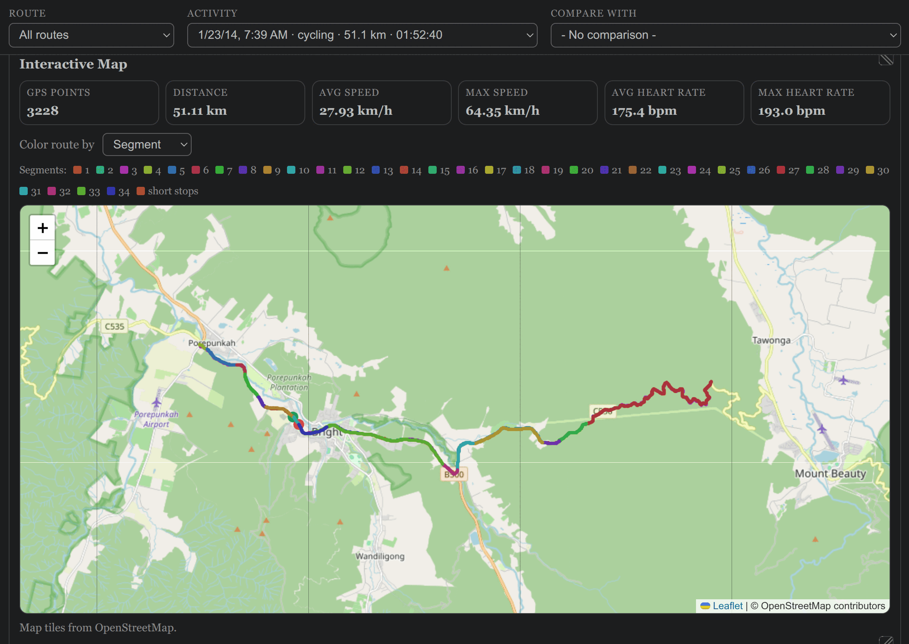
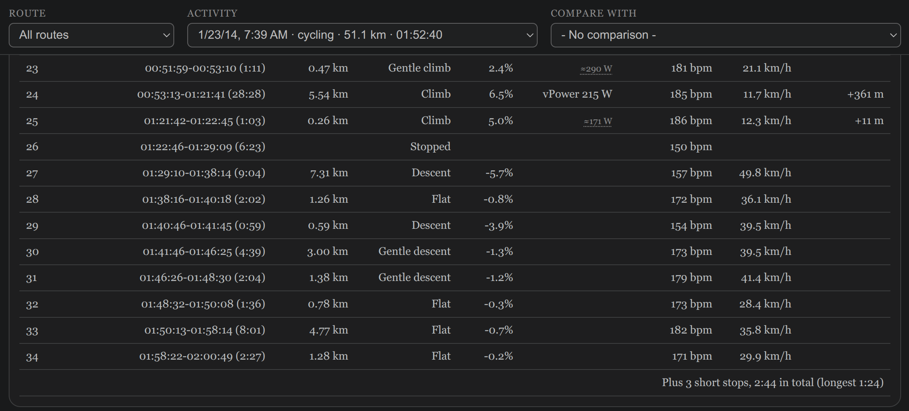
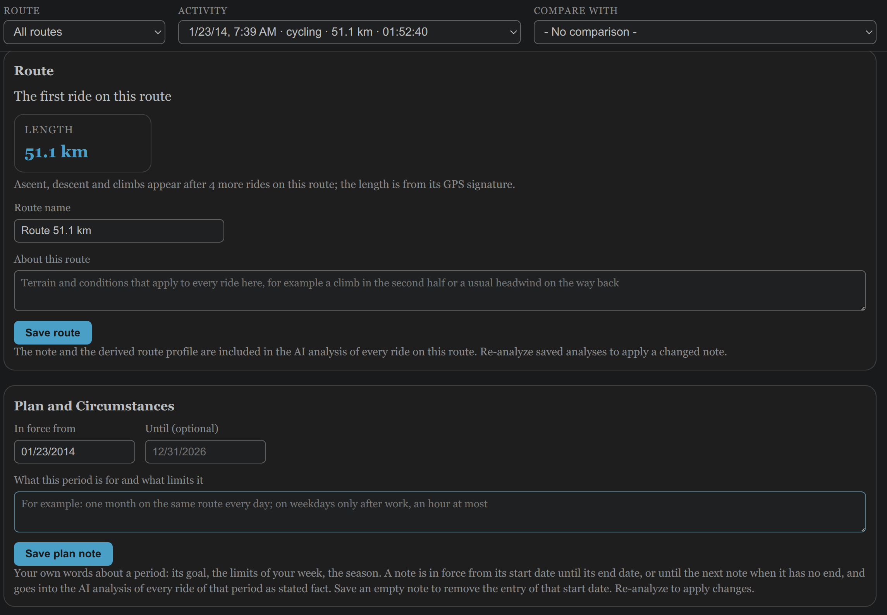
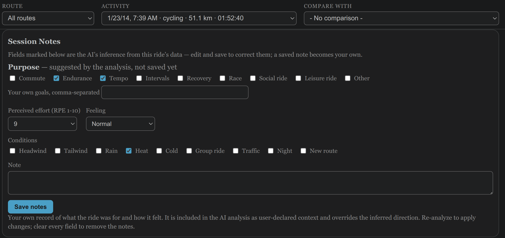

# FIT Visualizer

[Русская версия](README.ru.md)

**A FIT file viewer that doesn't stop at viewing.**

> Maybe a thousand years from now, they’ll dig up a gum wrapper and fragments of coins… — Mumiy Troll

FIT Visualizer is a VS Code extension for working through workouts recorded as `.fit` files by a bike computer or a watch.



- Open a file and the charts, the map and the ride split into stretches of steady effort are there at once.
- A ride on a familiar road is compared with your own earlier rides at the same places: "faster at the same heart rate".
- AI writes an analysis against the goal you declared, and you can discuss it. Everything else works without it, and the data stays in your folder.

Installation: open the Extensions view (`Ctrl+Shift+X`), find **FIT Visualizer** and press **Install**.

For people who already use VS Code and want to work out their own training themselves: the data sits next to the files in SQLite, every request to the AI is logged, and the analysis says what it does not know.

Next: [getting started](#getting-started) · [an example analysis](#an-example-analysis) · [what it looks like](#what-it-looks-like) · [what it does](#what-it-does) · [how it came about](#how-it-came-about) · [AI analysis](#ai-analysis-that-does-not-pretend-the-data-knows-more-than-it-does) · [routes](#routes-and-trends) · [privacy](#local-data-and-privacy) · [settings](#settings) · [if something is wrong](#if-something-is-wrong)

## Getting Started

1. Install the extension: open the Extensions view (`Ctrl+Shift+X`), find **FIT Visualizer** and press **Install**. Or press `Ctrl+P`, paste the line below and press Enter:

   ```
   ext install AntonPetrusevich.fit-visualizer
   ```

2. Open the folder with your `.fit` files (**File → Open Folder**). No files yet? See [where to get them](#what-a-fit-file-is-and-where-to-get-one).
3. Click any `.fit` file. It is added to the local history and opens on the same screen as **FIT: Browse Loaded Data**: the lists of routes, activities and **Compare with** are at the top. Once there is more than one ride, this is also where you switch to another one or lay one over another.
4. Look at the charts, the route on the map and the segment table.
5. At the bottom of the page, right above the analysis, are the **Session Notes**: what the ride was for, how it felt, what the conditions were. Filling them in is optional, but a ride is judged against its declared goals. Without them the AI infers a goal itself and keeps to an observation.
6. If GitHub Copilot Chat is installed and signed in, press **Analyze Activity** in the **AI Analysis** section below the notes.

That is all. Charts, the map and segments work straight away, with no account and nothing uploaded anywhere. Without a profile the heart-rate zones are temporary: they are taken from the highest heart rate held for 15 seconds in this recording. If the ride was not at the limit, they are too low. For real zones, fill in the **Heart Rate Zone Profile** (sex, age, resting heart rate) once on the activity page.

Two more things come in handy later:

- Got a folder of older rides? Run **FIT: Index All Files** from the Command Palette (`Ctrl+Shift+P`) to add them all at once. After new rides, **FIT: Index New Files** adds only the new ones.
- To get back to the history without opening a file, run **FIT: Browse Loaded Data**.

And then comes what is probably the most interesting part: in the **Follow-up Chat** you can question the analysis, correct it and add what was not in the file. What the analysis itself looks like is shown in [the example](#an-example-analysis).

## An Example Analysis

A ride on 31 August, 20.5 km on my usual route. The notes have the goals "Social ride" and "Leisure ride" ticked and say: "conversational ride with my son". The plan says that a month of daily rides ended on 19 August and that I meant to move on to longer routes after it. The analysis was made on 6 October by the claude-fable-5.1 model; the answer came in 32 seconds. The text is given as it is.

> **What kind of ride this was**
>
> You rode this with your son at conversational pace, and the data says exactly that: average HR 118 bpm, 86% of covered time in the low zones, 0% above tempo, and a 1‑minute peak of 143 bpm against 169 bpm as your best of the last 28 and 90 days. The computed class stays undetermined because only 49% of the ride has usable HR above the counting floor; the covered part looks like a recovery‑range spin, but half the ride is not in that picture. Both declared goals - social and leisure - are served: the ride was slower than usual on 77% of the comparable road at a heart rate 21 bpm lower, with 7:10 stopped, which is what riding together looks like, not a finding of mine.
>
> **How the ride unfolded**
>
> The first 11 km were already relaxed (km 3.9-4.5 at HR 112 vs usual 137), and after km 10.8 the pace dropped by 40% relative to the first part - more than in any of the 32 earlier rides on this route, where the usual drop is about 9%. The long stretch km 11.6-16.4 took 19:28 moving at 14.9 km/h with 4:55 stopped, and the final climb km 19.1-19.9 went at 7.5 km/h and HR 124 against usual 154. Nothing here needs explaining beyond the company; the ride is correctly left out of the route's usual values. One note on the recording: altitude started 33 m low and settled after about ten minutes, so the 147 m gain is inflated and the route consensus of ~114 m is the steadier figure.
>
> **Where your training is heading**
>
> The week of 17-24 Aug was three threshold rides with 44% of covered time high; the week of 24-31 Aug was three rides, 55% low and 12% high, including two 33-34 km rides on 26 and 29 Aug. That matches the intention you stated for after your month of daily riding - move on to longer routes - and explains the load ratio of 0.76 for a second week: fewer, longer, mostly easier rides instead of daily ~20 km hard ones. This social ride adds TRIMP 59 of low-zone riding to that mix and changes nothing about the direction.
>
> **Next step**
>
> The ride did what you set out to do, and nothing in the data calls for a change.

What is worth noticing here:

- The ride is judged against its declared goals. The speed is below usual on 77% of the road, yet this is not called a loss of form.
- The goal is met and there is nothing to change — and no step is invented at the end.
- The drop in load over two weeks is read through the plan: the month of daily rides is over, there are fewer rides, but longer ones have appeared.
- The altimeter, the heart-rate coverage, the stops and the weekly load were stated by the code. The model did not compute these numbers; it retold them.
- It is not flawless: the pace drop is counted from km 10.7 in the data, and the answer says 10.8.

## What It Looks Like




The segment table: time, distance, terrain, grade, effort, heart rate and speed of each stretch. Watts in small print on gentle climbs are a rough estimate from speed and grade: it depends noticeably on the wind, which the extension does not know, and heart rate is the measure of effort there.


The altitude profile with speed laid over it and the crosshair on one point; the strip at the bottom shows the segments.


The ride summary: everything essential on one screen, including what the device does not compute itself.


Speed by distance with heart rate laid over it. The crosshair is shared by all charts.


Time in heart-rate zones and heart rate coloured by zone, over the altitude profile.


Manual heart rate and the zone profile with the history of profiles.



The route card and "Plan and Circumstances".



Session notes: goals, effort, feeling, conditions. Here the goals and the heat are suggestions of the analysis, not yet saved.

### The Analysis of This Ride

The screenshots show the [demo ride](#demo-activity): 51 km with a 361 m climb. It has no history, no earlier rides on its route and no declared goals; the notes carry only an effort of 9 out of 10. The analysis was made on 6 October by the claude-fable-5.1 model; the answer came in 20 seconds. The text is given as it is.

> **What kind of ride this was**
>
> The computed class of threshold holds: 72 minutes without a break at or above the zone-4 floor and a 1-hour peak HR of 181 bpm describe one long, sustained hard effort, not repeated surges. The 68% shown in the VO2max zone is inflated, because the profile's zones sit too low for you (holding 181 bpm for an hour is 10% above the threshold the profile assumes), so read the distribution as "almost the whole ride hard", not as VO2max work. Your RPE of 9/10 agrees with that. No goal was declared; the goal taken here is a threshold session, derived automatically from the shape of the ride, not something you stated.
>
> **How it was ridden**
>
> The ride is a 50-minute hard approach, a 28-minute climb at 6.5% (+361 m, VAM ~761 m/h), then a descent and a fast flat finish. On the climb your HR stayed flat, 184.8 to 185.5 bpm between the two halves, while speed eased from 12 to 11.4 km/h and the device temperature read 32→29 °C; a steady HR with slowly falling speed on a constant grade is more consistent with accumulated effort or a steeper upper section than with heat drift, which would normally show HR rising. The 6:23 stop at the top explains most of the 8-minute gap between timer and elapsed time. Even after that, you rode the final 8-minute flat (segment 33) at 182 bpm average, so the finish was ridden hard rather than as a cool-down. No comparable segments or prior peaks were supplied, so nothing here can be set against earlier form.
>
> **Where this sits in your training**
>
> No activities are imported for the 7-day or 28-day windows before this ride, so the history is unknown, not rest, and no pattern or phase can be read from it. The only thing the data supports is that this single session was ridden almost entirely at high intensity with a long climb as its core.
>
> **Observation**
>
> With no earlier rides on this route or in the recent windows, there is no usual to compare against; this ride stands as the first reference point, defined by one 28-minute climb at a steady ~185 bpm and a hard flat finish rather than any easy riding.

Here the analysis has nothing to lean on but one recording, and it says so. The 68% share of the VO2max zone is visible on the zones screenshot; the analysis calls it inflated — that is the code's flag saying the zone profile is set too low. There is no advice at the end: without a goal and without a history there is nothing to derive it from.

## What It Does

Every workout you open goes into a local database, so a new one has something to be compared with. The ride is analysed by the code itself, without AI. The result can be handed to an AI and then discussed with it: why today was harder than a week ago, and whether there is any progress at all. At present the AI is connected through GitHub Copilot.

- **The ride.** Charts, the map and segments appear as soon as the file is open.
- **Segments.** The ride is divided into stretches of steady effort, and on a familiar route also by the stretches of the road itself. If there is a power meter, effort is taken from it. Without one it is estimated by a physical power model on climbs and by heart rate elsewhere; each segment says which.
- **History.** A familiar route is recognised by its track, and the ride is compared with your own earlier ones — at the same places on the road.
- **AI analysis.** First the code analyses the ride and lays the result out by segments, route stretches and earlier rides, so that rides can be compared with one another. From this data the AI writes its analysis. You can question it, correct it and add what was not in the file. How sensible it turns out depends first of all on this data: with it, even the cheapest models draw reasonable conclusions. The model matters more for how smoothly it is worded.
- **Data.** The database and the logs are in the `.fit-visualizer` folder next to the files. The AI receives only a text summary, and only when the analysis is started by hand. Everything else works without it.

My own data is cycling only so far, and that is what everything is tested on. Running, walking, hiking and swimming have profiles of their own: pace in min/km or min/100 m instead of speed, steps per minute instead of revolutions, no power metrics. Unfortunately I could not test them on real workouts of those kinds.

### One Ride

- Opens FIT files in an interactive visual editor
- Speed, heart rate and altitude charts by distance
- Up to two extra metrics over a chart, each with its own coloured Y axis and its values in the shared crosshair; heart rate keeps its zone colours as an overlay too
- A crosshair shared by all three charts: hover one and see the exact values at that point on all of them
- Hover explanations for activity and load terms: power, speed, heart rate, elevation, TSS, Normalized Power, xPower, TRIMP
- The GPS track on an interactive map
- The route coloured by speed, heart rate, segments or kilometres; each segment has its own colour, and the legend above the map carries the segment numbers — the same as in the table
- **Kilometres** mode: the track alternates two colours every kilometre, numbers stand at the boundaries, and hovering shows the time, speed and heart rate of that kilometre — as you know it from a sports watch
- The same segments as translucent bands on all distance charts, with one shared toggle; on a familiar route dashed lines mark the boundaries of its stretches
- A tooltip on a segment on the map or on its band on a chart: duration, distance, grade, speed, heart rate, effort, elevation, a mark for a technical stretch
- A compact table of the detected segments and, if the device recorded them, of laps
- Automatic segmentation of the ride into stretches of steady effort (climb, descent or flat by terrain) and stops; effort is estimated by a physical power model on climbs and by heart rate on the other stretches, and each segment states honestly which was applied
- A wheel-circumference calibration hint: it compares the wheel sensor's distance with GPS on reliable straight stretches and suggests a correction only when there is enough data
- Heart-rate zone profiles with an effective date
- If heart rate, power, cadence or altitude is not recorded, "n/a" is shown instead of zero

### History and Routes

- Indexes activities into a local SQLite database automatically
- Compares two activities on one screen
- A **route card** for rides on a known route: how many rides share it, which direction this ride took relative to the first one, the route's length/ascent/descent from the elevation consensus, the climbs in this direction and three trend indicators with their histories; the first ride on a route gets a card too — the length comes from the GPS signature, and facts are added as rides accumulate
- **The road as the rides show it** in the same card: the stretches of the route with terrain, grade, usual speed and heart rate, and the places where nearly every ride slows down. Read-only — to check against how the road feels from the saddle
- A filter of the activity and comparison lists by one route; the choice is remembered between sessions

### AI Analysis and the Plan

- **Ride goals** — what the whole analysis is measured from. They are ticked in the notes under **Purpose**, several at once, from the list or in your own words. For each one the analysis says whether the ride served it and which data shows it, and the advice at the end has to serve what was declared. Without a goal there is no judgement: what remains is an observation of how the ride differed from your usual ones
- **Plan and Circumstances** — dated notes in your own words about what a period is for and what limits it: "a month on one route every day", "weekdays only after work, an hour at most". A note has a start date and, if needed, an end date: a plan for a month ends with the month. Without an end the note is in force until the next one. It goes into the analysis of every ride of its period
- AI analysis of the current ride in the light of similar earlier rides, recent load and personal bests
- A follow-up chat: you can question, correct and add; your corrections are kept for later analyses
- AI comparison of two activities, segment by segment as well, with the result saved for each direction of the comparison
- Bulk re-analysis after an update that changes the analysis logic, instead of going through rides one at a time; it can also be targeted, for the listed rides only

### Data

- The database and the logs are in your working folder; the original FIT files are not copied anywhere
- AI analysis is optional and needs GitHub Copilot Chat installed and signed in. Without it the charts, the map, segmentation, the route card with the description of the road, zones, calibration and comparison all work
- Your own notes do not need AI either: for a workout — goals, feeling and conditions; for a route — a name and a note about it. The road itself is described by stretches, and that description cannot be edited yet, so the note is the way to add your own to it. Notes are stored in the database and are not lost when a ride is analysed again
- The map can be drawn without a network
- Every request to the model and its answer are logged locally; the retention period is configurable
- The interface, forms, map actions and analysis messages follow the VS Code interface language
- For a language without a packaged localisation, a local translation of the interface can be generated with the selected model

## How It Came About

It all started with choosing a bike computer. I was comparing a Sigma ROX 4.0 at about 80 euros with a CYCPLUS M1 at about 50, and asked Google AI for advice. Among other things it told me that the M1 connects over USB as Mass Storage and the workout files can be taken off it. Bought it.

USB, as it turned out, is for power only, and the files come off over Bluetooth LE. The same Google AI recommended "an excellent open-source solution" — a Python script, [cycplusSync](https://github.com/thefellaguy/cycplusSync). It did fetch the files, but the device name is written straight into the code, and every M1 has its own, with a piece of the MAC address. I [forked](https://github.com/jef-sure/cycplusSync) it and reworked it: the script finds an M1 nearby by itself, remembers its address so that next time it connects at once, and puts the files next to itself wherever it is started from, so what is already downloaded is not fetched again. At first I thought of building it into the extension, so that the extension would collect workouts from the bike computer itself, but I dropped that all-in-one idea: fetching files and making sense of them are too different as tasks. The extension took on FIT files only, hence the name.

Then I needed a program to look at these files. GPXSee, in the version of that time, did not load map tiles: OpenStreetMap had blocked its User-Agent. In the Issues they promised a fix in the next release — surely they fixed it, but I did not wait. GoldenCheetah crashed on my files, even after re-encoding through GPSBabel. Well, I am a programmer! I decided it was easier to write my own.

I did not need just a viewer. Before that I had used Samsung Health: there is a lot of data in it, but you cannot lay the chart of one workout over another. And one workout says little on its own; it is more interesting to compare it with similar ones, with the recent load, and to see a trend over a month at least. That is why the local database appeared. Segmentation appeared for a different reason: I already felt my route as distinct stretches — the viaduct with a sprint, the turn you take at 22–24 km/h, the climb at the end. I wanted the data laid out the same way. Laps and kilometre splits do not give that: they cut the road anywhere. But my own segments brought a problem too: one day I made it through a traffic light, another day I stood at it — and the boundaries had already drifted apart. So on a familiar route rides are now compared at the same places on the road. All of this is what goes to the AI: not the FIT file but a finished analysis of the ride together with the history.

It does not aim at Strava, Garmin Connect or GoldenCheetah. The tool is built to my own idea of what is good: I wanted to work properly with my own data and to see what comes out if the training history is handed to an AI. If Google AI had not been wrong back then, this project might not exist.

Most of the fiddling was not with parsing FIT (that part is trivial) but with segmentation and with making sure the model gets honest data: where power is computed by a physical model, and where it is better not to trust it. Unfortunately there is almost no feedback, and everything is tested on one person and, in effect, on one route. So any message is useful: a file from your device opened or did not, the segments fell differently from how you feel the road, the analysis said something silly. Write to [Issues](https://github.com/jef-sure/fit-visualizer/issues), and better in detail: which device, what you opened, what you expected to see and what you got. From a single word I will understand nothing.

## AI Analysis That Does Not Pretend the Data Knows More Than It Does

AI analysis is optional; the rest of FIT Visualizer works without it.

What it rests on:

- The FIT file is not sent to the model. It receives a text summary of what the code has already analysed.
- The unknown is not replaced by zero. Figures that cannot be computed are not shown at all.
- Estimated power is not measured power, and each segment says which was applied.
- No recording does not mean rest; unknown intensity does not mean zero.
- Physiological state — recovery, fatigue, overload or its absence — is not measured in the data, and the model is forbidden to pass it off as a fact.
- If the data is not enough, the model must say so and not fill the gap with plausible text.
- Your words outweigh the model's hypotheses: a note, a goal and a correction in the chat override earlier AI conclusions.
- The code computes the numbers, the model explains them. Verdicts such as "faster at the same heart rate" are issued in the code, not derived again by the model.

Whether the model keeps these rules is checked offline on saved analyses, but the checks are heuristic and do not guarantee that each single answer is right. I check this on my own rides, nearly all of them on one route, so this is an honest check on a small set, not statistics.

### What the Model Receives

**The ride itself.** The weekday and local start time, distance, time, speed, heart rate, ascent and descent, temperature, TRIMP and the power source. If the barometer was "drifting" at the start, ascent is computed without those minutes, and the device's figure and the route consensus stand next to it.

**Your account and goals.** Filled in in the notes section on the activity page:

- the free note goes first, as your own account of the ride. The model has to refer to it, explain with it what is seen in the data, not present that as a finding of its own and not advise against it;
- ride goals — several at once, from the list or in your own words. They are the yardstick: for each one the model says whether the ride served it and by which data, and the advice has to serve what was declared;
- perceived effort (RPE, Rating of Perceived Exertion) — your own estimate of how hard the ride was, from 1 "very easy" to 10 "at the limit"; feeling and conditions (headwind, rain, heat, …) — as facts you declared; the model must not ask about them again.

**Plan and circumstances.** Filled in in the card of the same name above the notes. These are the goals and limits not of one ride but of a period: a note is in force from its start date to its end date, and if there is no end, until the next note. The analysis gets the note that was in force on the day of the ride and up to three earlier ones — they explain the history rows of those dates. If the period ended before the ride, the model is told plainly that there is no plan for that day, while what the note said about what comes after remains your stated intention. A note dated later than the ride does not reach its analysis. The model has to read the frequency of riding, rest days, repetition of one route, ride length and time of day against the plan: what the plan states is an intention carried out, not a finding and not a risk. This appeared after thirty of my rides in a row on one route looked in the statistics like an absence of rest, although that was exactly the goal for the month.

If no goal is declared, the model says plainly that it derived one automatically from the type of ride. A ride cannot be judged against a goal taken from the ride itself: such a goal is met by construction. So instead of advice the last section holds an observation — how the ride differed from your usual ones on this route, without saying what to do about it.

**The road and the ride on it.** For a route you have ridden five times or more, the prompt carries one table: the ride against the median of the last five, stretch by stretch, at the same places on the road. Each row has moving time, speed, heart rate, stops, the time from the start to the end of the stretch and a verdict from the code. The places where nearly every ride slows down are listed separately, and only lost time counts there. More in [Routes and Trends](#routes-and-trends).

For a ride without such a route the model receives segments and, if the route is already known but has few rides, ten marks along the whole distance against the median of earlier rides.

**Heuristic session class.** A deterministic classifier in the code labels the ride (recovery / endurance / tempo / threshold / VO2max-anaerobic / mixed / unstructured / undetermined) with evidence and confidence. The model has to confirm or dispute the label in one sentence instead of re-deriving zone percentages.

**Load and history.** Volume and covered intensity for the preceding 7 and 28 days and the equal periods before them; the ratio of the load of the last seven days to a usual week; up to 12 earlier sessions of the same sport with summaries of their analyses. Each earlier session carries its weekday and start hour: an evening ride on a weekday and a long one at the weekend are different cases, and a ride should be compared with its own kind.

**Your conversations.** Earlier discussions of activities are passed in full, with the lines of both sides and with no limit on their number: a user's reply is often unintelligible without what it replies to. The assistant's lines are marked as earlier AI hypotheses, not evidence.

<details>
<summary>In detail: the contents of the prompt and the rules</summary>

- **Segments** (when the route has no stretches). For each one the model receives terrain and average grade, speed, distance and what effort was measured by: power, its model estimate or heart rate. For a climb that lasted at least 2 minutes and gained at least 25 m, VAM is added — the rate of ascent in vertical metres per hour. A segment longer than 10 minutes is additionally split in two by time, and the first half is compared with the second by speed, heart rate and measured power: this shows whether the pace sagged or heart rate rose inside a long even stretch. It does not count as a fitness test. If heart rate or grade is not recorded over the whole segment, the share covered is stated. Two segments torn apart by a stop shorter than five minutes (a traffic light, a barrier) are joined into one with a note about the stop, and a "work — rest" alternation repeated three times or more is folded into one line.
- **Device laps.** They go into the prompt only if at least one was set by a button or by a workout programme: such a lap carries an intention the segments do not know. Auto laps by distance or time and laps with no recorded trigger are not passed. No more than 40 laps, with a warning about the omitted ones.
- **Same-route context**: rides are matched by the geometry of the GPS track (same / reversed / partial / different), and direction by the order in which the road is ridden. The prompt gets the route's name, your note about it and the typical pattern (in how many earlier rides the second half is slower, and by how much) — so a regular slowdown is presented as a property of the route, not a finding of the day. Route comparisons are taken over the preceding 90 days.
- **Three computed trend indicators** with verdicts from the code are shown on the route card: **route effort** (time × time-weighted average heart rate from the start to the last shared mark against the median of 5 earlier rides of the same route and direction), **weekly load** (7-day TRIMP in the selected sport against a usual week over 28 days; at least 14 days with heart-rate load are needed) and **post-climb heart-rate recovery** (the drop in bpm over the 60 s after the last climb against 5 earlier rides with a comparable last climb). Load and recovery go into the prompt. Route effort stays on the card only: both of its factors stand in the stretch table as separate numbers, and the product also shrinks for a slower ride at a noticeably lower heart rate, so on its own it does not mean "better". The 80–130% load band describes a comparison with your own history, not a health norm. An available indicator has a verdict and up to six dated values; gaps are not turned into zeros. Without comparable data an indicator is hidden.
- **Route profile**: derived from the route's earlier rides — length and ascent, the climbs in the current riding direction (from the elevation consensus at 100 m resolution) and, if the route has been ridden both ways, near-flat stretches that are noticeably faster in one direction than in the other. Wind is not measured and not claimed; only the asymmetry of directions is recorded.
- **Data quality**: flags for the barometer settling at the start (`ALT_SETTLING`), missing altitude at the start (`ALT_MISSING_START`) and gaps inside the recording (`ALT_GAP`), heart-rate dropouts and a late heart-rate start, loss of contact of a chest strap, a zone profile set too low for this rider (`HR_PROFILE_LOW`: the ride held for an hour noticeably above the threshold the profile assumes), a sun-heated device, a mismatch of session time and a time-zone shift; plus the route's elevation consensus — the steadier figure for comparing days. A flag is a measured fact about the recording, not a caveat, and is mentioned where it changes a conclusion.
- **Candidates for comparison**: earlier segment sequences of the same sport with similar terrain, duration and distance — used for rides without a GPS-confirmed route. Up to four examples are chosen locally. Five ordered GPS points can support an approximate match but not prove that the route is the same; coordinates do not enter the prompt.
- **Volume and covered intensity**: the TRIMP sum, the mix of session classes, time, distance, recorded active days and the available HR-zone time, separated by sport. A usual week is computed over the days for which heart-rate load exists at all: one week of data in a three-week history does not turn into "four times the usual". A gap in the recordings is a prompt for discussion, not a diagnosis of a change of phase.
- **Time in HR zones** by a profile dated no later than the session, or by the legacy setting if there is no such profile, plus an approximate split into low, moderate and high intensity (Recovery+Endurance / Tempo / Threshold+VO2max) for the ride and for each volume period. Detailed signals are taken from the derived-feature cache; coverage limits are stated.
- **Peak sustained heart rate** over 1, 5, 20 and 60 minutes (time-weighted; a window breaks at a heart-rate dropout or a gap in the recording) and the best earlier values of the same sport over 28 and 90 days. Peaks describe the demand of the session, not a change of form.
- **Facts and AI summaries from the history**: up to 12 rows of earlier sessions of the same sport with the intensity of each (the L/M/H split, the 20-minute peak, TRIMP, the session class, your RPE and goals). Each analysis leaves a machine-readable summary (type, finding, advice with its category, an open question, revisions, presumed goals and conditions); the three latest carry the full summary, older ones only the type and the advice category.
- **What does not go into the prompt**, although it is computed and shown on the page: hrTSS (a second load scale from the same heart rate, with nothing to compare it to), the diagnostics of estimated power, data-provenance details, raw seconds per zone next to their own percentages. These repeated what was already passed or were not used in the answers.

The prompt is sent as two messages: instructions first (the principles of working with the data, the answer format, the language rule), then the data and the questions. The analysis confirms or disputes the computed session class, names the goal of the ride, goes through the execution, the mix of stimuli and the intensity distribution over recent periods, and ends with a practical step or an observation. It is not required to issue a verdict on form or recovery.

What the model is directly forbidden to do:

- set numeric targets — no heart rate, speed or time to "hold" or "stay under". A usual value describes earlier rides and is not a goal;
- advise on what you do not control on the bike: traffic, traffic lights, junctions, weather, time of day, the route's profile. A stop is a fact that explains time, not a flaw; cutting stops may be advised only if the declared goal requires it;
- invent a step when the ride met its declared goal and there is nothing to change;
- recompute numbers and call the indicators health or form.

The analysis concentrates on what is new compared with recent summaries and does not repeat the same advice, caveats and questions; each answer ends with a short machine-readable summary block that feeds later analyses (the block is stored separately and not shown in the report). Historical totals do not include the current activity, and rolling periods are tied to their dates. Your clarifications can overturn an earlier AI hypothesis. After a reported operation or illness, FIT does not establish healing, medical clearance or a safe increase of load; a clinician's restrictions outweigh sporting assumptions.

Average and maximum HR do not prove recovery or fatigue; a peak heart rate does not set target zones. Whole-ride estimated power is still excluded; decoupling requires measured power. HR zone names do not prove physiological thresholds, and device temperature is not necessarily air temperature.

Analysis progress survives browsing other activities: the page asks the extension for the state, and repeated requests for one activity share one operation. Database saves run in sequence, separately from generating the answer, so browsing does not wait for the AI's reply. Sometimes a model answers with nothing. This is unrelated to the data, so the request is repeated by itself up to two times and only then counts as an error. By my logs it is a trait of individual models: some do it now and then, another has not answered empty once in hundreds of requests. If the error comes back, choose another model in the analysis card.

</details>

### The Chat

In the chat the model receives the same ride summary, the original analysis and the whole history of the conversation. If the data is not enough, it must say so and ask one clarifying question. Outdated answers and manually entered heart rate do not reach the context, but your corrections are not lost: in August I clarified in the chat that there had been two rest days before a ride, not three, and the analysis of the same ride made anew on 5 October already says two. The date of a message and the period you are talking about are told apart.

The analysis and the chat answers are in the VS Code interface language by default. Only the current question in the chat can change the answer language; earlier messages, archived questions and old AI answers do not affect it. For example, the interface can stay English while you discuss training in another language.

Requests and answers are logged locally (see **Settings**), so you can check exactly what was sent and what came back.

### Which Model Answers

The analysis goes through the VS Code Language Model API. Nothing has to be set up separately in the extension: it sees the models already connected in the editor, including those on your own key. It neither stores nor sees the keys themselves. For a one-off analysis the default is the cheapest available model from the saved table of published prices (the bundled snapshot is used before the first update), with Auto and a search by name as fallbacks. The chat and comparison default to a middle-tier model (sonnet/gemini/gpt-5), and each feature has its own pinned model and its own dropdown. This is not necessarily the model from the Chat view; the log shows who answered.

<details>
<summary>In detail: model selection and prices</summary>

By default the analysis uses the `copilot` language-model vendor in VS Code. The model picker (in the analysis card and in **FIT: Select Analysis Model**) shows every model the editor offers, including BYOK providers with their own vendor ids: the chosen model is passed by its full identifier, so bulk re-analysis works through them when Copilot limits are used up. The `fitVisualizer.lmVendor` setting now only decides which models count as "default".

A one-off activity analysis (not the chat) by default uses the cheapest of the available Copilot models by published per-token price: the VS Code API does not expose prices. For models missing from the table the `Auto` family is tried, then a name heuristic (`fitVisualizer.cheapModelMarkers`, e.g. `haiku`, `mini`, `flash`, `luna`). To use the default model, set `fitVisualizer.preferCheapAnalysisModel` to `false`. The chat and AI comparison default to a middle-tier model (a named middle tier if there is one, otherwise the median of the price ranking) and are pinned separately for each feature. None of these paths is officially guaranteed by the VS Code language-model API, and the log of each request records which model answered.

To refresh prices from [GitHub's official table](https://docs.github.com/en/copilot/reference/copilot-billing/models-and-pricing), run **FIT: Update Model Prices** from the Command Palette (`Ctrl+Shift+P`). The validated input and output token rates of the regular context are saved in VS Code's local extension storage and apply to the next analysis and bulk re-analysis requests without a restart. On a download error or an unknown format the previous prices stay; before the first successful update the bundled snapshot is used. Only the public document is downloaded: no workout data is sent and no Copilot allowance is spent. The ranking is still approximate, weighting input 3 to output 1; cache, long context and plan terms can change the actual cost.

</details>

## Comparing Activities

**What you see.** Two activities on one screen: the charts of the second are laid over the charts of the first, and its track is drawn on the map as a dashed line. The **AI Analysis** section lists every saved comparison for the current activity, labelled the same way as in the "Compare with" list (date, sport, distance, duration).

**Why.** One workout says little on its own. Laying yesterday's ride over today's is what I missed in Samsung Health.

**How it works.** If you pick an activity to compare with in the toolbar, a **Compare with AI** button appears for that pair. The AI compares the two workouts by segments — the main one ("This Workout") with the selected one ("Another Compared Activity") — without assuming that the segments match in order: a stop can split a segment of one ride in two while in the other it stays whole. The list of saved comparisons does not depend on what is currently selected in "Compare with", so they stay visible after another activity is chosen or the selection is cleared.

Comparisons are stored for each pair with its direction: comparing A with B and B with A are saved separately. If a pair already has a saved comparison, **Compare Again** is offered. Each saved comparison has its own **Remove Comparison** button.

**Limitations.** A comparison made by an earlier version of the analysis is marked as outdated but does not update itself: it has to be run again. Two rides on different routes are compared only by what is comparable between them.

## Effort Segmentation

**What you see.** The ride laid out in segments: on the map and as bands on the charts they are coloured by terrain, and in the table each has its duration, distance, average grade and an effort estimate.

**Why.** Laps and kilometres cut a ride where it means nothing. A boundary where the effort changed means something.

**How it works.** A ride is divided into segments where the effort changes, plus stops. A segment is a stretch of roughly steady effort no shorter than a minute: a new one starts when the effort moves to another level and stays there. What it is measured by depends on the place. On a climb — by power (a step of about 30 W): nearly all the work there goes into lifting the mass, and even an estimate from speed and grade is reliable, while heart rate only catches up with the effort and would cut one climb into steps. On level road without a power meter — by heart rate (a step of about 5 bpm): the power estimate there depends almost entirely on the air, and the wind is unknown. Measured power cuts everywhere. Terrain only names a segment (climb, descent, flat, and between 1% and the climb threshold — gentle climb and gentle descent); one segment can hold both a slight rise and a slight fall if the effort was the same. The exception is a descent: it stays one segment however heart rate changes. Speed on a descent is set by the grade and by caution, and heart rate falling after a climb is not a change of effort. Heart rate is read 20 s back, because it lags behind the effort that caused it. Rides without heart rate are divided by power alone, and without both signals — by grade. The effort estimate for a segment:

- **Measured power**, when there is one, remains the main effort signal.
- **Climbs** may use vpower if the grade coverage and the check of the model's components allow a conditional relative comparison. Otherwise heart rate is preferred; without heart rate a climb estimate may remain for rough description only.
- **Flats and descents** are described by heart rate when there is one.
- Segments where the speed data itself is unreliable (technical descents, poor GPS reception) are marked as such — with no effort number rather than a misleading one.

On a route you have ridden five times or more, the segments rest on the road itself. A ride is cut first at the boundaries of the route's stretches and, inside a stretch, by effort, so every segment lies within one stretch and takes its terrain from the road: the same climb stays a climb on every ride. How the stretches are built is described in [Routes and Trends](#routes-and-trends).

This segmentation is also used in the AI analysis, so the model can reason about specific stretches and not only about whole-ride averages.

Hover a coloured stretch of the route or the matching band on a chart to see the segment's characteristics. Fields not available for a segment are not shown.

<details>
<summary>In detail: the estimated-power model and grade</summary>

The vpower model accounts for gravity, rolling, aerodynamics and acceleration. Frontal area and rolling resistance are configurable; wind is not modelled. Grade is computed as a robust local fit of height against distance in windows from 30 to 120 m, not as the difference of neighbouring heights. Many devices hold altitude in place and then catch up with a jump of a metre or two; on a gentle road a short window sees either the shelf or the jump. Where altitude stands still over most of the surrounding 240 m, a wide window is taken, up to 480 m, and it stops before a real slope. Stops, missing altitude, gaps in the recording and distance resets split the computation. A real slope above 18% is not rejected for steepness alone.

Power and segmentation use one spatial grade profile. For segments where vpower is the measure of effort, the window size, the residual scatter, the signal coverage and the sensitivity of power to grade and mass are computed. This is a check of consistency and applicability, not a confirmed error in watts: a smooth altitude error, an unknown wind or a wrong mass can still spoil the result. Absolute accuracy has to be checked against a power meter.

</details>

**Limitations.** Without a familiar route the same road is divided differently on different days — the effort is its own each day; an ordinary ride gives about 15–20 segments per hour. Estimated power is fit for relative comparison of climbs, not as a replacement for a meter. The thresholds (the grade limit, the minimum segment length, stop detection, the GPS trust window and so on) are configurable — see [Settings](#settings) — and are meant to be tuned to your terrain and riding style, not used as fixed values.

## Segments and Laps

**What you see.** Below the charts FIT Visualizer shows the detected segments. If the FIT file has laps recorded by the device, a compact switch shows their original summaries as well. On a familiar route the stretches of the road appear in the table as headings, with the ride's segments under them.

**Why.** Segments show how the ride actually went, and laps show how the device, or you with a button, marked it up. Sometimes both are needed.

**How it works.** Each view has only the columns there is data for: time, distance, heart rate, power, grade, elevation.

**Limitations.** The table shows every lap from the file. They reach the AI analysis only if at least one was set by a button or by a workout programme; an automatic device lap does not count as an intended interval.

## Routes and Trends

**What you see.** The route card on the ride's page: how many rides share it, which direction this one took, length, ascent and climbs, three trend indicators with histories. Below is **The road as the rides show it**: the stretches with terrain, grade, usual speed and heart rate, and the places where nearly every ride slows down. A route can be given a name and a note — the note goes into every analysis of rides on that route.

**Why.** Only the same thing can be compared honestly. A ride on a familiar road is compared with your own earlier rides on it, stretch by stretch, and "slower than usual" stops being a feeling.

**How it works.**

A route is recognised by the geometry of the GPS track: the same road, the reverse direction, a partial match or a different route. Direction is determined by the order in which the road is ridden and is not confused if a loop is entered from another place. Of several fitting routes the nearest is chosen. Records before the first GPS fix do not enter the track.

When a route has gathered five rides, FIT Visualizer reads the structure of the road from all the rides at once:

- **points** — places where nearly every ride slows down: a junction, a crossing, a turn without a view. They are found by the median speed along the road. Speed there is set by safety, not form, so only lost time is compared;
- **stretches** — the road between the points, divided further where the terrain changes. The terrain of a stretch is taken from the altitude of all rides at once, with each one's barometer offset removed.

A ride is measured between the same places: moving time, speed, heart rate, stops. "Usual" for a stretch is the median of the last five rides that rode it along the same road. The verdict for a stretch is issued by the code: "faster at the same heart rate", "slower at a lower heart rate" and so on. On a steep descent effort is not judged: speed there is set by the grade and by caution.

What is taken into account from how people actually ride:

- **Detours.** A ride that left the road on part of a stretch — roadworks, an early variant of the route — is not compared on that stretch and does not enter its "usual". The other stretches are compared as always.
- **A route that changed.** The reference road is a recent ride, not the first: a route is usually not found at the first attempt.
- **Unusually easy rides.** A ride that is slower than usual nearly everywhere at a noticeably lower heart rate — with company, a recovery spin, a leisure ride — is called exactly that, not presented as a loss of form, and does not enter the "usual" for later ones.
- **Stability.** Stretch boundaries should not jump with every new ride: a new one appears when it is clearly there and goes when it is clearly gone.

The route's length and the kilometre marks of the stretches are measured on the map, not by the wheel sensor.

**Limitations.** Below five rides there are no stretches, and rides are compared at marks along the road. The set of points depends on thresholds: a place where roughly nine rides in ten slow down may or may not become a point. The heart-rate recovery indicator needs a minute of riding after the last climb — on a route that ends at the top it will not appear. Wind is not measured. The description of the road cannot be edited by hand yet.

## Wheel Calibration

**What you see.** A hint with a suggested correction of the wheel circumference — when there is one.

**Why.** If the bike has a wheel speed sensor, the distance it covers depends on the configured wheel circumference. A couple of per cent of error is a different average speed and a different route length.

**How it works.** FIT Visualizer compares the sensor's distance with GPS on long straight stretches with a good track and suggests a correction only when there is enough reliable data.

**Limitations.** Otherwise it stays silent — deliberately: a bad correction is worse than none.

## Heart-Rate Zones

**What you see.** Time in five zones for the ride and the heart-rate line coloured by zone — both on its own chart and when heart rate is laid over another.

**Why.** The average heart rate of a ride says almost nothing about how it went. The distribution across zones does.

**How it works.**

- A zone profile is in force from its date until the next one: a ride ten years old has one set of zones, today's has another, and each is compared by its own. The history of profiles is shown in the card as a list; an entry can be edited or deleted. Repeats with the same numbers are removed by the extension itself
- Automatic calculation: the maximum heart rate is the greater of the Tanaka estimate (208 − 0.7 × age) and the maximum in the FIT data; manually entered heart-rate values are not used. The formula gives an average across people, and a particular person's real maximum can differ by ten beats either way: I have seen 10 above the calculated one in myself. If you know yours, enter it in the profile instead of the calculated one.
- Age is entered in the form as a number but stored as the year of birth that follows from it. So it does not go stale: the form shows the present age, and a profile dated in another year is computed for the age on that date. The boundaries of zones 2–5 follow Karvonen: resting heart rate + 60/70/80/90% of the reserve (maximum − resting). This is an estimating formula; dated user profiles take precedence.
- Zone names: Recovery, Endurance, Tempo, Threshold and VO2max. The 80–90% band is not called anaerobic.
- TRIMP is integrated over the heart-rate records, not computed from the average heart rate of the whole ride. hrTSS integrates the square of intensity relative to the reserve between resting and threshold heart rate (an hour at threshold = 100); the threshold is estimated from the zone profile, because there is no direct LTHR test. A user's LTHR from a test, if set, is used instead of the estimate.
- Average heart rate, power and cadence are weighted by the time each record covers, so "smart" recording with sparse points does not distort them
- Manual values can be saved and reused

**Limitations.** Without a profile the zones are temporary: they are computed from the peak of the recording itself, are visible only on the page and are labelled as temporary. Such zones do not go into the database, into comparison with the history or into the AI analysis. The hrTSS threshold is estimated from the Threshold zone or 85% of the maximum, not verified by an LTHR test; it is not a validated counterpart of a commercial scale. Zone names do not prove physiological thresholds.

## Local Data and Privacy

FIT files can contain sensitive data: GPS coordinates (and so the address you usually start from), time, heart rate, device details and training history.

**What stays with you.** FIT Visualizer stores activity data locally in the working folder.

- Database: `.fit-visualizer/fit-data.sqlite`
- Logs of requests to the AI and its answers: `.fit-visualizer/logs`
- Scope: the working folder (or a selected folder)
- Indexed activities persist between sessions
- Derived data (segments, zones, routes, stretches) is rebuilt on indexing and after updates that change its format; route names and notes, ride notes and goals, and plan notes are kept

Viewing FIT files, indexing, charts, the map, segmentation, heart-rate zones, wheel calibration and the activity history work locally in VS Code. FIT Visualizer does not upload or copy the original `.fit` files anywhere.

A file opened from a folder with no database of its own, when you already have a database elsewhere, does not start a new database silently. The extension asks: **View only** or **Start a database here**. "View only" puts the file into a temporary database in the extension's storage; it is cleared before each file and never becomes the "last" one. The last database can still be viewed from any folder.

**What goes to the AI.** AI analysis is optional. Data leaves, at present through GitHub Copilot, only when you start the analysis yourself: with the **Analyze Activity** button, a question in the chat, **Compare with AI** or the re-analysis commands. What is passed: the facts of the activity, calculations, segments, history, AI hypotheses, your notes and goals, plan and circumstances notes and earlier discussions in full, including health details if you wrote them. The original FIT file and GPS coordinates are not sent. The transfer follows your Copilot settings.

The selected model can also generate a missing translation of the interface if there is no packaged localisation for the VS Code language. Such a request contains only fixed interface and glossary strings — no activity, location, health or analysis data.

**What OpenStreetMap sees.** By default the map loads background tiles from `tile.openstreetmap.org`, so the tile server sees which area of the map you are looking at (but not the track itself).

**What is downloaded on a price update.** The model-price update command requests GitHub's public pricing page and passes no activity data.

**What is in the logs.** If the `fitVisualizer.logLlmRequests` setting is on, requests to the AI and its answers are saved locally in `.fit-visualizer/logs`. The logs contain the same sensitive context as the requests themselves.

**Retention.** Set by `fitVisualizer.llmLogRetentionDays` for one-off analyses and `fitVisualizer.llmChatLogRetentionDays` for chats and comparisons.

**How to do without a network.** Set `fitVisualizer.map.tiles` to `none` to draw the route on a neutral background with no network requests. Do not run the price update — the bundled snapshot is used until then. Do not run the AI features — everything else does not depend on them.

**How to delete everything.** The database and the logs are in the `.fit-visualizer` folder next to your files; delete the folder and the whole local history is gone. The original `.fit` files are not touched.

Before using AI features with activities that contain sensitive data, check your GitHub Copilot and logging settings.

## Commands

- FIT: Visualize File — open a file
- FIT: Browse Loaded Data — browse the loaded activities
- FIT: Index All Files — re-index every `.fit` file of the folder; it also rebuilds the derived data (segments, zones, classes, routes) and refreshes the device altitude figures
- FIT: Index New Files — index only the new ones
- FIT: Index This File — re-read one file and refresh the derived data (segments, zones, routes) in the same run
- FIT: Add Manual Activity — enter a workout by hand when there is no FIT file (say, the bike computer stayed at home), so that it still counts in the history and the analysis
- FIT: Select Analysis Model — choose the analysis model from all those the editor offers
- FIT: Re-analyze Outdated Analyses — process all activities with an outdated or missing analysis in one batch in chronological order, after confirming the total number of requests to the AI; current analyses are not changed
- FIT: Re-analyze Selected Activities — analyse again only the listed activities (ids or parts of file names, for example a date: `18, 120, 20260831`) whatever the version of the saved analysis; handy for trying a new version on a few rides first
- FIT: Update Model Prices — download the official GitHub Copilot price table and save it locally for later analyses; no request to the AI is made

The context menu of a `.fit` file in the Explorer has two shortcuts to the commands above — **Visualize File** and **Index This File**; nothing else is added there, and segmentation, analysis and everything else happen in the visual editor once the file is open.

## Settings

Most settings can be left alone. The segmentation thresholds are needed mainly if your terrain or riding style differs noticeably from ordinary road or gravel riding.

| Setting | Default | Purpose |
| --- | --- | --- |
| `fitVisualizer.maxHeartRate` | — | Legacy fallback maximum heart rate; prefer a dated zone profile on the activity page. |
| `fitVisualizer.logLlmRequests` | `true` | Write each request to the AI and its answer to `.fit-visualizer/logs`. |
| `fitVisualizer.llmLogRetentionDays` | `30` | Delete request logs older than this many days; `0` keeps them indefinitely. |
| `fitVisualizer.llmChatLogRetentionDays` | `180` | Delete chat and comparison logs older than this many days; conversations are kept longer than one-off analyses. `0` keeps them indefinitely. |
| `fitVisualizer.lmVendor` | `copilot` | VS Code language-model vendor ID used for analysis and chat. |
| `fitVisualizer.analysisModelId` | `` | Pins one-off analyses to one model id, overriding the cheapest-model selection; useful for reproducible prompts. |
| `fitVisualizer.comparisonModelId` | — | Pins the model for AI comparisons; the default is an automatic middle-tier choice (sonnet/gemini/gpt-5). |
| `fitVisualizer.chatModelId` | — | Pins the model for the chat; the same middle-tier default. |
| `fitVisualizer.powerModel.dragArea` | `0.32` | Effective frontal area CdA (m²) for estimated power: ~0.25 tucked on a TT bike, ~0.32 on the hoods, 0.40+ upright. |
| `fitVisualizer.powerModel.rollingResistance` | `0.004` | Rolling resistance Crr; raise it for wider or knobbly tyres. |
| `fitVisualizer.segmentation.gradeThresholdPct` | `2.5` | Grade (%) from which a segment is called a climb or a descent rather than flat. |
| `fitVisualizer.segmentation.gradeHysteresisPct` | `0.5` | Margin for switching terrain type; used only for rides with neither heart rate nor power. |
| `fitVisualizer.segmentation.minSegmentSeconds` | `45` | A shorter stretch of movement between two stops is treated as part of the stop. |
| `fitVisualizer.segmentation.technicalGradePct` | `-8` | Descent grade below which an erratic speed trace marks the segment as technical (no effort estimate). |
| `fitVisualizer.segmentation.effortMinSegmentSeconds` | `60` | Shortest stretch of steady effort that becomes a segment of its own. |
| `fitVisualizer.routeSections.minRideSharePct` | `90` | A place where rides slow down (a junction, a crossing, a turn without a view) becomes a point of the route when at least this share of its rides slow down there; rides are compared by the stretches between the points. |
| `fitVisualizer.routeSections.placeToleranceM` | `0` | How far from the route's road a ride may be and still count as riding it, in metres; `0` means 60 m. A ride further away on part of a stretch (a detour, an early variant of the route) is not compared on that stretch. |
| `fitVisualizer.routeSections.minRides` | `5` | How many rides a route needs before it is cut into stretches; below that, rides are compared at marks. |
| `fitVisualizer.routeSections.autoAdjust` | `true` | When no slow-down reaches the required share, lower it step by step (never below 70%) until the route has at least one point. |
| `fitVisualizer.segmentation.effortHrStepBpm` | `5` | Heart-rate difference that counts as a different level of effort. Lower gives more segments. |
| `fitVisualizer.segmentation.effortPowerStepWatts` | `30` | Power difference (measured or estimated) that counts as a different level of effort. Lower gives more segments. |
| `fitVisualizer.segmentation.stopSpeedKmh` | `1` | Speed at or below which a record counts as stopped. |
| `fitVisualizer.segmentation.stopMinSeconds` | `10` | Minimum duration of a stop or an auto-pause gap. |
| `fitVisualizer.segmentation.gpsTrustMinKm` | `1` | Minimum continuous straight distance after which a GPS window can confirm the recorded speed or calibrate against it. |
| `fitVisualizer.map.tiles` | `osm` | Map tiles: `osm` loads OpenStreetMap tiles over the network; `none` draws the route offline with no network requests. |

> The table lists the keys most users need. `preferCheapAnalysisModel`, `cheapModelMarkers`, `analysisModelId` and `lmVendor` control which model answers; see the AI analysis section above.

## Upgrading

New users can skip this section. If the local history already has rides, two kinds of stored results can go out of date after an update. They are refreshed by different commands from the Command Palette (`Ctrl+Shift+P`):

| What is stored | Refresh with | When it is needed |
|---|---|---|
| **Saved AI analyses** — the text the model wrote for each ride | **FIT: Re-analyze Outdated Analyses** | After almost every update: the analysis prompt changes often, and the activity page marks older analyses as *Analyzed with an older version*. One request to the AI per outdated ride; current analyses are left alone. |
| **Indexed data** — the figures read from the FIT files into the local database | **FIT: Index All Files** | Only when a release changes *what exactly is read from the file*. The changelog says so explicitly under *Upgrade Notes*. Last time — 0.29.0: device ascent and descent above 5000 m or below 5 m were stored with a wrong multiplier. If you have no such rides and indexed with 0.20.0 or later, it is not needed. |

Derived data (segments, zones, routes, route stretches) needs no command: on the first start after an update that changed its format it is recomputed before the first page opens, with a progress notification ("FIT Visualizer: rebuilding derived features", N/M). The route names and notes you entered are carried over to the rebuilt routes. If you start a re-analysis while the recomputation is still running, the re-analysis simply waits for it to finish.

Re-indexing is local and does not change the original FIT files. Re-running the AI analysis is not required: old analyses stay where they are, only marked as made by an earlier version. If you do run it, each request goes to the AI with the same contents as an ordinary analysis and spends the Copilot allowance.

## What a FIT File Is and Where to Get One

FIT (Flexible and Interoperable Data Transfer) is the binary format in which most GPS bike computers, sports watches and fitness apps record an activity: coordinates, speed, heart rate, power, cadence and more, roughly one record per second. It was originally developed by Garmin, but it is an open format, used far beyond Garmin devices.

How to get `.fit` files off common devices:

- **Garmin**: Garmin Connect → activity → **⋯** → *Export Original*. Or connect the device over USB and copy the files from `GARMIN/Activity`.
- **Wahoo**: the ELEMNT app → ride → share/export.
- **Polar**: Polar Flow → activity → export, choose FIT.
- **Suunto, COROS, Bryton, Sigma and most other GPS computers and watches**: the companion app usually has an export; if not, connecting over USB often shows a folder such as `Activities` or `Garmin` with the original `.fit` files.
- **Zwift**: saves automatically after each ride to `Documents/Zwift/Activities`.
- **Strava**: if the ride was uploaded from a device (not entered by hand), *Export Original* on the activity page returns the original `.fit` file.
- **Samsung Health** (Galaxy Watch): there is no direct export to FIT. There is a third-party Python project, [samsung-health-to-garmin](https://github.com/joaoruimatos/samsung-health-to-garmin): it turns recorded workouts from the "Download personal data" export into `.fit` files. Unfortunately I have not tried it myself yet.
- **CYCPLUS M1** (no companion app): see [cycplusSync](https://github.com/jef-sure/cycplusSync).

## Demo Activity

The screenshots show a public cycling ride from the [kuperov/fit](https://github.com/kuperov/fit) repository. It has a real GPS track and a noticeable climb, so it shows the map, altitude, segmentation and analysis well.

## If Something Is Wrong

- **The zones are labelled as temporary.** There is no heart-rate profile, and the zones are computed from the peak of this recording. Fill in the **Heart Rate Zone Profile** on the activity page. If the recording has no heart rate at all, there will be no zones.
- **The map has no background or is empty.** Tiles are loaded from the network; with `fitVisualizer.map.tiles` = `none` the route is drawn on a neutral background. If the file has no GPS, the map says so.
- **The analysis is marked as made by an earlier version.** Run **FIT: Re-analyze Outdated Analyses**.
- **"Copilot Chat is not installed or you are not signed in".** The AI features need GitHub Copilot Chat installed and signed in.
- **A message about the Copilot limit.** Wait and start the analysis again; bulk re-analysis stops at the limit and continues from the next run.
- **After an update the page does not open at once.** Derived data is being recomputed — wait for the "rebuilding derived features" notification to finish.
- **Opening a file asks about a database.** The file lies outside the folder where you already have a database; choose **View only** if you do not want to start a separate history.
- **I ticked a goal and the analysis ignored it.** Ticking a goal is saved at once; after it the analysis has to be started again.

Anything else — write to [Issues](https://github.com/jef-sure/fit-visualizer/issues).

## Known Limitations

- Route stretches appear from five rides and are tested mainly on one route — mine. On other roads the thresholds may need tuning.
- The post-climb heart-rate recovery indicator does not appear on a route that ends at the top of its last climb.
- Wind is not measured and not derived from the data.
- Estimated power is a physical model without wind; absolute values need a meter.
- The hrTSS threshold is an estimate until a tested threshold heart rate is set.
- The check of the model's answers is heuristic: it catches typical violations but does not guarantee that a single answer is right.
- The description of the road on the route card is read-only.
