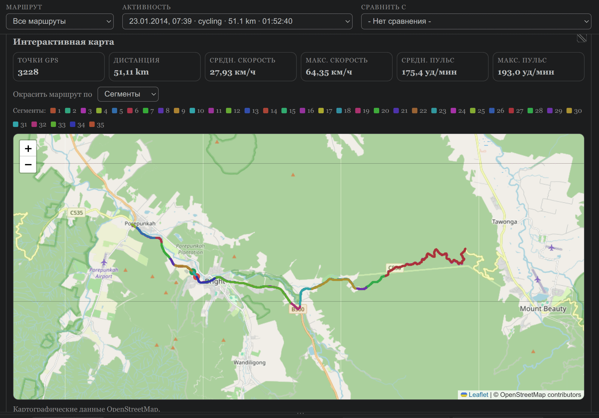
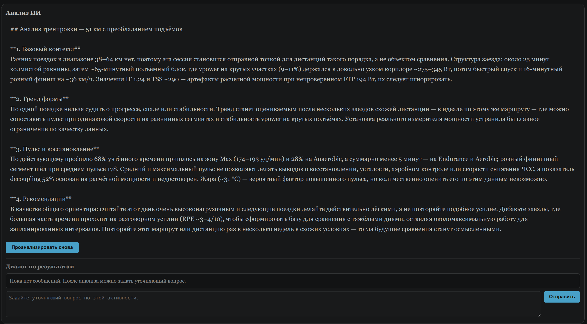
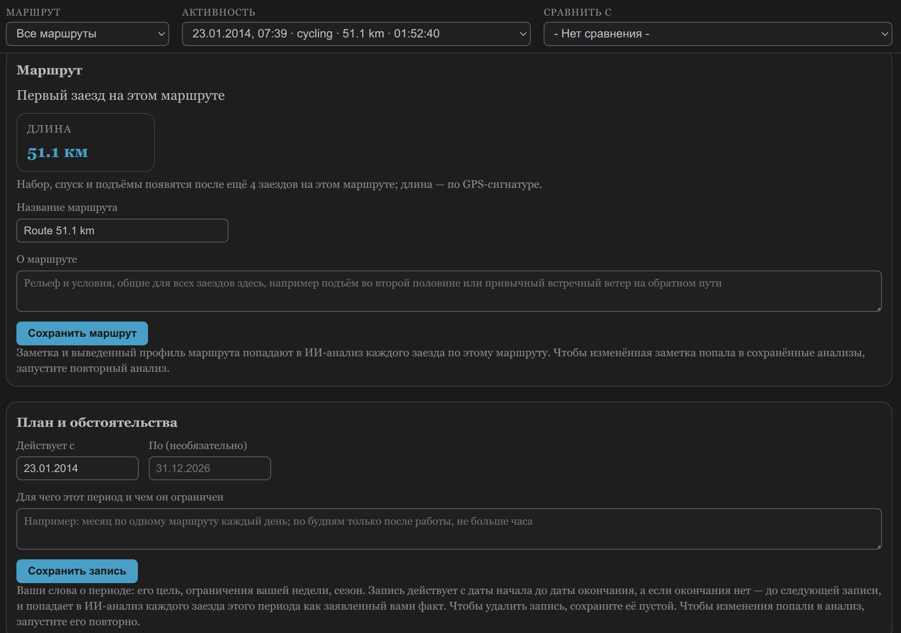
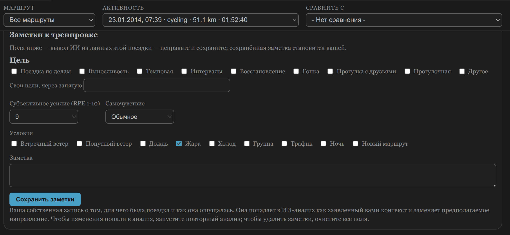

# FIT Visualizer

[English version](README.md)

**FIT file viewer, который не останавливается на просмотре.**

> Быть может, откопают через тысячи лет фантик от жвачки и осколки монет… — (c) Мумий Тролль

FIT Visualizer — расширение VS Code для разбора тренировок из `.fit`-файлов с велокомпьютера или часов.



- Открыли файл — и сразу графики, карта и поездка, разложенная на участки ровного усилия.
- Заезд по знакомой дороге сравнивается с вашими же прошлыми по одним и тем же местам: «быстрее при том же пульсе».
- ИИ пишет разбор относительно цели, которую вы заявили, и с ним можно это обсудить. Всё остальное работает без него, а данные лежат в вашей папке.

Установка: откройте панель расширений (`Ctrl+Shift+X`), найдите **FIT Visualizer** и нажмите **Install**.

Для тех, кто и так пользуется VS Code и хочет сам разбираться в своих тренировках: данные лежат рядом в SQLite, каждый запрос к ИИ записан, а анализ говорит, чего он не знает.

Дальше: [с чего начать](#с-чего-начать) · [пример анализа](#пример-анализа) · [как это выглядит](#как-это-выглядит) · [что умеет](#что-умеет) · [как это появилось](#как-это-появилось) · [ИИ-анализ](#ии-анализ-который-не-делает-вид-что-данные-знают-больше-чем-знают) · [маршруты](#маршруты-и-динамика) · [приватность](#локальные-данные-и-приватность) · [настройки](#настройки) · [если что-то не так](#если-что-то-не-так)

## С чего начать

1. Установите расширение: откройте панель расширений (`Ctrl+Shift+X`), найдите **FIT Visualizer** и нажмите **Install**. Или нажмите `Ctrl+P`, вставьте строку ниже и нажмите Enter:

   ```
   ext install AntonPetrusevich.fit-visualizer
   ```

2. Откройте папку с `.fit`-файлами (**File → Open Folder**). Файлов пока нет? Смотрите, [где их взять](#что-такое-fit-файл-и-где-его-взять).
3. Кликните любой `.fit`-файл. Он добавится в локальную историю и откроется на том же экране, что и **FIT: Browse Loaded Data**: вверху списки маршрутов, активностей и **Сравнить с**. Когда поездок больше одной, отсюда же можно перейти к другой или наложить одну на другую.
4. Посмотрите графики, маршрут на карте и таблицу сегментов.
5. Внизу страницы, прямо над анализом, стоят **Заметки к тренировке**: зачем ехали, как ощущалось, какие были условия. Заполнять необязательно, но заезд оценивается относительно заявленных целей. Без них ИИ выводит цель сам и ограничивается наблюдением.
6. Если установлен и подключён GitHub Copilot Chat, нажмите **Анализировать активность** в разделе **Анализ ИИ** под заметками.

Всё. Графики, карта и сегменты работают сразу, без регистрации и без загрузки куда-либо. Пульсовые зоны без профиля показываются временные: от самого высокого пульса, удержанного 15 секунд в этой записи. Если поездка была не на пределе, они занижены. Для настоящих зон один раз заполните **Профиль пульсовых зон** (пол, возраст, пульс покоя) на странице активности.

Дальше пригодятся две вещи:

- Есть папка со старыми поездками? Запустите **FIT: Index All Files** из палитры команд (`Ctrl+Shift+P`), чтобы добавить их все разом. После новых поездок **FIT: Index New Files** добавит только новые.
- Чтобы вернуться к истории, не открывая файл, запустите **FIT: Browse Loaded Data**.

А дальше начинается, пожалуй, самое интересное: в **Диалоге по результатам** анализ можно переспросить, поправить и добавить то, чего в файле не было. Как выглядит сам анализ — в [примере](#пример-анализа).

## Пример анализа

Заезд 31 августа, 20,5 км по моему обычному маршруту. В заметках отмечены цели «Прогулка с друзьями» и «Прогулочная» и написано: «тестовая поездка с сыном». В плане записано, что месяц ежедневных поездок закончился 19 августа и дальше я собирался переходить к более длинным маршрутам. Анализ сделан 6 октября моделью claude-opus-5.5, ответ пришёл за 29 секунд. Текст приведён как есть.

> **Что это была за поездка**
>
> Ты сам написал: «тестовая поездка с сыном». Данные это подтверждают. Средний пульс 118 при максимуме 151. В учтённой части 86 % времени пришлось на восстановительную и базовую зоны, а 0 % — на пороговую и выше.
>
> Автоматический класс не определён: пульс выше нижней границы зон покрыт меньше чем наполовину. Ничто в данных не противоречит тому, что это восстановительная по нагрузке прогулка: пиковые 5 минут дали всего 133 bpm.
>
> Обе заявленные цели выполнены:
> - **Совместная поездка:** ты проехал весь маршрут 20,46 км вместе с сыном. Остановки заняли 7:10.
> - **Прогулка:** темп был спокойный — медленнее обычного на 77 % сопоставимой дороги, при пульсе на 21 bpm ниже.
>
> Здесь эти цели друг другу не мешают.
>
> **Как прошла поездка**
>
> До 4-го км всё шло почти как обычно. Отрезок км 1,1–3,3 ты проехал даже чуть быстрее при похожем пульсе.
>
> Дальше темп задавала компания:
> - Больше всего времени ушло на км 11,6–16,4: 19:28 вместо обычных 12:23, из них 4:55 стоянки.
> - Финальный подъём занял 6:02 при пульсе 124. Обычно здесь пульс 154.
>
> На км 5,9–8,6 датчик пульса пропал на 194 с, поэтому усилие на этом отрезке неизвестно. Пиковая минута 143 bpm против лучшего значения за 28 дней — 169 bpm (14.08). Это просто описание лёгкого характера поездки, а не показатель формы.
>
> Набор высоты 147 м завышен: в начале записи высотомер долго выходил на правильный уровень. Для маршрута надёжнее ориентир ~114 м.
>
> **Куда движутся тренировки**
>
> Месячный план «час каждый день» закончился 19.08. После него ты собирался переходить к более длинным маршрутам. Поездки 26.08 и 29.08 по 33,6–33,7 км — как раз этот шаг.
>
> Распределение нагрузки тоже сдвинулось:
> - Неделя до 24.08: три пороговых заезда, 44 % времени в высоких зонах.
> - Последняя неделя: темповый, смешанный и базовый заезды, 12 % в высоких зонах.
>
> Отношение недельного TRIMP к среднему за 28 дней — 0,76, ниже обычного уже вторую неделю. Причина — меньше поездок за неделю: три вместо почти ежедневных. Эта поездка в расчёт не входит.
>
> **Что дальше**
>
> Поездка выполнила обе заявленные цели — совместную поездку и прогулку. В данных нет ничего, что требовало бы что-то менять.

На что тут стоит посмотреть:

- Заезд оценён относительно заявленных целей. Скорость на 77 % дороги ниже обычной, но потерей формы это не названо.
- Цель выполнена, менять нечего — и шаг в конце не придуман.
- Спад нагрузки за две недели прочитан по плану: месяц ежедневных поездок закончился, поездок стало меньше, зато появились длинные.
- Про высотомер, выпадение пульса, остановки и нагрузку за неделю сказал код. Модель эти числа не считала, она их пересказала. Сама она посчитала одно: обычное время отрезка, 12:23 — это 19:28 минус 7:05 из данных.

## Как это выглядит




Таблица сегментов: время, дистанция, рельеф, уклон, усилие, пульс и скорость каждого участка. Ватты мелким шрифтом на пологих подъёмах — грубая оценка по скорости и уклону: она заметно зависит от ветра, которого расширение не знает, и мерой усилия там служит пульс.


Профиль высоты с наложенным пульсом; полоса внизу показывает сегменты.


Сводка поездки: всё главное на одном экране, включая то, чего устройство не считает само.


Скорость по дистанции с наложенным пульсом. Перекрестие общее для всех графиков.


Время в пульсовых зонах и пульс, раскрашенный по зонам, поверх профиля высоты.


Ручной пульс и профиль пульсовых зон с историей профилей.



Карточка маршрута и «План и обстоятельства».



Заметки к тренировке: цели, усилие, самочувствие, условия.

### Анализ этой поездки

На скриншотах — [демонстрационная поездка](#демонстрационная-активность): 51 км с подъёмом на 361 м. У неё нет ни истории, ни прежних заездов по маршруту, ни заявленных целей; в заметках указано только усилие 9 из 10. Анализ сделан 6 октября моделью claude-opus-5.5, ответ пришёл за 13 секунд. Текст приведён как есть.

> **Что это была за поездка**
>
> Расчёт отнёс поездку к пороговой, и это подтверждается структурой. Больше часа ты ехал без перерыва на уровне не ниже нижней границы порогового пульса, а в центре поездки был длинный подъём на 28:28 со средним уклоном 6,5% при среднем пульсе 185. Доля зоны VO2max (68%) завышена: ты удерживал 181 bpm целый час, а это выше порога, заложенного в профиль зон. Значит, зоны в профиле выставлены слишком низко, и интервальной работы уровня VO2max здесь не было. Цель тебе не задана, поэтому её определили автоматически по типу поездки: долгая работа на пороге. Возможно, ты задумывал что-то совсем другое, например просто поездку в гору.
>
> **Как прошла работа**
>
> На главном подъёме пульс держался ровно: в первой половине 184,8, во второй 185,5. Скорость при этом немного снизилась, с 12 до 11,4 км/ч, при каденсе около 63 об/мин. Перед подъёмом пульс рос постепенно: около 175 на равнине, затем 181–185 на коротких подъёмах после 34-й минуты. Наверху ты простоял 6:23, ещё три короткие остановки заняли 2:44. Этим объясняется разница между чистым и общим временем поездки. На спуске пульс упал до 157, но на последнем ровном участке длиной 4,7 км снова поднялся до 182. Ты оценил усилие на 9 из 10, и это согласуется с пульсом. Термометр устройства показал в среднем 30,8 °C, а на подъёме от 32 до 29 °C. Жара могла поднять пульс при той же нагрузке. Различить это можно только по поездке на том же маршруте в прохладную погоду. Сравнимых участков из прошлых поездок нет, поэтому сопоставить с прежними результатами нельзя.
>
> **Направление тренировок**
>
> За 56 дней до этой поездки загруженных активностей нет. Это не значит, что ты отдыхал, просто данных нет. Поэтому по истории невозможно судить ни о соотношении типов тренировок, ни о распределении интенсивности, ни о форме. Пока это одиночная пороговая поездка без контекста.
>
> **Наблюдение**
>
> Сравнить с маршрутом или с недавними поездками не с чем. Самое заметное в этой поездке — последние километры: после спуска и стоянки пульс на равнине снова поднялся до 182, почти до уровня подъёма.

Здесь анализу не на что опереться, кроме одной записи, и он так и говорит. Доля зоны VO2max в 68 % видна на скриншоте зон; анализ считает её завышенной — это флаг кода о том, что профиль зон выставлен слишком низко. Совета в конце нет: без цели и без истории его не из чего вывести.

## Что умеет

Все открытые тренировки складываются в локальную базу, так что новую есть с чем сравнить. Поездку анализирует сам код, без ИИ. Результат можно отдать ИИ и потом обсудить с ним: почему сегодня было тяжелее, чем неделю назад, и есть ли вообще прогресс. Сейчас ИИ подключается через GitHub Copilot.

- **Поездка.** Графики, карта и сегменты появляются сразу, как только открыт файл.
- **Сегменты.** Поездка делится на участки ровного усилия, а на знакомом маршруте ещё и по отрезкам самой дороги. Если есть измеритель мощности, усилие берётся с него. Без него на подъёмах оно оценивается по физической модели мощности, на остальном — по пульсу; у каждого сегмента написано, чем именно.
- **История.** Знакомый маршрут узнаётся по треку, и заезд сравнивается с вашими же прошлыми — по одним и тем же местам дороги.
- **Анализ ИИ.** Сначала поездку анализирует код и раскладывает результат по сегментам, отрезкам маршрута и прошлым заездам, чтобы поездки можно было сравнивать между собой. По этим данным ИИ пишет разбор. Его можно переспросить, поправить и дополнить тем, чего в файле не было. Насколько он выйдет толковым, зависит прежде всего от этих данных: с ними разумные выводы делают и самые дешёвые модели. От модели больше зависит гладкость формулировок.
- **Данные.** База и журналы лежат в папке `.fit-visualizer` рядом с файлами. ИИ получает только текстовую сводку и только когда анализ запущен вручную. Всё остальное работает без него.

Мои данные пока только велосипедные, на них всё и проверяется. Для бега, ходьбы, походов и плавания есть свои профили: темп в мин/км или мин/100 м вместо скорости, шаги в минуту вместо оборотов, без метрик мощности. На настоящих тренировках этих видов я их, к сожалению, проверить не мог.

### Одна поездка

- Открывает FIT-файлы в интерактивном визуальном редакторе
- Графики скорости, пульса и высоты по дистанции
- До двух дополнительных метрик поверх графика, у каждой своя цветная шкала Y, а их значения видны в общем перекрестии; пульс и в наложении рисуется своими зоновыми цветами
- Общее перекрестие для всех трёх графиков: наводите на один — видите точные значения в этой точке на всех
- Подсказки при наведении на термины активности и нагрузки: мощность, скорость, пульс, высота, TSS, Normalized Power, xPower, TRIMP
- GPS-трек на интерактивной карте
- Раскраска маршрута по скорости, пульсу, сегментам или километрам; у каждого сегмента свой цвет, а в легенде над картой стоят номера сегментов — те же, что в таблице
- Режим **Километры**: трек чередует два цвета каждый километр, на границах стоят номера, а при наведении видны время, скорость и пульс этого километра — как привычно по спортивным часам
- Те же сегменты полупрозрачными полосами на всех графиках по дистанции, с одним общим переключателем; на знакомом маршруте пунктиром отмечены границы его отрезков
- Подсказка при наведении на сегмент на карте или его полосу на графике: длительность, дистанция, уклон, скорость, пульс, усилие, высота, признак технического участка
- Компактная таблица найденных сегментов и, если устройство их записало, кругов
- Автоматическая сегментация поездки на участки ровного усилия (подъём, спуск или равнина по рельефу) и остановки; усилие оценивается физической моделью мощности на подъёмах и по пульсу на остальных участках, и для каждого сегмента честно указано, что именно применено
- Подсказка калибровки окружности колеса: сравнивает дистанцию колёсного датчика с GPS на надёжных прямых участках и предлагает поправку, только когда данных достаточно
- Профили пульсовых зон с датой начала действия
- Если пульс, мощность, каденс или высота не записаны, вместо нуля показывается «n/a»

### История и маршруты

- Автоматически индексирует активности в локальную базу SQLite
- Сравнивает две активности на одном экране
- **Карточка маршрута** для заездов по известному маршруту: сколько заездов его делят, в каком направлении пройден этот заезд относительно первого, длина/набор/спуск маршрута по консенсусу высоты, подъёмы в этом направлении и три индикатора динамики с их историями; первый заезд по маршруту тоже получает карточку — длина берётся из GPS-сигнатуры, а факты добавляются по мере накопления заездов
- **Дорога по данным заездов** в той же карточке: отрезки маршрута с рельефом, уклоном, обычными скоростью и пульсом, и места, где почти каждый заезд сбрасывает скорость. Только для чтения — чтобы сверить с тем, как дорога ощущается из седла
- Фильтр списка активностей и сравнений по одному маршруту; выбор запоминается между сессиями

### Анализ ИИ и план

- **Цели заезда** — то, от чего отсчитывается весь анализ. Отмечаются в заметках, несколько сразу, из списка или своими словами. По каждой анализ говорит, послужил ли ей заезд и по каким данным это видно, а совет в конце обязан служить заявленному. Без цели оценки нет: остаётся наблюдение, чем заезд отличался от ваших обычных
- **План и обстоятельства** — датированные записи своими словами о том, для чего период и чем он ограничен: «месяц по одному маршруту каждый день», «по будням только после работы, не больше часа». У записи есть дата начала и, если нужно, дата окончания: план на месяц кончается вместе с месяцем. Без окончания запись действует до следующей. Она идёт в анализ каждого заезда своего периода
- ИИ-анализ текущей поездки с учётом похожих прошлых поездок, недавней нагрузки и личных рекордов
- Диалог по результатам: можно переспросить, поправить и дополнить; ваши поправки сохраняются для следующих анализов
- ИИ-сравнение двух активностей, в том числе по сегментам, с сохранением результата для каждого направления сравнения
- Массовый повторный анализ после обновления, которое меняет логику анализа, вместо того чтобы проходить по одной; можно и адресно, только по перечисленным поездкам

### Данные

- База и журналы — в вашей рабочей папке; исходные FIT-файлы никуда не копируются
- ИИ-анализ необязателен и требует установленного и подключённого GitHub Copilot Chat. Без него работают графики, карта, сегментация, карточка маршрута с описанием дороги, зоны, калибровка и сравнение
- Свои заметки тоже не требуют ИИ: к тренировке — цели, самочувствие и условия, к маршруту — название и заметка о нём. Сама дорога описана отрезками, и править это описание пока нельзя, так что заметка — способ добавить к нему своё. Заметки хранятся в базе и не пропадают, когда поездка анализируется заново
- Карту можно рисовать без сети
- Каждый запрос к модели и её ответ записываются локально; срок хранения настраивается
- Интерфейс, формы, действия карты и сообщения анализа следуют языку интерфейса VS Code
- Для языка без готовой локализации можно сгенерировать локальный перевод интерфейса выбранной моделью

## Как это появилось

Всё началось с выбора велокомпьютера. Сравнивал Sigma ROX 4.0 примерно за 80 евро и CYCPLUS M1 примерно за 50 и спросил совета у Google AI. Тот, среди прочего, сообщил, что M1 подключается по USB как Mass Storage и с него можно забрать файлы тренировок. Купил.

USB, как выяснилось, только для питания, а файлы забираются по Bluetooth LE. Тот же Google AI посоветовал «отличное опенсорс-решение» — скрипт на Python [cycplusSync](https://github.com/thefellaguy/cycplusSync). Файлы он забирал, но имя устройства в нём прописано прямо в коде, а у каждого M1 оно своё, с куском MAC-адреса. [Форкнул](https://github.com/jef-sure/cycplusSync) и доработал: скрипт сам находит M1 поблизости, запоминает его адрес, чтобы в следующий раз подключаться сразу, и складывает файлы рядом с собой, откуда бы его ни запустили, так что уже скачанное второй раз не тянется. Сначала думал встроить его прямо в расширение, чтобы оно само забирало тренировки с велокомпьютера, но от такого комбайна отказался: забрать файлы и разобраться в них — задачи слишком разные. Расширение занялось только FIT-файлами, отсюда и название.

Потом понадобилась программа, чтобы эти файлы смотреть. GPXSee в тогдашней версии не грузил тайлы карты: OpenStreetMap заблокировал его User-Agent. В Issues обещали исправить в следующем релизе — наверняка исправили, но ждать я не стал. GoldenCheetah падал на моих файлах — даже после перекодирования через GPSBabel. Ну я ж программист! Решил, что проще написать свою.

Просто просмотрщик мне был не нужен. До этого я пользовался Samsung Health: данных там много, но наложить график одной тренировки на другую нельзя. А одна тренировка сама по себе мало что говорит, интереснее сравнить её с похожими, с недавней нагрузкой и увидеть тренд хотя бы за месяц. Поэтому появилась локальная база. Сегментация появилась по другой причине: свой маршрут я и так чувствовал как разные участки — виадук с рывком, поворот, который проходишь на 22–24 км/ч, подъём в конце. Хотелось, чтобы и данные были разложены так же. Круги и километровые отрезки этого не дают: они режут дорогу где попало. Но и со своими сегментами вылезла проблема: в один день проскочил светофор, в другой постоял — и границы уже разъехались. Поэтому на знакомом маршруте заезды теперь сравниваются по одним и тем же местам дороги. Всё это и уходит ИИ: не FIT-файл, а готовый анализ поездки вместе с историей.

На Strava, Garmin Connect или GoldenCheetah это не замахивается. Инструмент сделан по моим представлениям о прекрасном: мне хотелось нормально работать со своими данными и посмотреть, что выйдет, если отдать историю тренировок ИИ. Если бы Google AI тогда не ошибся, этого проекта, возможно, и не было бы.

Возни было в основном не с разбором FIT (тут всё банально), а с сегментацией и с тем, чтобы модели доставались честные данные: где мощность посчитана по физической модели, а где ей лучше не верить. Обратной связи, к сожалению, почти нет, а проверяется всё на одном человеке и, по сути, на одном маршруте. Поэтому полезно любое сообщение: открылся файл с вашего устройства или нет, сегменты легли не так, как вы чувствуете дорогу, анализ сказал глупость. Пишите в [Issues](https://github.com/jef-sure/fit-visualizer/issues), и лучше подробно: какое устройство, что открывали, что ожидали увидеть и что получилось. По одному слову я ничего не пойму.

## ИИ-анализ, который не делает вид, что данные знают больше, чем знают

ИИ-анализ необязателен; остальной FIT Visualizer работает без него.

На чём он стоит:

- FIT-файл модели не отправляется. Она получает текстовую сводку того, что уже проанализировал код.
- Неизвестное не заменяется нулём. Показатели, которые нельзя рассчитать, не выводятся вовсе.
- Оценочная мощность — не измеренная, и для каждого сегмента сказано, какая применена.
- Нет записи — не значит отдых; неизвестная интенсивность — не значит нулевая.
- Физиологическое состояние — восстановление, усталость, перегрузка или её отсутствие — в данных не измерено, и модели запрещено выдавать его за факт.
- Если данных не хватает, модель должна сказать об этом, а не заполнять пробел правдоподобным текстом.
- Ваши слова важнее гипотез модели: заметка, цель и поправка в диалоге перекрывают прежние выводы ИИ.
- Числа считает код, модель их объясняет. Вердикты «быстрее при том же пульсе» и подобные выносятся в коде, а не выводятся моделью заново.

Соблюдение этих правил моделью проверяется офлайн по сохранённым анализам, но проверки эвристические и не гарантируют правильность каждого отдельного ответа. Проверяю я это на собственных поездках, почти все они по одному маршруту, так что речь о честной проверке на малом наборе, а не о статистике.

### Что получает модель

**Сама поездка.** День недели и местное время старта, дистанция, время, скорость, пульс, набор и спуск, температура, TRIMP и источник мощности. Если барометр в начале «плыл», набор считается без этих минут, а рядом стоят цифра устройства и консенсус маршрута.

**Ваш рассказ и цели.** Заполняются в разделе заметок на странице активности:

- свободная заметка идёт первой строкой, как ваш собственный рассказ о заезде. Модель обязана сослаться на неё, объяснять ею то, что видно в данных, не выдавать это за собственную находку и не советовать против неё;
- цели заезда — несколько сразу, из списка или своими словами. Они служат мерилом: по каждой модель говорит, послужил ли ей заезд и по каким данным, а совет обязан служить заявленному;
- субъективное усилие (RPE, Rating of Perceived Exertion) — ваша собственная оценка того, насколько тяжело было ехать, от 1 «очень легко» до 10 «на пределе»; самочувствие и условия (встречный ветер, дождь, жара, …) — как заявленные вами факты; переспрашивать их модель не должна.

**План и обстоятельства.** Заполняются в одноимённой карточке над заметками. Это цели и ограничения не одного заезда, а периода: запись действует с даты начала до даты окончания, а если окончания нет — до следующей записи. В анализ идёт запись, действовавшая в день заезда, и до трёх предыдущих — они объясняют строки истории тех дат. Если период закончился раньше заезда, модели прямо сказано, что плана на этот день нет, а сказанное в записи о том, что будет после, остаётся вашим заявленным намерением. Запись, датированная позже заезда, в его анализ не попадает. Частоту заездов, дни отдыха, повторение одного маршрута, длину поездки и время дня модель обязана читать относительно плана: то, что в нём заявлено, — выполненное намерение, а не находка и не риск. Появилось это после того, как тридцать моих заездов подряд по одному маршруту выглядели в статистике как отсутствие отдыха, хотя такой и была цель на месяц.

Если цель не заявлена, модель прямо говорит, что вывела её автоматически из типа поездки. Оценивать заезд относительно цели, взятой из него самого, нельзя: такая цель выполнена по построению. Поэтому вместо совета последний раздел содержит наблюдение — чем заезд отличался от ваших обычных на этом маршруте, без указания, что с этим делать.

**Дорога и заезд на ней.** Для маршрута, который вы проехали пять раз и больше, в промпт идёт одна таблица: заезд против медианы последних пяти, отрезок за отрезком, по одним и тем же местам дороги. В каждой строке — время в движении, скорость, пульс, остановки, время от старта до конца отрезка и вердикт от кода. Места, где почти каждый заезд сбрасывает скорость, перечислены отдельно, и там считается только потерянное время. Подробнее — в разделе [Маршруты и динамика](#маршруты-и-динамика).

Для заезда без такого маршрута модель получает сегменты и, если маршрут уже известен, но заездов мало, — десять отметок по всей дистанции против медианы прошлых заездов.

**Эвристический класс занятия.** Детерминированный классификатор в коде помечает поездку (восстановление / выносливость / темп / порог / VO2max-анаэробное / смешанное / неструктурированное / неопределённое) с доказательствами и уверенностью. Модель должна подтвердить или оспорить метку одной фразой, а не пересчитывать проценты зон.

**Нагрузка и история.** Объём и покрытая интенсивность за предыдущие 7 и 28 дней и равные периоды перед ними; отношение нагрузки последних семи дней к обычной неделе; до 12 прошлых занятий того же спорта со сводками прежних анализов. У каждого прошлого занятия указаны день недели и час старта: вечерняя поездка в будний день и длинная в выходной — разные случаи, и сравнивать заезд стоит с такими же.

**Ваши разговоры.** Прежние обсуждения активностей передаются целиком, с репликами обеих сторон и без ограничения числа: ответ пользователя часто непонятен без того, на что он отвечает. Реплики ассистента помечены как прежние гипотезы ИИ, а не доказательства.

<details>
<summary>Подробно: состав промпта и правила</summary>

- **Сегменты** (когда у маршрута нет отрезков). По каждому модель получает рельеф и средний уклон, скорость, дистанцию и то, чем измерено усилие: мощностью, её оценкой по модели или пульсом. Для подъёма, который длился от 2 минут и набрал от 25 м, добавляется VAM — скорость набора высоты в метрах по вертикали за час. Сегмент длиннее 10 минут дополнительно делится пополам по времени, и первая половина сравнивается со второй по скорости, пульсу и измеренной мощности: так видно, просел ли темп или вырос пульс внутри длинного ровного участка. Тестом формы это не считается. Если пульс или уклон записаны не на всём сегменте, указана доля покрытия. Два сегмента, разорванные остановкой короче пяти минут (светофор, шлагбаум), склеиваются в один с пометкой об остановке, а чередование «работа — отдых», повторённое три раза и больше, сводится в одну строку.
- **Круги устройства.** Идут в промпт, только если хотя бы один поставлен кнопкой или программой тренировки: такой круг несёт намерение, которого сегменты не знают. Автокруги по расстоянию или времени и круги без записанной причины не передаются. Не больше 40 кругов, с предупреждением о пропущенных.
- **Контекст того же маршрута**: поездки сопоставляются по геометрии GPS-трека (та же / обратная / частичная / другая), а направление — по порядку прохождения дороги. В промпт идут название маршрута, ваша заметка о нём и типичный рисунок (в скольких прошлых заездах вторая половина медленнее и насколько) — так регулярное замедление подаётся как свойство маршрута, а не находка дня. Маршрутные сравнения берутся за предыдущие 90 дней.
- **Три вычисленных индикатора динамики** с вердиктами от кода показываются в карточке маршрута: **усилие на маршруте** (время × средневзвешенный по времени пульс от старта до последней общей отметки против медианы 5 прошлых заездов того же маршрута и направления), **нагрузка за неделю** (TRIMP за 7 дней в выбранном виде спорта против обычной недели за 28 дней; нужно хотя бы 14 дней с пульсовой нагрузкой) и **восстановление пульса после подъёма** (падение уд/мин за 60 с после последнего подъёма против 5 прошлых заездов со сравнимым последним подъёмом). В промпт идут нагрузка и восстановление. Усилие на маршруте осталось только на карточке: оба его слагаемых стоят в таблице отрезков отдельными числами, а произведение уменьшается и у более медленного заезда на заметно меньшем пульсе, так что само по себе «лучше» оно не значит. Диапазон нагрузки 80–130% описывает сравнение с собственной историей, а не норму здоровья. У доступного индикатора — вердикт и до шести значений с датами; пропуски не превращаются в нули. Без сравнимых данных индикатор скрыт.
- **Профиль маршрута**: выведен из прошлых заездов маршрута — длина и набор, подъёмы в текущем направлении езды (по консенсусу высоты с разрешением 100 м) и, если маршрут ездили в обе стороны, почти ровные участки, которые заметно быстрее в одном направлении, чем в другом. Ветер не измеряется и не утверждается; фиксируется только асимметрия направлений.
- **Качество данных**: флаги успокоения барометра в начале (`ALT_SETTLING`), отсутствия высоты на старте (`ALT_MISSING_START`) и пропусков внутри записи (`ALT_GAP`), пропусков и позднего старта пульса, потери контакта нагрудного датчика, профиля зон, заниженного для этого ездока (`HR_PROFILE_LOW`: заезд час держался заметно выше порога, который предполагает профиль), нагретого солнцем устройства, расхождения времени сессии и сдвига часового пояса; плюс консенсус высоты маршрута — более устойчивая цифра для сравнения дней. Флаг — измеренный факт о записи, а не оговорка, и упоминается там, где он меняет вывод.
- **Кандидаты для сравнения**: более ранние последовательности сегментов того же спорта с похожими рельефом, длительностью и дистанцией — используются для заездов без GPS-подтверждённого маршрута. Локально выбираются до четырёх примеров. Пять упорядоченных GPS-точек могут поддержать приблизительное совпадение, но не доказать идентичность маршрута; координаты в промпт не входят.
- **Объём и покрытая интенсивность**: сумма TRIMP, микс классов занятий, время, дистанция, записанные активные дни и доступное время HR-зон, разделённые по видам спорта. Обычная неделя считается по тем дням, за которые пульсовая нагрузка вообще есть: одна неделя данных в трёхнедельной истории не превращается во «вчетверо больше обычного». Перерыв в записях служит поводом для обсуждения, а не диагнозом смены этапа.
- **Время в HR-зонах** по профилю не позднее даты занятия, либо по legacy-настройке, если такого профиля нет, плюс приблизительное деление на низкую, среднюю и высокую интенсивность (Recovery+Endurance / Tempo / Threshold+VO2max) для поездки и каждого периода объёма. Подробные сигналы берутся из кеша производных признаков; ограничения покрытия указаны.
- **Пиковый устойчивый пульс** за 1, 5, 20 и 60 минут (взвешенный по времени; окно прерывается при пропуске пульса или разрыве записи) и лучшие прежние значения того же спорта за 28 и 90 дней. Пики описывают нагрузку занятия, а не изменение формы.
- **Факты и сводки ИИ из истории**: до 12 строк прошлых занятий того же спорта с интенсивностью каждой сессии (деление L/M/H, 20-минутный пик, TRIMP, класс занятия, ваш RPE и цели). Каждый анализ оставляет машиночитаемую сводку (тип, вывод, совет с категорией, открытый вопрос, пересмотры, предполагаемые цели и условия); три последних несут полную сводку, старшие — только тип и категорию совета.
- **Что в промпт не идёт**, хотя считается и показывается на странице: hrTSS (вторая шкала нагрузки по тому же пульсу, которую не с чем сравнить), диагностика оценочной мощности, сведения о происхождении данных, сырые секунды по зонам рядом с их же процентами. Эти вещи повторяли уже переданное или не использовались в ответах.

Промпт отправляется двумя сообщениями: сначала инструкции (принципы работы с данными, формат ответа, правило языка), затем данные и вопросы. Анализ подтверждает или оспаривает вычисленный класс занятия, называет цель заезда, разбирает исполнение, сочетание стимулов и распределение интенсивности за недавние периоды и заканчивает практическим шагом или наблюдением. Вердикт о форме и восстановлении он выдавать не обязан.

Что модели прямо запрещено:

- назначать числовые цели — ни пульс, ни скорость, ни время, которые надо «удержать» или «не превысить». Обычное значение описывает прошлые заезды и целью не является;
- советовать про то, чем вы на велосипеде не управляете: трафик, светофоры, перекрёстки, погоду, время суток, профиль маршрута. Остановка — факт, который объясняет время, а не недостаток; сокращать остановки можно советовать, только если этого требует заявленная цель;
- придумывать шаг, когда заезд выполнил заявленную цель и менять нечего;
- пересчитывать числа и называть индикаторы здоровьем или формой.

Анализ сосредоточен на том, что нового по сравнению с недавними сводками, и не повторяет те же советы, оговорки и вопросы; каждый ответ заканчивается коротким машиночитаемым блоком сводки, который питает следующие анализы (блок хранится отдельно и в отчёте не показывается). Исторические итоги не включают текущую активность, а скользящие периоды привязаны к своим датам. Ваши уточнения могут опровергнуть прошлую гипотезу ИИ. После сообщённой операции или болезни FIT не определяет заживление, медицинский допуск и безопасное увеличение нагрузки; ограничения врача важнее спортивных предположений.

Средний и максимальный HR не доказывают восстановление или усталость; пиковый пульс не задаёт целевые зоны. Whole-ride estimated power по-прежнему исключена, decoupling требует измеренной мощности. Названия HR-зон не доказывают физиологические пороги, температура устройства не обязательно температура воздуха.

Прогресс анализа сохраняется при просмотре других активностей: страница запрашивает состояние у расширения, повторные запросы для одной активности используют одну операцию. Сохранения БД выполняются последовательно, отдельно от генерации ответа, поэтому просмотр не ждёт ответа ИИ. Иногда модель отвечает пусто. С данными это не связано, поэтому запрос сам повторяется до двух раз и только потом считается ошибкой. По моим журналам это свойство отдельных моделей: некоторые изредка так делают, другая за сотни запросов не ответила пусто ни разу. Если ошибка возвращается, выберите другую модель в карточке анализа.

</details>

### Диалог

В диалоге модель получает ту же сводку поездки, исходный анализ и всю историю разговора. Если данных не хватает, она должна сказать об этом и задать один уточняющий вопрос. Устаревшие ответы и вручную введённый пульс в контекст не попадают, но ваши поправки не теряются: в августе я уточнил в диалоге, что перед поездкой было два дня отдыха, а не три, и в анализе той же поездки, сделанном заново 5 октября, стоит уже два. Дата сообщения и период, о котором вы рассказываете, различаются.

Анализ и ответы в диалоге по умолчанию — на языке интерфейса VS Code. Язык ответа может изменить только текущий вопрос в диалоге; прежние сообщения, архивные вопросы и старые ответы ИИ на него не влияют. Например, интерфейс можно оставить английским, а обсуждать тренировки по-русски. По-русски модель обращается на «ты».

Запросы и ответы записываются локально (смотрите **Настройки**), так что можно точно проверить, что было отправлено и получено.

### Какая модель отвечает

Анализ идёт через Language Model API VS Code. Отдельно настраивать в расширении ничего не нужно: оно видит те модели, которые уже подключены в редакторе, в том числе по собственному ключу. Самих ключей оно не хранит и не видит. Для разового анализа по умолчанию выбирается самая дешёвая доступная модель из сохранённой таблицы опубликованных цен (до первого обновления используется встроенный снимок), с запасными вариантами Auto и поиска по имени. Диалог и сравнение по умолчанию работают на модели среднего класса (sonnet/gemini/gpt-5), у каждой функции своя закреплённая модель и свой выпадающий список. Это не обязательно модель из окна чата; в журнале видно, кто ответил.

<details>
<summary>Подробно: выбор модели и цены</summary>

По умолчанию анализ использует поставщика языковых моделей `copilot` в VS Code. Выбор модели (в карточке анализа и в **FIT: Select Analysis Model**) показывает все модели, которые предлагает редактор, включая BYOK-провайдеров со своими vendor id: выбранная модель передаётся полным идентификатором, поэтому массовый реанализ работает через них, когда лимиты Copilot исчерпаны. Настройка `fitVisualizer.lmVendor` теперь лишь определяет, какие модели считаются «по умолчанию».

Разовый анализ активности (не диалог) по умолчанию использует самую дешёвую из доступных моделей Copilot по опубликованной цене за токены: API VS Code цены не отдаёт. Для моделей, которых в таблице нет, пробуется семейство `Auto`, затем эвристика по имени (`fitVisualizer.cheapModelMarkers`, например `haiku`, `mini`, `flash`, `luna`). Чтобы использовать модель по умолчанию, установите `fitVisualizer.preferCheapAnalysisModel` в `false`. Диалог и ИИ-сравнение по умолчанию работают на модели среднего класса (именованный средний класс, если он есть, иначе медиана по ранжированию цен) и закрепляются отдельно для каждой функции. Ни один из этих путей официально не гарантируется API языковых моделей VS Code, а в журнале каждого запроса записывается, какая модель ответила.

Чтобы обновить цены из [официальной таблицы GitHub](https://docs.github.com/en/copilot/reference/copilot-billing/models-and-pricing), запустите **FIT: Update Model Prices** из палитры команд (`Ctrl+Shift+P`). Проверенные ставки входных и выходных токенов обычного контекста сохраняются в локальном хранилище расширения VS Code и применяются к следующим запросам анализа и пакетного реанализа без перезапуска. При ошибке загрузки или неизвестном формате остаются прежние цены; до первого успешного обновления используется встроенный снимок. Загружается только публичный документ: данные тренировок не передаются, лимит Copilot не расходуется. Ранжирование по-прежнему приближённое, с весом входа 3 к выходу 1; кеш, длинный контекст и условия тарифа могут менять фактическую стоимость.

</details>

## Сравнение активностей

**Что видно.** Две активности на одном экране: графики второй накладываются на графики первой, её трек рисуется на карте пунктиром. В разделе **Анализ ИИ** перечислены все сохранённые сравнения для текущей активности, подписанные так же, как в списке «Сравнить с» (дата, вид спорта, дистанция, длительность).

**Зачем.** Одна тренировка сама по себе мало что говорит. Наложить вчерашнюю поездку на сегодняшнюю — это то, чего мне не хватало в Samsung Health.

**Как работает.** Если выбрать активность для сравнения в панели инструментов, появится кнопка **ИИ-сравнение** для этой пары. ИИ сравнивает две тренировки по сегментам — основную («Эта тренировка») с выбранной («Сравниваемая активность») — не предполагая, что сегменты совпадают по порядку: остановка может разделить сегмент одной поездки на два, а в другой он останется целым. Список сохранённых сравнений не зависит от того, что сейчас выбрано в «Сравнить с», поэтому они видны и после выбора другой активности или сброса выбора.

Сравнения хранятся для каждой пары с учётом направления: сравнение A с B и B с A сохраняются отдельно. Если для пары уже есть сохранённое сравнение, предлагается **Сравнить ещё раз**. У каждого сохранённого сравнения своя кнопка **Удалить сравнение**.

**Ограничения.** Сравнение, сделанное более ранней версией анализа, помечается как устаревшее, но само не обновляется: его нужно запустить заново. Две поездки по разным маршрутам сравниваются только по тому, что у них сопоставимо.

## Сегментация по усилию

**Что видно.** Поездка разложена на сегменты: на карте и полосами на графиках они окрашены по рельефу, в таблице у каждого — длительность, дистанция, средний уклон и оценка усилия.

**Зачем.** Круги и километры режут поездку там, где это ничего не значит. Граница там, где изменилось усилие, значит.

**Как работает.** Поездка делится на сегменты там, где меняется усилие, плюс остановки. Сегмент — это участок примерно ровного усилия не короче минуты: новый начинается, когда усилие выходит на другой уровень и держится на нём. Чем оно меряется, зависит от места. На подъёме — мощностью (шаг около 30 Вт): почти вся работа там уходит на подъём массы, и даже оценка по скорости и уклону надёжна, а пульс только догоняет усилие и резал бы один подъём на ступени. На ровной дороге без измерителя мощности — пульсом (шаг около 5 уд/мин): оценка мощности там почти целиком зависит от воздуха, а ветер неизвестен. Измеренная мощность режет везде. Рельеф лишь называет сегмент (подъём, спуск, равнина, а между 1 % и порогом подъёма — пологий подъём и пологий спуск); в одном сегменте могут оказаться и лёгкий подъём, и лёгкий спуск, если усилие было одинаковым. Исключение — спуск: он остаётся одним сегментом, как бы ни менялся пульс. Скорость на спуске задают уклон и осторожность, а пульс, который падает после подъёма, сменой усилия не является. Пульс читается на 20 с назад, потому что он отстаёт от вызвавшего его усилия. Поездки без пульса делятся только по мощности, а без обоих сигналов — по уклону. Оценка усилия для сегмента:

- **Измеренная мощность**, если она есть, остаётся основным сигналом усилия.
- **Подъёмы** могут использовать vpower, если покрытие уклона и проверка составляющих модели допускают условное относительное сравнение. Иначе предпочтителен пульс; без пульса оценка подъёма может остаться только для приблизительного описания.
- **Равнина и спуски** описываются по пульсу, когда он есть.
- Сегменты, где ненадёжны сами данные скорости (технические спуски, плохой приём GPS), так и помечаются — без числа усилия, вместо вводящего в заблуждение.

На маршруте, который вы проехали пять раз и больше, сегменты опираются на саму дорогу. Заезд режется сначала по границам отрезков маршрута, а внутри отрезка — по усилию, поэтому каждый сегмент лежит в одном отрезке и берёт рельеф от дороги: один и тот же подъём остаётся подъёмом в каждом заезде. Как устроены отрезки — в разделе [Маршруты и динамика](#маршруты-и-динамика).

Эта сегментация используется и в ИИ-анализе, поэтому модель может рассуждать о конкретных участках, а не только о средних по всей поездке.

Наведите на раскрашенный участок маршрута или на соответствующую полосу графика, чтобы увидеть характеристики сегмента. Недоступные для сегмента поля не показываются.

<details>
<summary>Подробно: модель оценочной мощности и уклон</summary>

Модель vpower учитывает гравитацию, качение, аэродинамику и разгон. Лобовая площадь и сопротивление качению настраиваются, ветер не моделируется. Уклон считается устойчивым локальным приближением высоты по дистанции в окнах от 30 до 120 м, а не разностью соседних высот. Многие устройства держат высоту на месте, а потом догоняют её рывком на метр-два; на пологой дороге короткое окно видит либо полку, либо рывок. Там, где высота стоит на большей части окрестных 240 м, берётся широкое окно, до 480 м, и оно останавливается перед настоящим уклоном. Остановки, отсутствующая высота, разрывы записи и сбросы дистанции разделяют расчёт. Настоящий уклон выше 18% не отбрасывается только за крутизну.

Мощность и сегментация используют один пространственный профиль уклона. Для сегментов, где мерой усилия служит vpower, считаются размер окна, остаточный разброс, покрытие сигналами и чувствительность мощности к уклону и массе. Это проверка согласованности и применимости, не подтверждённая погрешность в ваттах: плавная ошибка высоты, неизвестный ветер или неверная масса всё ещё могут испортить результат. Абсолютную точность надо проверять по измерителю мощности.

</details>

**Ограничения.** Без знакомого маршрута одна и та же дорога в разные дни делится по-разному — усилие каждый день своё; на обычной поездке получается около 15–20 сегментов в час. Оценочная мощность годится для относительного сравнения подъёмов, а не как замена измерителю. Пороги (граница уклона, минимальная длина сегмента, определение остановок, окно доверия GPS и т. д.) настраиваются — смотрите [Настройки](#настройки) — и рассчитаны на подстройку под ваш рельеф и стиль езды, а не на фиксированные значения.

## Сегменты и круги

**Что видно.** Под графиками FIT Visualizer показывает найденные сегменты. Если в FIT-файле есть записанные устройством круги, компактный переключатель показывает и их исходные сводки. На знакомом маршруте отрезки дороги идут в таблице заголовками, под ними — сегменты заезда.

**Зачем.** Сегменты показывают, как поездка прошла на самом деле, а круги — как её разметило устройство или вы сами кнопкой. Иногда нужно и то и другое.

**Как работает.** В каждом представлении — только те столбцы, для которых есть данные: время, дистанция, пульс, мощность, уклон, высота.

**Ограничения.** В таблице показаны все круги из файла. В ИИ-анализ они попадают, только если хотя бы один поставлен кнопкой или программой тренировки; автоматический круг устройства намеренным интервалом не считается.

## Маршруты и динамика

**Что видно.** Карточка маршрута на странице заезда: сколько заездов его делят, в каком направлении пройден этот, длина, набор и подъёмы, три индикатора динамики с историями. Ниже — **Дорога по данным заездов**: отрезки с рельефом, уклоном, обычными скоростью и пульсом, и места, где почти каждый заезд сбрасывает скорость. Маршруту можно дать имя и оставить заметку о нём — она пойдёт в каждый анализ заездов по этому маршруту.

**Зачем.** Честно сравнивать можно только одно и то же. Заезд по знакомой дороге сравнивается с вашими же прошлыми заездами по ней, отрезок за отрезком, и «медленнее обычного» перестаёт быть ощущением.

**Как работает.**

Маршрут узнаётся по геометрии GPS-трека: та же дорога, обратное направление, частичное совпадение или другой маршрут. Направление определяется по порядку, в котором пройдена дорога, и не путается, если на петлю заехали с другого места. Из нескольких подходящих маршрутов выбирается ближайший. Записи до первого захвата GPS в трек не входят.

Когда на маршруте набирается пять заездов, FIT Visualizer читает устройство дороги по всем заездам сразу:

- **точки** — места, где почти каждый заезд сбрасывает скорость: перекрёсток, переезд, поворот без обзора. Находятся по медианной скорости вдоль дороги. Скорость там задаёт безопасность, а не форма, поэтому сравнивается только потерянное время;
- **отрезки** — дорога между точками, дополнительно разделённая там, где меняется рельеф. Рельеф отрезка берётся из высоты всех заездов сразу, со снятым смещением барометра у каждого.

Заезд измеряется между одними и теми же местами: время в движении, скорость, пульс, остановки. «Обычное» для отрезка — медиана последних пяти заездов, которые проехали его по этой же дороге. Вердикт по отрезку выносит код: «быстрее при том же пульсе», «медленнее при меньшем пульсе» и так далее. На крутом спуске усилие не оценивается: скорость там задают уклон и осторожность.

Что учтено из того, как ездят на самом деле:

- **Объезды.** Заезд, ушедший с дороги на части отрезка — ремонт, ранний вариант маршрута, — на этом отрезке не сравнивается и не входит в его «обычное». Остальные отрезки сравниваются как всегда.
- **Маршрут, который менялся.** Опорной дорогой служит недавний заезд, а не первый: маршрут обычно находят не с первой попытки.
- **Необычно лёгкие заезды.** Заезд, который почти везде медленнее обычного при заметно более низком пульсе — с компанией, восстановительный, прогулочный, — так и называется, а не подаётся как потеря формы, и не входит в «обычное» для следующих.
- **Устойчивость.** Границы отрезков не должны прыгать от каждого нового заезда: новая появляется, когда она явно есть, и исчезает, когда её явно нет.

Длина маршрута и километраж отрезков меряются по карте, а не по датчику колеса.

**Ограничения.** До пяти заездов отрезков нет, и заезды сравниваются по отметкам вдоль дороги. Состав точек зависит от порогов: место, где сбрасывает скорость примерно девять заездов из десяти, может попасть в точки, а может и нет. Индикатор восстановления пульса требует минуты езды после последнего подъёма — на маршруте, который кончается на вершине, он не появится. Ветер не измеряется. Править описание дороги вручную пока нельзя.

## Калибровка колеса

**Что видно.** Подсказка с предложенной поправкой окружности колеса — когда она есть.

**Зачем.** Если на велосипеде стоит колёсный датчик скорости, пройденная им дистанция зависит от заданной окружности колеса. Пара процентов ошибки — это другая средняя скорость и другая длина маршрута.

**Как работает.** FIT Visualizer сравнивает дистанцию датчика с GPS на длинных прямых участках с хорошим треком и предлагает поправку, только когда надёжных данных достаточно.

**Ограничения.** В остальных случаях молчит — намеренно: плохая поправка хуже отсутствующей.

## Пульсовые зоны

**Что видно.** Время в пяти зонах для поездки и линия пульса, раскрашенная по зонам, — и на своём графике, и когда пульс наложен на другой.

**Зачем.** Средний пульс за поездку почти ничего не говорит о том, как она прошла. Распределение по зонам говорит.

**Как работает.**

- Профиль зон действует со своей даты до следующего: у поездки десятилетней давности зоны одни, у сегодняшней другие, и сравниваются они каждая по своим. История профилей показана в карточке списком, запись можно изменить или удалить. Повторы с теми же числами расширение убирает само
- Автоматический расчёт: максимальный пульс — большее из оценки по формуле Танаки (208 − 0,7 × возраст) и максимума в FIT-данных; вручную введённые значения пульса не учитываются. Формула даёт среднее по людям, а настоящий максимум у конкретного человека может отличаться на десяток ударов в любую сторону: я у себя видел на 10 больше расчётного. Если знаете свой — впишите его в профиль вместо расчётного.
- Возраст в форме вводится числом, а хранится как год рождения, который из него следует. Поэтому он не устаревает: форма показывает нынешний возраст, а профиль с датой в другом году считается по возрасту на ту дату. Границы зон 2–5 — по Карвонену: пульс покоя + 60/70/80/90% резерва (максимум − покой). Это оценочная формула; датированные пользовательские профили имеют приоритет.
- Названия зон: Recovery, Endurance, Tempo, Threshold и VO2max. Диапазон 80–90% не называется анаэробным.
- TRIMP интегрируется по записям пульса, а не рассчитывается из среднего пульса за всю поездку. hrTSS интегрирует квадрат интенсивности относительно резерва между пульсом покоя и пороговым пульсом (час на пороге = 100); порог оценивается по профилю зон, потому что прямого теста LTHR нет. Пользовательский LTHR из теста, если задан, используется вместо оценки.
- Средние пульс, мощность и каденс взвешиваются по времени, которое покрывает каждая запись, так что «умная» запись с редкими точками их не искажает
- Ручные значения можно сохранить и использовать повторно

**Ограничения.** Без профиля зоны временные: они считаются от пика самой записи, видны только на странице и подписаны как временные. В базу, в сравнение с историей и в ИИ-анализ такие зоны не идут. Порог hrTSS оценён по зоне Threshold или 85% максимума, а не проверен тестом LTHR; это не подтверждённый аналог коммерческой шкалы. Названия зон не доказывают физиологические пороги.

## Локальные данные и приватность

FIT-файлы могут содержать чувствительные данные: GPS-координаты (а значит, и адрес, откуда вы обычно стартуете), время, пульс, сведения об устройстве и историю тренировок.

**Что остаётся у вас.** FIT Visualizer хранит данные активностей локально в рабочей папке.

- База данных: `.fit-visualizer/fit-data.sqlite`
- Журналы запросов к ИИ и его ответов: `.fit-visualizer/logs`
- Область: рабочая папка (или выбранная папка)
- Проиндексированные активности сохраняются между сеансами
- Производные данные (сегменты, зоны, маршруты, отрезки) пересоздаются при индексации и после обновлений, меняющих их формат; названия и заметки маршрутов, заметки и цели заездов, записи плана сохраняются

Просмотр FIT-файлов, индексация, графики, карта, сегментация, пульсовые зоны, калибровка колеса и история активностей работают локально в VS Code. Исходные `.fit`-файлы FIT Visualizer никуда не загружает и не копирует.

Файл, открытый из папки без своей базы, когда база у вас уже есть в другом месте, не заводит новую базу молча. Расширение спросит: только посмотреть или завести базу здесь. «Только посмотреть» кладёт файл во временную базу в хранилище расширения; она очищается перед каждым файлом и никогда не становится «последней». Смотреть последнюю базу из любой папки можно по-прежнему.

**Что уходит ИИ.** ИИ-анализ необязателен. Данные уходят, сейчас через GitHub Copilot, только когда вы сами запускаете анализ: кнопкой **Анализировать активность**, вопросом в диалоге, **ИИ-сравнением** или командами повторного анализа. Передаются факты активности, расчёты, сегменты, история, ИИ-гипотезы, ваши заметки и цели, записи плана и обстоятельств и прежние обсуждения целиком, включая сведения о здоровье, если вы их написали. Исходный FIT и GPS-координаты не отправляются. Передача идёт в соответствии с вашими настройками Copilot.

Выбранной моделью можно также сгенерировать недостающий перевод интерфейса, если для языка VS Code нет готовой локализации. Такой запрос содержит только фиксированные строки интерфейса и глоссария — без данных активностей, местоположения, здоровья или анализа.

**Что видит OpenStreetMap.** По умолчанию карта загружает фоновые тайлы с `tile.openstreetmap.org`, поэтому тайл-сервер видит, какую область карты вы смотрите (но не сам трек).

**Что скачивается при обновлении цен.** Команда обновления цен моделей запрашивает публичную страницу цен GitHub и не передаёт данных об активностях.

**Что в журналах.** Если включена настройка `fitVisualizer.logLlmRequests`, запросы к ИИ и его ответы сохраняются локально в `.fit-visualizer/logs`. Журналы содержат тот же чувствительный контекст, что и сами запросы.

**Срок хранения.** Задаётся `fitVisualizer.llmLogRetentionDays` для разовых анализов и `fitVisualizer.llmChatLogRetentionDays` для диалогов и сравнений.

**Как обойтись без сети.** Установите `fitVisualizer.map.tiles` в `none`, чтобы рисовать маршрут на нейтральном фоне без сетевых запросов. Не запускайте обновление цен — до него используется встроенный снимок. Не запускайте ИИ-функции — всё остальное от них не зависит.

**Как всё удалить.** База и журналы лежат в папке `.fit-visualizer` рядом с вашими файлами; удалите папку — исчезнет вся локальная история. Исходные `.fit`-файлы при этом не затрагиваются.

Перед использованием ИИ-функций с активностями, содержащими чувствительные данные, проверьте настройки GitHub Copilot и журналирования.

## Команды

Названия команд в палитре команд — на английском.

- FIT: Visualize File — открыть файл
- FIT: Browse Loaded Data — просмотр загруженных активностей
- FIT: Index All Files — переиндексировать все `.fit`-файлы папки; заодно пересоздаёт производные данные (сегменты, зоны, классы, маршруты) и обновляет высоту устройства
- FIT: Index New Files — проиндексировать только новые
- FIT: Index This File — заново прочитать один файл и в том же запуске обновить производные данные (сегменты, зоны, маршруты)
- FIT: Add Manual Activity — ввести тренировку вручную, когда FIT-файла нет (например, велокомпьютер остался дома), чтобы она всё равно учитывалась в истории и анализе
- FIT: Select Analysis Model — выбрать модель для анализа из всех, которые предлагает редактор
- FIT: Re-analyze Outdated Analyses — обработать все активности с устаревшим или отсутствующим анализом одним пакетом в хронологическом порядке, после подтверждения общего числа запросов к ИИ; актуальные анализы не меняются
- FIT: Re-analyze Selected Activities — заново проанализировать только перечисленные активности (id или части имён файлов, например дата: `18, 120, 20260831`) независимо от версии сохранённого анализа; удобно, чтобы сначала проверить новую версию на нескольких поездках
- FIT: Update Model Prices — загрузить официальную таблицу цен GitHub Copilot и сохранить её локально для следующих анализов; запрос к ИИ не выполняется

В контекстном меню `.fit`-файла в Explorer есть два ярлыка на команды выше — **Visualize File** и **Index This File**; больше ничего туда не добавляется, сегментация, анализ и всё остальное происходят в визуальном редакторе после открытия файла.

## Обновление

Делать после обновления ничего не нужно. Расширение само приводит базу в порядок:

- **FIT-файлы перечитываются**, если новая версия читает из них что-то иначе. У каждой поездки записано, какая версия прочитала её файл, и поездка перечитывается оттуда, где файл лежал при индексации, в тот момент, когда она нужна: когда открывается её страница, когда её сравнивают или когда она идёт в промпт как история. Всей базой ничего не перечитывается. Если файл перемещён или удалён, поездка остаётся с прежними данными; запись об этом попадает в вывод «FIT Visualizer: Analysis».
- **Производные данные** (сегменты, зоны, маршруты, отрезки маршрутов) пересчитываются один раз, когда меняется их формат, перед первым открытием страницы, с уведомлением о прогрессе. Введённые вами названия и заметки маршрутов переносятся на пересозданные маршруты. Второе окно VS Code с той же базой ждёт, пока первое закончит.
- **Сохранённые ИИ-анализы** прежней версии расширение один раз предлагает обновить. Сам этот шаг не выполняется: каждый анализ — запрос к ИИ с тем же содержимым, что и обычный анализ, и он расходует лимит Copilot. Если отказаться, старые анализы останутся на месте с пометкой о прежней версии; обновить их позже можно командой **FIT: Re-analyze Outdated Analyses**. Поездки, которые вы никогда не анализировали, в это предложение не входят.

Перечитывание и пересчёт выполняются локально и не меняют исходные FIT-файлы. Заметки, цели, записи плана и профили зон при этом сохраняются.

## Что такое FIT-файл и где его взять

FIT (Flexible and Interoperable Data Transfer) — бинарный формат, в котором большинство GPS-велокомпьютеров, спортивных часов и фитнес-приложений записывают активность: координаты, скорость, пульс, мощность, каденс и прочее, примерно одна запись в секунду. Изначально его разработал Garmin, но это открытый формат, и используется он далеко за пределами устройств Garmin.

Как забрать `.fit`-файлы с распространённых устройств:

- **Garmin**: Garmin Connect → активность → **⋯** → *Export Original*. Или подключите устройство по USB и скопируйте файлы из `GARMIN/Activity`.
- **Wahoo**: приложение ELEMNT → поездка → поделиться/экспорт.
- **Polar**: Polar Flow → активность → экспорт, выбрать FIT.
- **Suunto, COROS, Bryton, Sigma и большинство других GPS-компьютеров и часов**: в фирменном приложении обычно есть экспорт; если нет, при подключении по USB часто видна папка вроде `Activities` или `Garmin` с исходными `.fit`-файлами.
- **Zwift**: сохраняет автоматически после каждой поездки в `Documents/Zwift/Activities`.
- **Strava**: если поездка загружена с устройства (а не введена вручную), *Export Original* на странице активности вернёт исходный `.fit`-файл.
- **Samsung Health** (Galaxy Watch): прямого экспорта в FIT нет. Есть сторонний проект [samsung-health-to-garmin](https://github.com/joaoruimatos/samsung-health-to-garmin) на Python: он превращает записанные тренировки из выгрузки «Скачать личные данные» в `.fit`-файлы. Сам я его, к сожалению, ещё не пробовал.
- **CYCPLUS M1** (без фирменного приложения): смотрите [cycplusSync](https://github.com/jef-sure/cycplusSync).

## Демонстрационная активность

На скриншотах — публичная велопоездка из репозитория [kuperov/fit](https://github.com/kuperov/fit). В ней настоящий GPS-трек и заметный подъём, поэтому она хорошо показывает карту, высоту, сегментацию и анализ.

## Если что-то не так

- **Зоны подписаны как временные.** Профиля пульса нет, и зоны посчитаны от пика этой записи. Заполните **Профиль пульсовых зон** на странице активности. Если в записи нет пульса вовсе, зон не будет.
- **Карта без подложки или пустая.** Тайлы грузятся из сети; при `fitVisualizer.map.tiles` = `none` маршрут рисуется на нейтральном фоне. Если в файле нет GPS, карта так и скажет.
- **Анализ помечен как выполненный прежней версией.** Запустите **FIT: Re-analyze Outdated Analyses**.
- **«Copilot Chat is not installed or you are not signed in».** ИИ-функциям нужен установленный и подключённый GitHub Copilot Chat.
- **Сообщение о лимите Copilot.** Подождите и запустите анализ снова; пакетный реанализ останавливается на лимите и продолжается со следующего запуска.
- **После обновления страница открывается не сразу.** Идёт пересчёт производных данных — дождитесь конца уведомления «rebuilding derived features».
- **При открытии файла спрашивают про базу.** Файл лежит вне папки, где у вас уже есть база; выберите «только посмотреть», если не хотите заводить отдельную историю.
- **Отметил цель, а анализ её не учёл.** Отметка цели сохраняется сразу; после неё нужно запустить анализ заново.

Что-то другое — пишите в [Issues](https://github.com/jef-sure/fit-visualizer/issues).

## Известные ограничения

- Отрезки маршрута появляются с пяти заездов и проверены в основном на одном маршруте — моём. На других дорогах пороги, возможно, придётся подстроить.
- Индикатор восстановления пульса после подъёма не появляется на маршруте, который заканчивается на вершине последнего подъёма.
- Ветер не измеряется и не выводится из данных.
- Оценочная мощность — физическая модель без ветра; для абсолютных значений нужен измеритель.
- Порог для hrTSS оценочный, пока не задан пороговый пульс из теста.
- Проверка ответов модели эвристическая: она ловит типовые нарушения, но не гарантирует правильность отдельного ответа.
- Описание дороги на карточке маршрута только для чтения.

## Настройки

Большинство настроек можно не трогать. Пороги сегментации нужны в основном если ваш рельеф или стиль езды заметно отличается от обычной шоссейной или гравийной езды.

| Настройка | По умолчанию | Назначение |
| --- | --- | --- |
| `fitVisualizer.maxHeartRate` | — | Устаревший запасной максимальный пульс; лучше задать профиль зон с датой на странице активности. |
| `fitVisualizer.logLlmRequests` | `true` | Записывать каждый запрос к ИИ и его ответ в `.fit-visualizer/logs`. |
| `fitVisualizer.llmLogRetentionDays` | `30` | Удалять журналы старше указанного числа дней; `0` — хранить бессрочно. |
| `fitVisualizer.llmChatLogRetentionDays` | `180` | Удалять журналы диалогов и сравнений старее указанного числа дней; разговоры хранятся дольше разовых анализов. `0` — бессрочно. |
| `fitVisualizer.lmVendor` | `copilot` | ID поставщика языковых моделей VS Code для анализа и диалога. |
| `fitVisualizer.analysisModelId`                  | ``      | Закрепляет разовые анализы за конкретным id модели, отменяя выбор самой дешёвой; удобно для воспроизводимых промптов. |
| `fitVisualizer.comparisonModelId` | — | Закрепляет модель для ИИ-сравнений; по умолчанию автоматический выбор среднего класса (sonnet/gemini/gpt-5). |
| `fitVisualizer.chatModelId` | — | Закрепляет модель для чата; тот же средний класс по умолчанию. |
| `fitVisualizer.powerModel.dragArea` | `0.32` | Эффективная лобовая площадь CdA (м²) для оценки мощности: ~0.25 в разделке на TT-велосипеде, ~0.32 на верхнем хвате, 0.40+ при прямой посадке. |
| `fitVisualizer.powerModel.rollingResistance` | `0.004` | Коэффициент сопротивления качению Crr; увеличьте для широких или шипованных покрышек. |
| `fitVisualizer.segmentation.gradeThresholdPct` | `2.5` | Уклон (%), с которого сегмент называется подъёмом или спуском, а не равниной. |
| `fitVisualizer.segmentation.gradeHysteresisPct` | `0.5` | Запас для смены типа рельефа; используется только для поездок без пульса и мощности. |
| `fitVisualizer.segmentation.minSegmentSeconds` | `45` | Более короткий отрезок движения между двумя остановками считается частью остановки. |
| `fitVisualizer.segmentation.technicalGradePct` | `-8` | Уклон спуска, ниже которого неровная скорость помечает сегмент как технический (без оценки усилия). |
| `fitVisualizer.segmentation.effortMinSegmentSeconds` | `60` | Самый короткий участок ровного усилия, который становится отдельным сегментом. |
| `fitVisualizer.routeSections.minRideSharePct` | `90` | Место, где заезды сбрасывают скорость (перекрёсток, переезд, поворот без обзора), становится точкой маршрута, если так происходит не менее чем в такой доле заездов; заезды сравниваются по отрезкам между точками. |
| `fitVisualizer.routeSections.placeToleranceM` | `0` | Насколько далеко от дороги маршрута может быть заезд, чтобы считаться едущим по ней, в метрах; `0` — 60 м. Заезд, ушедший дальше на части отрезка (объезд, ранний вариант маршрута), на этом отрезке не сравнивается. |
| `fitVisualizer.routeSections.minRides` | `5` | Сколько заездов нужно на маршруте, чтобы делить его на отрезки; до этого заезды сравниваются по отметкам. |
| `fitVisualizer.routeSections.autoAdjust` | `true` | Если ни одно замедление не набирает нужной доли, снижать её шагами (не ниже 70 %), пока у маршрута не появится хотя бы одна точка. |
| `fitVisualizer.segmentation.effortHrStepBpm` | `5` | Разница пульса, которая считается другим уровнем усилия. Меньше — больше сегментов. |
| `fitVisualizer.segmentation.effortPowerStepWatts` | `30` | Разница мощности (измеренной или оценочной), которая считается другим уровнем усилия. Меньше — больше сегментов. |
| `fitVisualizer.segmentation.stopSpeedKmh` | `1` | Скорость, при которой и ниже которой запись считается остановкой. |
| `fitVisualizer.segmentation.stopMinSeconds` | `10` | Минимальная длительность остановки или паузы автопаузы. |
| `fitVisualizer.segmentation.gpsTrustMinKm` | `1` | Минимальная непрерывная прямая дистанция, после которой окно GPS может подтвердить записанную скорость или откалибровать её. |
| `fitVisualizer.map.tiles` | `osm` | Тайлы карты: `osm` — загружать тайлы OpenStreetMap через сеть; `none` — рисовать маршрут автономно, без сетевых запросов. |

> В таблице перечислены самые нужные ключи. `preferCheapAnalysisModel`, `cheapModelMarkers`, `analysisModelId` и `lmVendor` управляют тем, какая модель отвечает; см. раздел об ИИ-анализе выше.
