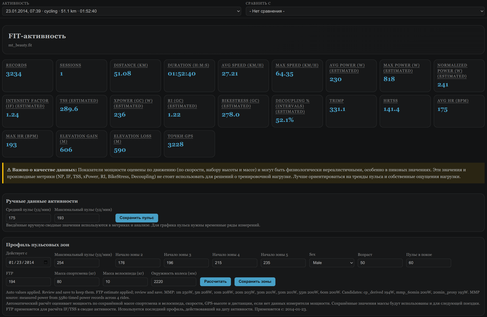
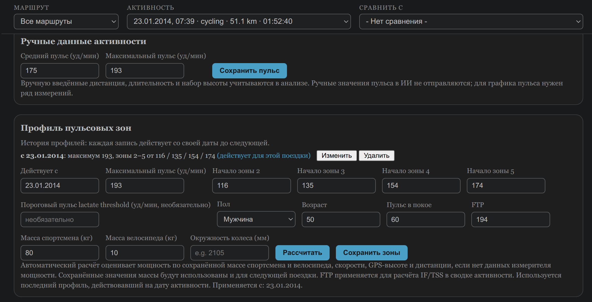
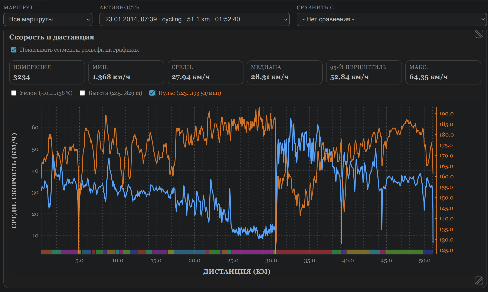
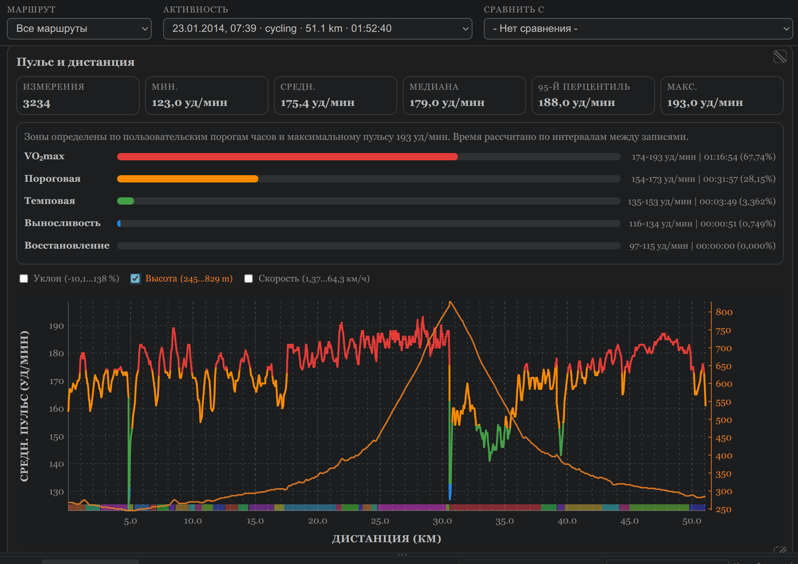
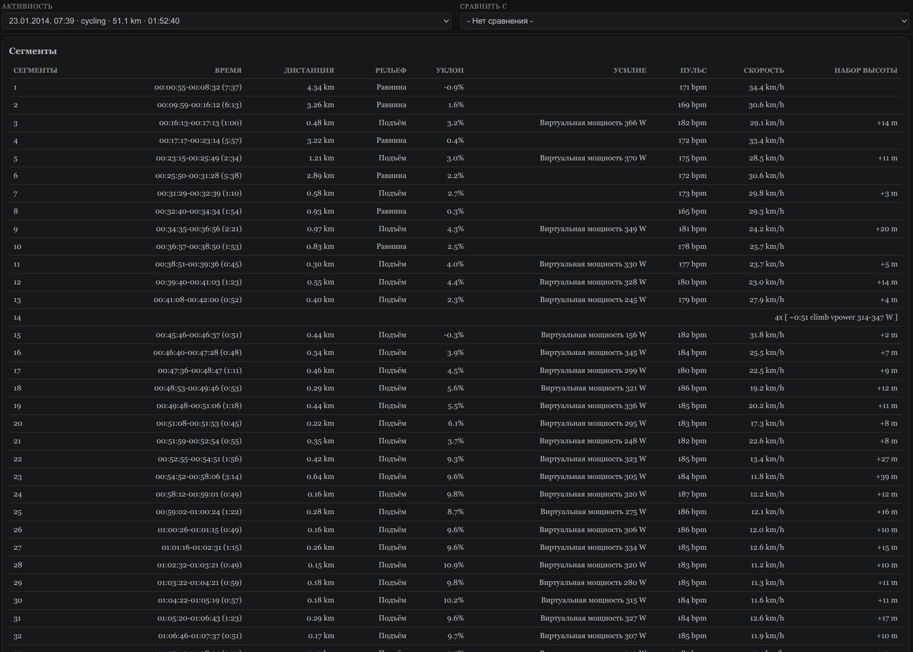
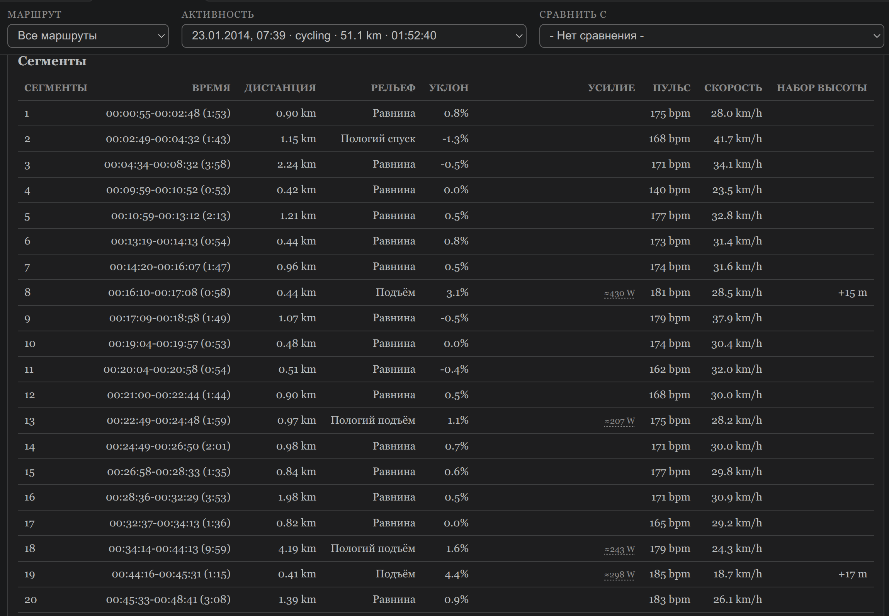

# FIT Visualizer

[English version](README.md)

**FIT file viewer, который не останавливается на просмотре.**

FIT Visualizer — расширение VS Code для просмотра и анализа тренировок. Открываете `.fit` с велокомпьютера или часов — и видите графики скорости, пульса и высоты, трек на карте, а сама поездка уже разложена на подъёмы, спуски, равнину и остановки.

Все открытые тренировки складываются в локальную базу, так что новую есть с чем сравнить. А с GitHub Copilot её можно ещё и обсудить: почему сегодня было тяжелее, чем неделю назад, и есть ли вообще прогресс.

## Обновление

### До 0.14.1

1. Запустите **FIT: Re-analyze Outdated Analyses**, чтобы обновить сохранённые AI-анализы (формат анализа 18). Переиндексация для этого обновления не нужна.
2. По желанию запустите **FIT: Tidy Heart-Rate Profiles**, чтобы схлопнуть дубликаты датированных профилей, созданные прежними сохранениями.

### До 0.14.0

**Если вы уже пользовались расширением, после обновления переиндексируйте FIT-файлы и повторите AI-анализ.** Изменились расчёты уклона, сегментов, пульсовой нагрузки и контекст AI; сохранённые показатели и старые анализы автоматически не обновляются.

1. Откройте папку с исходными `.fit`-файлами и запустите **FIT: Index All Files** из палитры команд (`Ctrl+Shift+P`). **Index New Files** не обновляет уже загруженные активности.
2. Дождитесь завершения индексации и запустите **FIT: Re-analyze Outdated Analyses**, чтобы обновить устаревшие AI-анализы и создать отсутствующие с новыми расчётами и контекстом. Одно подтверждение покажет общее число запросов Copilot; актуальные анализы останутся без изменений.

Переиндексация выполняется локально и не меняет исходные FIT-файлы. Повторный AI-анализ необязателен, требует GitHub Copilot, передаёт модели контекст активностей и обсуждений и может расходовать лимит Copilot.

## С чего начать

1. Установка: нажмите `Ctrl+P`, вставьте `ext install AntonPetrusevich.fit-visualizer` и нажмите Enter.
2. Откройте папку с `.fit`-файлами (**File → Open Folder**). Файлов пока нет? Смотрите, [где их взять](#что-такое-fit-файл-и-где-его-взять).
3. Кликните любой `.fit`-файл. Он откроется как страница активности и сразу добавится в локальную историю.
4. Есть папка со старыми поездками? Запустите **FIT: Index All Files** из палитры команд (`Ctrl+Shift+P`), чтобы добавить их все разом. После новых поездок **FIT: Index New Files** добавит только новые.
5. Чтобы потом переключаться между поездками, запустите **FIT: Browse Loaded Data** и выберите активность в списке вверху.

Всё. Графики, карта, сегменты и пульсовые зоны работают сразу, без регистрации и без загрузки куда-либо. Для персональных зон один раз заполните **Профиль пульсовых зон** (пол, возраст, пульс покоя) на странице активности.

Если установлен и подключён GitHub Copilot Chat, прокрутите до раздела **Анализ ИИ** и нажмите **Анализировать активность**. Дальше самое интересное: в **Диалоге по результатам** можно переспросить, поправить модель и добавить то, чего в файле не было.

Вот как это выглядело у меня после поездки 25 августа. Сначала исходный анализ таким, каким он был тогда (модель написала его по-английски, ниже перевод):

> Это было до нынешних исправлений качества данных. Расхождение 171 и 191 уд/мин появилось из-за вручную введённого максимума с часов; считать его подтверждённым значением из FIT было нельзя. Теперь AI-анализ не получает ручные переопределения пульса и ответы устаревших версий модели.

> **Анализ тренировки — 2026-08-25**
>
> **1. Сравнение с базой**
> Это первая поездка после трёх полных дней отдыха — отдых наконец-то случился — и она немного выше базы по 31 поездке по скорости (23.35 против 22.7 км/ч) при явно более низком пульсе (133 против 138 уд/мин). Это лучшее сочетание скорости и усилия в недавней истории. Как и раньше, не учитывайте мощность, оценённую по движению (IF 1.15, TSS 112.7, decoupling −35.9% неправдоподобны); нагрузку лучше отражают hrTSS (36.3) и TRIMP.
>
> **2. Динамика формы**
> Тренды по-прежнему благоприятные — скорость на сравнимых поездках растёт на +4.4% при стабильном пульсе — но «точку эффективности» так оформлять нельзя: сегодняшняя поездка быстрее базы при более низком пульсе, однако сравнение vpower на финишных подъёмах между днями (150–192 Вт при пульсе 136–146 против 152–165 на 8/19–8/21) — это разные условия и не подтверждённое совпадение маршрута, а не измеренная мощность. Один день после отдыха — это ещё не изменение формы; если связка «быстрее и легче» повторится 2–4 недели на одном и том же подтверждённом маршруте, вывод станет надёжным.
>
> **3. Пульс и восстановление**
> Распределение по зонам показывает хорошо контролируемую аэробную поездку: 98% времени в аэробной зоне или ниже, лишь 2% в анаэробной и практически ноль в максимальной; пик 160 заметно ниже потолка профиля 171. Длинные ровные отрезки в середине поездки держались в диапазоне 125–144 уд/мин. Состояние восстановления и кардиодрейф по этим сводкам оценить нельзя, а расхождение максимального пульса в профиле (171 против 191) по-прежнему не проверено.
>
> **4. Рекомендации**
> Это почти тот самый чистый эталон спокойной поездки (темп, при котором можно разговаривать), которого давно не хватало, — сохраните его как точку отсчёта и повторяйте еженедельно, чтобы следить за эффективностью на финишных подъёмах. Вы отдохнули и проехали спокойно — на этой неделе можно позволить одну структурированную интенсивную тренировку, а затем лёгкие дни; не возвращайтесь к ежедневным тяжёлым поездкам. Остаются в силе: проверить максимальный пульс в профиле и подумать о настоящем измерителе мощности вместо непригодной оценки по движению.

Вот только трёх дней отдыха не было. 22-го я катался, просто забыл велокомпьютер дома. Дальше диалог (выдержки, ответы сокращены):

> **Я:** «Это первая поездка после трёх полных дней отдыха» — не совсем так, было два дня отдыха. 22 августа я просто забыл велокомпьютер дома и данные есть только на смартчасах… там была поездка на 20 км, в которой я попал под сильный дождь.
>
> **ИИ:** Спасибо за уточнение — исправляю контекст: это первая **записанная** поездка после двух дней отдыха… Это немного меняет картину: восстановление было короче, что делает сегодняшнюю связку «скорость выше базовой (23.35 vs 22.7 км/ч) при пульсе ниже базового (133 vs 138 bpm)» даже более убедительным сигналом эффективности, а не просто эффектом свежести. …Уточните: поездка 22.08 была лёгкой/восстановительной или с усилиями?
>
> **Я:** 22.08: время 55.08; средняя скорость 22.5; средний пульс 138
>
> **ИИ:** …скорость и пульс практически совпадают со средними по 31 сравнимой поездке (22.7 км/ч, 138 bpm), то есть это была умеренная, не тяжёлая нагрузка.
>
> **Я:** 22.08: подъём 163, спуск 850
>
> **ИИ:** Спасибо, но эти цифры выглядят сомнительно: набор 163 м при спуске 850 м даёт чистое понижение ~687 м за ~20 км… Скорее всего, это ошибка барометрического альтиметра — дождь часто искажает такие данные.

А вот где я засомневался в рекомендации:

> **Я:** «Не возвращайтесь к ежедневным тяжёлым поездкам» — почему? … Разве организм не адаптируется к нагрузкам?
>
> **ИИ:** Адаптируется — но именно в этом суть: адаптация происходит **между** нагрузками, а не во время них. …Ваши данные это иллюстрируют: 8/19–8/21 подряд — пульс 152–165 на тех же финишных подъёмах, а после отдыха — 136–146 bpm при vpower ~150–192 Вт и 23.35 км/ч при 133 bpm против базовых 22.7/138. Прирост проявился именно после отдыха, а не после серии нагрузок.

Про альтиметр я сам не догадался. Диалог сохраняется вместе с анализом, к нему можно вернуться позже.

## Как это появилось

Всё началось с выбора велокомпьютера. Сравнивал Sigma ROX 4.0 примерно за 80 евро и CYCPLUS M1 примерно за 50 и спросил совета у Google AI. Тот, среди прочего, сообщил, что M1 подключается по USB как Mass Storage и с него можно забрать файлы тренировок. Купил.

USB, как выяснилось, только для питания, а файлы забираются по Bluetooth LE. Так появился [cycplusSync](https://github.com/jef-sure/cycplusSync). Сначала думал встроить его прямо в расширение, чтобы оно само забирало тренировки с велокомпьютера, но от такого комбайна отказался: забрать файлы и разобраться в них — задачи слишком разные. Расширение занялось только FIT-файлами, отсюда и название.

Потом понадобилась программа, чтобы эти файлы смотреть. GPXSee не грузил тайлы карты, GoldenCheetah падал на моих файлах — даже после перекодирования через GPSBabel. Ну я ж программист! Решил, что проще написать свою.

Просто просмотрщик мне был не нужен. До этого я пользовался Samsung Health: данных там много, но наложить график одной тренировки на другую нельзя. А одна тренировка сама по себе мало что говорит, интереснее сравнить её с похожими, с недавней нагрузкой и увидеть тренд хотя бы за месяц. Поэтому появилась локальная база. Круги и километровые отрезки для сравнения не годятся: на одной и той же дороге в один день проскочил светофор, в другой постоял — и границы уже разъехались. Поэтому появилась своя сегментация. А языковой модели отдаётся не FIT-файл, а уже посчитанная аналитика вместе с историей.

На Strava, Garmin Connect или GoldenCheetah это не замахивается. Инструмент получился довольно эгоистичный: мне хотелось нормально работать со своими данными и посмотреть, что выйдет, если отдать историю тренировок LLM. Если бы Google AI тогда не ошибся, этого проекта, возможно, и не было бы.

Возни было в основном не с разбором FIT (тут всё банально), а с сегментацией и с тем, чтобы модели доставались честные данные: где мощность посчитана по физической модели, а где ей лучше не верить. Если попробуете на своих тренировках, найдёте баг или знаете, как сделать лучше, — пишите в [Issues](https://github.com/jef-sure/fit-visualizer/issues).

## Что умеет

Работает и с велосипедом, и с бегом. Примеры в основном велосипедные — просто потому, что это мои данные.

- Открывает FIT-файлы в интерактивном визуальном редакторе
- Автоматически индексирует активности в локальную базу SQLite
- Сравнивает две активности на одном экране
- Графики скорости, пульса и высоты по дистанции
- До двух дополнительных метрик поверх графика, у каждой своя цветная шкала Y, а их значения видны в общем перекрестии
- Общее перекрестие для всех трёх графиков: наводите на один — видите точные значения в этой точке на всех
- Подсказки при наведении на термины активности и нагрузки: мощность, скорость, пульс, высота, TSS, Normalized Power, xPower, TRIMP
- Интерфейс, формы, действия карты и сообщения анализа следуют языку интерфейса VS Code
- Для языка без готовой локализации можно сгенерировать локальный перевод интерфейса выбранной моделью Copilot
- GPS-трек на интерактивной карте
- Раскраска маршрута по скорости, пульсу или найденным участкам рельефа, с легендой для подъёмов, спусков, равнины, остановок и технических спусков
- Те же участки полупрозрачными полосами на всех графиках по дистанции, с одним общим переключателем
- Подсказка при наведении на участок карты или полосу графика: длительность, дистанция, уклон, скорость, пульс, усилие, высота, признак технического участка
- Компактная таблица найденных сегментов и, если устройство их записало, кругов
- Автоматическая сегментация поездки на подъёмы, спуски, равнину и остановки; усилие оценивается физической моделью мощности на подъёмах и по пульсу на остальных участках, и для каждого сегмента честно указано, что именно применено
- Подсказка калибровки окружности колеса: сравнивает дистанцию колёсного датчика с GPS на надёжных прямых участках и предлагает поправку, только когда данных достаточно
- Профили пульсовых зон с датой начала действия
- AI-анализ текущей поездки с учётом похожих прошлых поездок, недавней нагрузки и личных рекордов
- AI-сравнение двух активностей, в том числе по сегментам, с сохранением результата для каждого направления сравнения
- Массовый повторный анализ после обновления, которое меняет логику анализа, вместо того чтобы проходить по одной

AI-анализ необязателен и требует установленного и подключённого GitHub Copilot Chat. Всё остальное — графики, карта, сегментация, зоны, калибровка, сравнение — работает без него.

## Что такое FIT-файл и где его взять

FIT (Flexible and Interoperable Data Transfer) — бинарный формат, в котором большинство GPS-велокомпьютеров, спортивных часов и фитнес-приложений записывают активность: координаты, скорость, пульс, мощность, каденс и прочее, примерно одна запись в секунду. Изначально его разработал Garmin, но это открытый формат, и используется он далеко за пределами устройств Garmin.

Как забрать `.fit`-файлы с распространённых устройств:

- **Garmin**: Garmin Connect → активность → **⋯** → *Export Original*. Или подключите устройство по USB и скопируйте файлы из `GARMIN/Activity`.
- **Wahoo**: приложение ELEMNT → поездка → поделиться/экспорт.
- **Polar**: Polar Flow → активность → экспорт, выбрать FIT.
- **Suunto, COROS, Bryton, Sigma и большинство других GPS-компьютеров и часов**: в фирменном приложении обычно есть экспорт; если нет, при подключении по USB часто видна папка вроде `Activities` или `Garmin` с исходными `.fit`-файлами.
- **Zwift**: сохраняет автоматически после каждой поездки в `Documents/Zwift/Activities`.
- **Strava**: если поездка загружена с устройства (а не введена вручную), *Export Original* на странице активности вернёт исходный `.fit`-файл.
- **CYCPLUS M1** (без фирменного приложения): смотрите [cycplusSync](https://github.com/jef-sure/cycplusSync).

## Скриншоты

## Команды

Названия команд в палитре команд — на английском.

- FIT: Visualize File — открыть файл
- FIT: Browse Loaded Data — просмотр загруженных активностей
- FIT: Index All Files — проиндексировать все файлы
- FIT: Index New Files — проиндексировать только новые
- FIT: Index This File — проиндексировать текущий файл
- FIT: Add Manual Activity — ввести тренировку вручную, когда FIT-файла нет (например, велокомпьютер остался дома), чтобы она всё равно учитывалась в истории и анализе
- FIT: Re-analyze Outdated Analyses — обработать все активности с устаревшим или отсутствующим анализом одним пакетом в хронологическом порядке, после подтверждения общего числа запросов Copilot; актуальные анализы не меняются
- FIT: Tidy Heart-Rate Profiles — показать подряд идущие дубликаты датированных профилей зон и удалить их после подтверждения; заодно перечислить смены максимального пульса, которые стоит проверить
- FIT: Update Model Prices — загрузить официальную таблицу цен GitHub Copilot и сохранить её локально для следующих анализов; запрос к Copilot не выполняется

В контекстном меню `.fit`-файла в Explorer есть два ярлыка на команды выше — **Visualize File** и **Index This File**; больше ничего туда не добавляется, сегментация, анализ и всё остальное происходят в визуальном редакторе после открытия файла.

## Сегментация по усилию

Каждая поездка делится на сегменты по рельефу (подъём, спуск, равнина) и по усилию внутри каждого типа рельефа, плюс остановки. Для сегмента показываются длительность, дистанция, средний уклон и оценка усилия:

- **Измеренная мощность**, если она есть, остаётся основным сигналом усилия.
- **Подъёмы** могут использовать vpower, если покрытие уклона и проверка составляющих модели допускают условное относительное сравнение. Иначе предпочтителен пульс; без пульса оценка подъёма может остаться только для приблизительного описания.
- **Равнина и спуски** описываются по пульсу, когда он есть. Без него грубая vpower не дробит эти участки на псевдоинтервалы.
- Сегменты, где ненадёжны сами данные скорости (технические спуски, плохой приём GPS), так и помечаются — без числа усилия, вместо вводящего в заблуждение.

Модель vpower учитывает гравитацию, качение, аэродинамику и разгон. Лобовая площадь и сопротивление качению настраиваются, ветер не моделируется. Уклон теперь считается устойчивым локальным приближением высоты по дистанции в окнах от 30 до 120 м, а не разностью соседних высот. Остановки, отсутствующая высота, разрывы записи и сбросы дистанции разделяют расчёт. Настоящий уклон выше 18% больше не отбрасывается только за крутизну.

Мощность и сегментация используют один пространственный профиль уклона. Для сегментов, где мерой усилия служит vpower, в AI-контекст входят размер окна, остаточный разброс, покрытие сигналами и чувствительность мощности к уклону и массе. Это проверка согласованности и применимости, не подтверждённая погрешность в ваттах: плавная ошибка высоты, неизвестный ветер или неверная масса всё ещё могут испортить результат. Абсолютную точность надо проверять по измерителю мощности.

Эта сегментация используется и в AI-анализе, поэтому модель может рассуждать о конкретных участках, а не только о средних по всей поездке.

Наведите на раскрашенный участок маршрута или на соответствующую полосу графика, чтобы увидеть характеристики сегмента. Недоступные для сегмента поля не показываются.

## Сегменты и круги

Под графиками FIT Visualizer показывает найденные сегменты. Если в FIT-файле есть записанные устройством круги, компактный переключатель показывает и их исходные сводки. В каждом представлении — только те столбцы, для которых есть данные: время, дистанция, пульс, мощность, уклон, высота.

Пороги (граница уклона, минимальная длина сегмента, определение остановок, окно доверия GPS и т. д.) настраиваются — смотрите **Настройки** ниже — и рассчитаны на подстройку под ваш рельеф и стиль езды, а не на фиксированные значения.

## Калибровка колеса

Если на велосипеде стоит колёсный датчик скорости, пройденная им дистанция зависит от заданной окружности колеса. FIT Visualizer сравнивает дистанцию датчика с GPS на длинных прямых участках с хорошим треком и предлагает поправку, только когда надёжных данных достаточно. В остальных случаях молчит.

## AI-анализ

AI-анализ необязателен; остальной FIT Visualizer работает без GitHub Copilot.

Анализ идёт через Language Model API VS Code. Для разового анализа по умолчанию выбирается самая дешёвая доступная модель из сохранённой таблицы опубликованных цен (до первого обновления используется встроенный снимок), с запасными вариантами Auto и поиска по имени. Диалог и сравнение используют первую доступную модель провайдера. Это не обязательно модель из окна чата; в журнале видно, кто ответил.

FIT-файл модели не отправляется. Она получает текстовую сводку:

- **Сама поездка**: дистанция, время, скорость, пульс, набор и спуск, температура, hrTSS, TRIMP и остальные метрики.
- **Сегменты и круги устройства**: рельеф, источник усилия, неполное покрытие сигналами, диагностика уклона там, где усилие оценивается по vpower, VAM для подъёмов от 2 минут и от 25 м, динамика половин участков от 10 минут. Повторы группируются, короткие остановки суммируются. Передаются до 40 кругов с предупреждением о пропущенных; автоматический круг не считается намеренным интервалом.
- **Кандидаты для сравнения**: более ранние последовательности сегментов того же спорта с похожими рельефом, длительностью и дистанцией. Пульс и мощность не обязаны совпадать. Локально выбираются до четырёх примеров. Пять упорядоченных GPS-точек могут поддержать приблизительное совпадение, но не доказать идентичность маршрута; координаты в промпт не входят.
- **Объём и покрытая интенсивность** за предыдущие 7 и 28 дней, плюс равные периоды перед ними. Время, дистанция, записанные активные дни и доступное время HR-зон разделены по видам спорта. Нет записи не значит отдых; неизвестная интенсивность не значит нулевая.
- **Адаптивное окно наблюдения**: 28, 56 или 90 дней по числу доступных занятий того же спорта. Тренды длительности и дистанции описательные; восемь записей и эвристический порог шума не доказывают изменение формы. Перерыв в записях служит поводом для обсуждения, а не диагнозом смены этапа.
- **Время в HR-зонах** по профилю не позднее даты занятия, либо по legacy-настройке, если такого профиля нет, плюс приблизительное деление на низкую, среднюю и высокую интенсивность (Recovery+Endurance / Tempo / Threshold+VO2max) для поездки и каждого периода объёма. Подробные сигналы рассчитываются максимум для 40 прошлых занятий каждого спорта в пределах 90 дней; ограничения покрытия указаны.
- **Пиковый устойчивый пульс** за 1, 5, 20 и 60 минут (взвешенный по времени; окно прерывается при пропуске пульса или разрыве записи) и лучшие прежние значения того же спорта за 28 и 90 дней. Пики описывают нагрузку занятия, а не изменение формы.
- **Факты и гипотезы из истории**: до 12 сводок предыдущих занятий того же спорта, для четырёх последних может добавляться AI-текст актуальной версии. Прежняя интерпретация пересматривается, а не становится доказательством от повторения.
- **Датированный пользовательский контекст** из последних 24 обсуждений более ранних активностей, до восьми пользовательских сообщений на каждое, независимо от числового окна. В текущем разговоре сохраняются до 24 реплик. Устаревшие ответы и ручной HR исключаются, но ваши поправки не теряются. Дата сообщения и период, о котором вы рассказываете, различаются.

Анализ определяет тип занятия (восстановительное, выносливость, темп, порог, VO2max/анаэробное, смешанное — или честно говорит, что без пульса и измеренной мощности это определить нельзя), затем разбирает исполнение, сочетание стимулов и распределение интенсивности за недавние периоды и предлагает один практический шаг, а не обязан выдать вердикт о форме и восстановлении. Он сосредоточен на том, что нового по сравнению с недавними анализами, и не повторяет те же советы, оговорки и вопросы. Исторические итоги не включают текущую активность, а скользящие периоды привязаны к своим датам. Целей может не быть, их может быть несколько, приоритеты могут меняться. Предположенная направленность не выдаётся за ваше намерение; ваши уточнения могут опровергнуть прошлую гипотезу ИИ. После сообщённой операции или болезни FIT не определяет заживление, медицинский допуск и безопасное увеличение нагрузки; ограничения врача важнее спортивных предположений.

Средний и максимальный HR не доказывают восстановление или усталость; пиковый пульс не задаёт целевые зоны. Whole-ride estimated power по-прежнему исключена, decoupling требует измеренной мощности. Порог hrTSS оценён по зоне Threshold или 85% максимума, а не проверен тестом LTHR; это не подтверждённый аналог коммерческой шкалы. Названия HR-зон не доказывают физиологические пороги, температура устройства не обязательно температура воздуха. Неизвестное не заменяется нулём.

В диалоге модель получает ту же сводку поездки, исходный анализ и историю разговора. Если данных не хватает, она должна сказать об этом и задать один уточняющий вопрос — поэтому в примере она переспрашивала про 22.08.

Производные показатели нагрузки, которые нельзя рассчитать из имеющихся данных, не выводятся, а не показываются нулём.

Запросы и ответы записываются локально (смотрите **Настройки**), так что можно точно проверить, что было отправлено и получено.

По умолчанию анализ использует поставщика языковых моделей `copilot` в VS Code. Его можно сменить настройкой `fitVisualizer.lmVendor`, если в VS Code зарегистрирован другой совместимый поставщик.

Анализ и ответы в диалоге по умолчанию — на языке интерфейса VS Code. Язык ответа может изменить только текущий вопрос в диалоге; прежние сообщения, архивные вопросы и старые ответы ИИ на него не влияют. Например, интерфейс можно оставить английским, а обсуждать тренировки по-русски.

Разовый анализ активности (не диалог) по умолчанию использует самую дешёвую из доступных моделей Copilot по опубликованной цене за токены: API VS Code цены не отдаёт. Для моделей, которых в таблице нет, пробуется семейство `Auto`, затем эвристика по имени (`fitVisualizer.cheapModelMarkers`, например `haiku`, `mini`, `flash`, `luna`). Чтобы использовать модель по умолчанию, установите `fitVisualizer.preferCheapAnalysisModel` в `false`. Диалог и AI-сравнение всегда работают на модели по умолчанию. Ни один из этих путей официально не гарантируется API языковых моделей VS Code, а в журнале каждого запроса записывается, какая модель ответила.

Чтобы обновить цены из [официальной таблицы GitHub](https://docs.github.com/en/copilot/reference/copilot-billing/models-and-pricing), запустите **FIT: Update Model Prices** из палитры команд (`Ctrl+Shift+P`). Проверенные ставки входных и выходных токенов обычного контекста сохраняются в локальном хранилище расширения VS Code и применяются к следующим запросам анализа и пакетного реанализа без перезапуска. При ошибке загрузки или неизвестном формате остаются прежние цены; до первого успешного обновления используется встроенный снимок. Загружается только публичный документ: данные тренировок не передаются, лимит Copilot не расходуется. Ранжирование по-прежнему приближённое, с весом входа 3 к выходу 1; кеш, длинный контекст и условия тарифа могут менять фактическую стоимость.

### AI-сравнение двух активностей

В разделе **Анализ ИИ** перечислены все сохранённые сравнения для текущей активности, подписанные так же, как в списке «Сравнить с» (дата, вид спорта, дистанция, длительность). Этот список не зависит от того, что сейчас выбрано в «Сравнить с», поэтому сохранённые сравнения видны и после выбора другой активности или сброса выбора.

Если выбрать активность для сравнения в панели инструментов, появится кнопка **AI-сравнение** для этой пары. Copilot сравнивает две тренировки по сегментам — основную («Эта тренировка») с выбранной («Сравниваемая активность») — не предполагая, что сегменты совпадают по порядку: остановка может разделить сегмент одной поездки на два, а в другой он останется целым.

Сравнения хранятся для каждой пары с учётом направления: сравнение A с B и B с A сохраняются отдельно. Если для пары уже есть сохранённое сравнение, предлагается **Сравнить ещё раз**. У каждого сохранённого сравнения своя кнопка **Удалить сравнение**.

## Пульсовые зоны

- Поддерживаются профили зон с датой начала действия
- Автоматический расчёт: максимальный пульс — большее из оценки по формуле Танаки (208 − 0,7 × возраст) и максимума в FIT-данных; вручную введённые значения пульса не учитываются. Границы зон 2–5 — по Карвонену: пульс покоя + 60/70/80/90% резерва (максимум − покой). Это оценочная формула; датированные пользовательские профили имеют приоритет.
- Названия зон: Recovery, Endurance, Tempo, Threshold и VO2max. Диапазон 80–90% не называется анаэробным.
- TRIMP интегрируется по записям пульса, а не рассчитывается из среднего пульса за всю поездку. hrTSS интегрирует квадрат интенсивности относительно резерва между пульсом покоя и пороговым пульсом (час на пороге = 100); порог оценивается по профилю зон, потому что прямого теста LTHR нет.
- Ручные значения можно сохранить и использовать повторно

## Локальные данные и приватность

FIT Visualizer хранит данные активностей локально в рабочей папке.

- База данных: `.fit-visualizer/fit-data.sqlite`
- Журналы запросов и ответов Copilot: `.fit-visualizer/logs`
- Область: рабочая папка (или выбранная папка)
- Проиндексированные активности сохраняются между сеансами

Просмотр FIT-файлов, индексация, графики, карта, сегментация, пульсовые зоны, калибровка колеса и история активностей работают локально в VS Code. Исходные `.fit`-файлы FIT Visualizer никуда не загружает и не копирует.

Одно сетевое исключение: по умолчанию карта загружает фоновые тайлы с `tile.openstreetmap.org`, поэтому тайл-сервер видит, какую область карты вы смотрите (но не сам трек). Установите `fitVisualizer.map.tiles` в `none`, чтобы рисовать маршрут на нейтральном фоне без сетевых запросов. Обновление цен моделей запрашивает публичную страницу цен GitHub и не передаёт данных об активностях.

FIT-файлы могут содержать чувствительные данные: GPS-координаты, время, пульс, сведения об устройстве и историю тренировок.

AI-анализ необязателен. Данные уходят через GitHub Copilot, только когда вы сами запускаете анализ: кнопкой **Анализировать активность**, вопросом в диалоге, **AI-сравнением** или командой **FIT: Re-analyze Outdated Analyses**. Передаются факты активности, расчёты, сегменты, история, AI-гипотезы и ваши сообщения из прошлых обсуждений, включая сведения о здоровье, если вы их написали. Исходный FIT и GPS-координаты сегментов не отправляются. Журналы могут содержать тот же чувствительный контекст. Передача идёт в соответствии с вашими настройками Copilot.

Выбранной моделью можно также сгенерировать недостающий перевод интерфейса, если для языка VS Code нет готовой локализации. Такой запрос содержит только фиксированные строки интерфейса и глоссария — без данных активностей, местоположения, здоровья или анализа.

Если включена настройка `fitVisualizer.logLlmRequests`, запросы и ответы Copilot сохраняются локально в `.fit-visualizer/logs`. Срок хранения задаётся `fitVisualizer.llmLogRetentionDays`.

Перед использованием AI-функций с активностями, содержащими чувствительные данные, проверьте настройки GitHub Copilot и журналирования.

## Демонстрационная активность

На скриншотах — публичная велопоездка из репозитория [kuperov/fit](https://github.com/kuperov/fit). В ней настоящий GPS-трек и заметный подъём, поэтому она хорошо показывает карту, высоту, сегментацию и анализ.

## Настройки

Большинство настроек можно не трогать. Пороги сегментации нужны в основном если ваш рельеф или стиль езды заметно отличается от обычной шоссейной или гравийной езды.

| Настройка | По умолчанию | Назначение |
| --- | --- | --- |
| `fitVisualizer.maxHeartRate` | — | Устаревший запасной максимальный пульс; лучше задать профиль зон с датой на странице активности. |
| `fitVisualizer.logLlmRequests` | `true` | Записывать каждый запрос и ответ Copilot в `.fit-visualizer/logs`. |
| `fitVisualizer.llmLogRetentionDays` | `30` | Удалять журналы старше указанного числа дней; `0` — хранить бессрочно. |
| `fitVisualizer.llmChatLogRetentionDays` | `180` | Удалять журналы диалогов и сравнений старее указанного числа дней; разговоры хранятся дольше разовых анализов. `0` — бессрочно. |
| `fitVisualizer.lmVendor` | `copilot` | ID поставщика языковых моделей VS Code для анализа и диалога. |
| `fitVisualizer.powerModel.dragArea` | `0.32` | Эффективная лобовая площадь CdA (м²) для оценки мощности: ~0.25 в разделке на TT-велосипеде, ~0.32 на верхнем хвате, 0.40+ при прямой посадке. |
| `fitVisualizer.powerModel.rollingResistance` | `0.004` | Коэффициент сопротивления качению Crr; увеличьте для широких или шипованных покрышек. |
| `fitVisualizer.segmentation.gradeThresholdPct` | `2.5` | Уклон (%), отделяющий подъёмы и спуски от равнины. |
| `fitVisualizer.segmentation.gradeHysteresisPct` | `0.5` | Дополнительный запас для смены типа рельефа, чтобы сегменты не дребезжали у самого порога. |
| `fitVisualizer.segmentation.minSegmentSeconds` | `45` | Более короткие сегменты сливаются с соседними. |
| `fitVisualizer.segmentation.technicalGradePct` | `-8` | Уклон спуска, ниже которого неровная скорость помечает сегмент как технический (без оценки усилия). |
| `fitVisualizer.segmentation.effortWindowSeconds` | `10` | Окно усреднения перед разбиением сегмента на интервалы. |
| `fitVisualizer.segmentation.minEffortMacroSeconds` | `600` | Минимальная длительность сегмента рельефа, после которой он делится на интервалы усилия. |
| `fitVisualizer.segmentation.effortMergeTolerancePct` | `12` | Максимальная разница усилия соседних участков, при которой они сливаются в один сегмент рельефа. |
| `fitVisualizer.segmentation.effortCostThreshold` | — | Порог стоимости слияния при поиске интервалов; если не задан, выводится из уровня шума самой поездки. |
| `fitVisualizer.segmentation.stopSpeedKmh` | `1` | Скорость, при которой и ниже которой запись считается остановкой. |
| `fitVisualizer.segmentation.stopMinSeconds` | `10` | Минимальная длительность остановки или паузы автопаузы. |
| `fitVisualizer.segmentation.gpsTrustMinKm` | `1` | Минимальная непрерывная прямая дистанция, после которой окно GPS может подтвердить записанную скорость или откалибровать её. |
| `fitVisualizer.map.tiles` | `osm` | Тайлы карты: `osm` — загружать тайлы OpenStreetMap через сеть; `none` — рисовать маршрут автономно, без сетевых запросов. |

> В таблице перечислены самые нужные ключи. `preferCheapAnalysisModel`, `cheapModelMarkers`, `analysisModelId` и `lmVendor` управляют тем, какая модель отвечает; см. раздел об AI выше.
